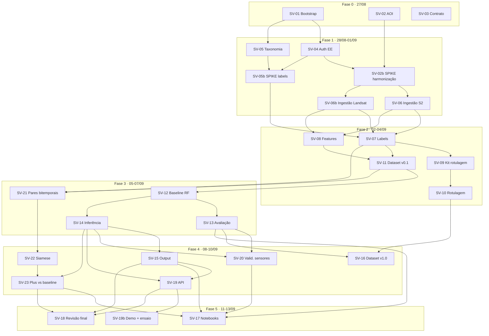

# Plano de Execução — Sentinela Verde / frente de ML

> Cada tarefa vive em `docs/tarefas/SV-XX-*.md` e é **auto-contida**: o arquivo da tarefa É o prompt
> de quem for implementá-la. Escopo, classes e fonte de labels vêm do `CLAUDE.md`.

- **Criado:** 2026-08-27 · **Revisado:** 2026-08-27 (3ª rodada — cronograma próprio da frente de ML)
- **Prazo final:** **14/09/2026, apresentação de 20 min — fixo, sem prorrogação**
- **Hoje:** 27/08 · **Dias úteis de trabalho até a véspera:** **18** (27/08 a 13/09, incluindo fins de semana)

---

## 1. O que mudou nesta revisão

O enquadramento por "Sprint 3/4/5" do Notion foi **descartado** como estrutura organizadora. A frente
de ML passa a ter cronograma próprio, em **fases com datas-alvo**, contado a partir de hoje até a
apresentação. As sprints do curso continuam existindo para o resto do time; só não organizam mais
este repo.

Além disso, o **Plus (Siamese CNN / change detection) entrou no escopo como meta**, não como
"se sobrar tempo". Tarefas novas: **SV-21, SV-22, SV-23**.

O que **não** mudou: 14/09 é imutável, e a nota da disciplina exige **demonstração funcional +
documentação completa**. Por isso os três últimos dias são reserva protegida (§5) — documentação e
ensaio não são o que se corta quando o prazo aperta; são critério de nota.

---

## 2. Capacidade: a conta honesta

Não adianta desenhar um calendário bonito se o esforço não cabe. Somando as estimativas das 27
tarefas e aplicando uma margem de 1,6× (padrão para trabalho geoespacial com incógnitas — quota do
Earth Engine, alinhamento de grade, harmonização entre sensores):

| Bloco | Estimativa | Com margem 1,6× |
|---|---|---|
| V1 (dados → baseline → output) | ~48 h | ~77 h |
| Documentação, API e demo | ~10 h | ~16 h |
| Plus (SV-21/22/23) | ~13 h | ~21 h |
| **Total** | **~71 h** | **~114 h** |

**114 h ÷ 18 dias = 6,3 h por dia, todos os dias, sem folga.**

### Cenário confirmado: 1 pessoa, ~10 h/dia dirigindo agentes

Capacidade nominal: **180 h-pessoa** contra 114 h estimadas. A conta fecha, mas o número nominal
superestima — descontando troca de contexto entre as duas trilhas (uma pessoa supervisiona dois
agentes em paralelo, mas as decisões e revisões serializam), a vazão efetiva fica em torno de
**120–130 h**. Ainda acima das 114 h, com **~10 % de folga real**. O plano se sustenta, Plus incluso.

**O que 10 h/dia resolvem:** as ~10 h de tempo humano irredutível — decisões (SV-02, SV-03),
rotulagem manual (SV-10), validação visual dos critérios de aceite, ensaio (SV-19b) — cabem
folgadamente. Nenhuma delas é gargalo neste cenário.

**O que 10 h/dia NÃO resolvem** (é aqui que está o risco remanescente):

| Gargalo | Por que não escala com supervisão | Tratamento |
|---|---|---|
| **Tempo de treino de SV-22** | É relógio de parede, não hora-pessoa. FC-Siam-diff em CPU sobre milhares de chips de 128×128×13: ~5–20 min por época, 30–50 épocas, e tipicamente 3–5 execuções até acertar → **10–40 h de máquina**. Supervisionar mais não acelera | **D-11 promovida a obrigatória e decidida agora: GPU (Colab).** Reduz o ciclo para ~30 min por execução. O caminho de exportação dos chips precisa estar montado até o dia 14, não improvisado no dia 15 |
| **Latência do Earth Engine** (SV-06/SV-06b) | Fila e quota de export são do Google, não suas. ~45 rasters | Disparar a ingestão cedo no dia e trabalhar em outra trilha enquanto roda. Absorvível com 10 h/dia |
| **Resposta de terceiros** (SV-03, e o aval do time em SV-05b) | Calendário, não esforço | Já isolados, com regra de escalonamento em 48 h |
| **Ausência de backup** | Um dia perdido = ~10 h = 9 % do orçamento, sem ninguém para cobrir | Checkpoint do dia 9 (§7) e alavancas de corte |

> **Veredito:** com 10 h/dia dirigindo agentes, o plano fecha com folga modesta. A condição que
> mudou de "desejável" para **obrigatória** é o **treino do Plus em GPU** — em CPU, SV-22 sozinha
> consumiria mais relógio de parede do que a Fase 4 inteira tem, e nenhuma quantidade de supervisão
> mudaria isso.

---

## 3. Cronograma por fases

| Fase | Dias | Datas | Entrega da fase |
|---|---|---|---|
| **0 — Destravar** | 1 | 27/08 (qui) | Repo de pé, AOI decidida, contrato proposto |
| **1 — Dados** | 5 | 28/08–01/09 | Série 2013–2025 harmonizada e ingerida nas duas eras |
| **2 — Dataset** | 3 | 02/09–04/09 | Dataset de modelagem versionado, sem vazamento |
| **3 — Baseline** | 3 | 05/09–07/09 | RF treinado, avaliado, mapas classificados |
| **4 — Output e Plus** | 3 | 08/09–10/09 | Output para Indicadores, API, Siamese treinado e comparado |
| **🔒 Congelamento de escopo** | — | **fim de 10/09** | **Nada de modelo ou feature novo depois daqui** |
| **5 — Entrega** | 3 | 11/09–13/09 | Notebooks, model card, demo ensaiada, revisão final |
| **Apresentação** | — | **14/09 (seg)** | 20 min |

### Calendário dia a dia

| # | Data | Dia | Trilha A — Dados/Engenharia | Trilha B — Modelagem |
|---|---|---|---|---|
| 1 | 27/08 | qui | **SV-01** bootstrap | **SV-02** AOI (humano) · **SV-03** contrato (humano) |
| 2 | 28/08 | sex | **SV-04** auth Earth Engine | **SV-05** taxonomia + remaps |
| 3 | 29/08 | sáb | **SV-02b** spike harmonização (3h, timeboxed) | **SV-05b** spike fonte de labels (3h, timeboxed) |
| 4 | 30/08 | dom | SV-02b — fechar ADR-003 | SV-05b — fechar ADR-004 + **levar ao time** |
| 5 | 31/08 | seg | **SV-06** ingestão Sentinel-2 | **SV-06b** ingestão Landsat |
| 6 | 01/09 | ter | SV-06 / SV-06b — fechar e validar grades | idem |
| 7 | 02/09 | qua | **SV-07** labels alinhados | **SV-08** features harmonizadas |
| 8 | 03/09 | qui | **SV-09** kit de rotulagem | **SV-11** dataset v0.1 (início) |
| 9 | 04/09 | sex | **SV-10** rotulagem manual (humano, ~2h30) | **SV-11** dataset v0.1 (fechar) |
| 10 | 05/09 | sáb | **SV-12** baseline RF | **SV-21** pares bitemporais (Plus) |
| 11 | 06/09 | dom | **SV-13** avaliação em holdout | SV-21 — fechar |
| 12 | 07/09 | seg | **SV-14** inferência (2 eras) | **SV-22** ambiente + Colab + overfit de 8 chips |
| 13 | 08/09 | ter | **SV-15** output para Indicadores | **SV-22** treino real (GPU) |
| 14 | 09/09 | qua | **SV-20** validação entre sensores · **SV-16** dataset v1.0 | **SV-22** fechar + EXP-003 · 🚦 **portão: GPU de pé com treino-fumaça, ou aciona alavanca 3** |
| 15 | 10/09 | qui | **SV-19** API (FastAPI) | **SV-23** Plus vs. baseline |
| — | — | — | 🔒 **Congelamento de escopo ao fim do dia 15** | |
| 16 | 11/09 | sex | **SV-17** notebooks + model card | SV-17 (notebooks 03 e 04) |
| 17 | 12/09 | sáb | **SV-19b** página de demo + **ensaio cronometrado** | SV-17 — fechar + README |
| 18 | 13/09 | dom | **SV-18** revisão de segurança | **SV-18** revisão de código · ensaio final |
| — | **14/09** | **seg** | **APRESENTAÇÃO — 20 min** | |

**Os fins de semana são dias de trabalho** neste plano (29–30/08, 05–06/09, 12–13/09), conforme o
ritmo diário sinalizado. Note que o último fim de semana é justamente o de documentação e ensaio —
é a hora de menor risco para gastar sábado e domingo, porque não há código novo em jogo.

---

## 4. As duas trilhas

O plano assume duas frentes trabalhando em paralelo, com pouquíssimo bloqueio mútuo:

- **Trilha A — Dados/Engenharia** (agente `data-engineer`): ingestão, harmonização, labels, features,
  output, API. Domina as fases 0–2.
- **Trilha B — Modelagem** (agente `ml-engineer`): taxonomia, dataset, treino, avaliação, Plus.
  Domina as fases 3–4.

Os únicos pontos de sincronia obrigatória são: **fim do dia 6** (as duas ingestões precisam ter
grades compatíveis), **fim do dia 9** (dataset pronto destrava tudo), e o **congelamento do dia 15**.

---

## 5. Reserva protegida de entrega (não negociável)

**Dias 16, 17 e 18 (11–13/09) são reservados para documentação, demo e revisão.** A nota da
disciplina exige demonstração funcional e documentação completa — são critério explícito do
professor, não capricho.

Regras da reserva:
- **Nenhum modelo novo, nenhuma feature nova, nenhuma tarefa de dados** entra depois do dia 15.
- Se uma tarefa de modelagem estourar o prazo, ela é **cortada**, não empurrada para dentro da reserva.
- O ensaio de SV-19b acontece no dia 17, **não** no dia 18 — para sobrar um dia inteiro de margem
  para corrigir o que o ensaio revelar. Ensaio na véspera é ensaio decorativo.

---

## 6. O Plus cabe? Sim, mas sem folga

O Plus (SV-21/22/23) ocupa os dias 10 a 15, na Trilha B, em paralelo com o fechamento da V1 na
Trilha A. **Ele cabe no calendário, mas com zero folga**, e depende de três coisas serem verdade:

1. **SV-05b precisa adotar uma fonte de label anual.** Change detection exige saber *onde houve
   mudança*, e a única fonte viável no prazo é a diferença de classe entre anos numa fonte anual
   (MapBiomas). **Se o WorldCover de safra fixa for mantido, o Plus perde a base de treino** —
   SV-21 tem essa pré-condição escrita como bloqueante. Este é o acoplamento mais importante do
   plano: uma decisão do dia 4 determina se o Plus do dia 15 existe.
2. **A arquitetura precisa ser pequena e conhecida** (FC-Siam-diff, ~1,3 M de parâmetros). SV-22
   proíbe explicitamente transformers. Não há prazo para pesquisa de arquitetura.
3. **O timebox de 6h de SV-22 precisa ser respeitado.** Se não convergir, entrega-se o diagnóstico
   escrito e segue-se. Um Plus documentado como "treinado, não convergiu, hipóteses A/B/C" é entrega
   honesta; um Plus que come os dias 16 e 17 é falha de projeto.

**E o Plus vale a pena mesmo que perca:** SV-23 compara o Siamese contra a diferença das
classificações do RF. Se o RF ganhar, isso é um resultado válido, interessante e apresentável — a
tarefa exige que a expectativa seja declarada **antes** de medir, justamente para que o resultado
negativo não seja maquiado nem escondido.

---

## 7. Alavancas de corte, em ordem

Se ao fim do **dia 9 (04/09)** o dataset não estiver pronto, o plano está atrasado e uma destas
alavancas precisa ser puxada **naquele dia**, não no dia 14:

| # | Corte | Economia | Custo |
|---|---|---|---|
| 1 | **SV-16** (re-treino com labels manuais) | ~2h30 | A V1 fecha com `rf_v0.1`; a rotulagem vira melhoria documentada |
| 2 | **3 → 2 sites** | ~30% de ingestão, rotulagem e inferência | Nenhuma conclusão metodológica muda. **É a melhor alavanca** |
| 3 | **Plus reduzido** — sem treinar o Siamese, entregando só a comparação pós-classificação + protótipo documentado | ~15h | Perde-se o Deep Learning como entrega, mantém-se a análise de mudança |
| 4 | **Faixa temporal 2013 → 2016** | pouco (o código é o mesmo) | Perdem-se 3 anos de série. Último recurso |

**Nunca cortar:** SV-17 (documentação), SV-19b (demo e ensaio), SV-18 (revisão), SV-20 (validação
entre sensores). Os três primeiros são nota; o quarto é o que sustenta a série de 13 anos.

---

## 8. Decisões técnicas registradas

| ID | Decisão | Razão | Status |
|---|---|---|---|
| D-01 | **Núcleo V1 = Python 3.11 + scikit-learn + rasterio/geopandas + earthengine-api.** Sem Deep Learning no pipeline principal. | O Plus tem ambiente próprio (`requirements-plus.txt`); quebrar o ambiente da V1 a 4 dias da entrega seria caro. | **Firme** |
| D-02 | **Plus = PyTorch** (+ TorchGeo / `segmentation_models_pytorch`), arquitetura **FC-Siam-diff**. | Reavaliada por mérito técnico, sem o argumento de Windows — ver §9. | **Firme** |
| D-03 | **Série 2013–2025 multi-sensor:** Landsat 8/9 (2013–2018) + Sentinel-2 (2019–2025), sobreposição em 2019–2021. | Maximiza a cobertura defensável; 2013 é o primeiro ano de Landsat 8. | **Firme** |
| D-04 | **Máscara de nuvem:** Cloud Score+ (`cs_cdf ≥ 0.60`) no S2; bitmask de `QA_PIXEL` no Landsat C2 L2. | QA60 perde nuvem fina e sombra. | **Firme** |
| D-05 | **Versionamento = parquet gitignorado + manifest JSON commitado.** Sem DVC/LFS. | Rastreabilidade suficiente sem exigir remote para 6 pessoas. | **Firme** |
| D-06 | **Entregável = 4 notebooks + scripts reproduzíveis + modelo versionado + model card + relatório de métricas + API/demo funcional + relatório do Plus.** | Confirmado pelo usuário; cobre o critério de nota (demo + documentação). | **Firme** |
| D-07 | **Labels manuais são commitados**, ao contrário do resto de `data/`. | Leves, e são o trabalho humano insubstituível do repo. | **Firme** |
| D-08 | **Cada era é classificada em resolução nativa** (30 m / 10 m); comparabilidade vem da harmonização espectral + área em m², com viés medido em SV-20. | Reamostrar Landsat para 10 m inventaria precisão. | **Firme** |
| D-09 | **Faixa 2000–2011 (Landsat 5/7) fora do escopo.** | Buraco de 2012, segunda harmonização TM→OLI, e as construções dos sites são posteriores a ~2013. | Backlog |
| D-10 | **API = FastAPI + Uvicorn, local**, página estática servida pelo próprio app. | `/docs` do OpenAPI já é metade do entregável; sem build step; **sem dependência de rede na apresentação**. | **Firme** |
| D-11 | **Treino do Plus em GPU (Google Colab). Obrigatório, não opcional.** O caminho de exportação dos chips de SV-21 para o Colab deve estar montado até o **dia 14 (09/09)**. | Em CPU, SV-22 custa 10–40 h de relógio de parede, e isso **não** encolhe com mais supervisão — consumiria mais tempo do que a Fase 4 inteira tem. Em GPU, cada execução cai para ~30 min. | **Decidida (promovida de opcional em 27/08)** |
| D-12 | **Pares bitemporais só dentro da mesma era de sensor.** | Um par Landsat↔S2 confundiria mudança real com diferença de instrumento — exatamente o que SV-20 mostra existir. | **Firme** |

---

## 9. D-02: PyTorch vs. TensorFlow/Keras, por mérito técnico

| Critério | PyTorch | TensorFlow / Keras |
|---|---|---|
| Arquiteturas de referência de change detection (FC-Siam, STANet, BIT, ChangeFormer, SNUNet) | Praticamente todas | Poucas portas, desatualizadas |
| Toolboxes de domínio (Open-CD, Raster Vision) | Sim | Sem equivalente ativo |
| Pesos pré-treinados em Sentinel-2 multiespectral (TorchGeo / SSL4EO-S12) | Sim | Não |
| Entrada com nº arbitrário de bandas (o nosso tem 13, não 3) | `smp` + `timm` aceitam `in_channels` | Manual |
| Arquitetura siamesa (pesos compartilhados, fusão por diferença) | Idiomático | Mais cerimônia |
| Multi-backend | — | **Vantagem real do Keras 3** |
| Deploy TF Serving / TFLite | — | Vantagem do TF, **irrelevante aqui** (deploy é API local) |

**Conclusão: PyTorch.** O argumento decisivo, dado o prazo: a rota viável é **reproduzir uma
arquitetura publicada** (FC-Siam-diff) em vez de inventar uma — e essa arquitetura existe em PyTorch,
com implementação de referência, e não em Keras. Contraponto registrado: o repo irmão
`datacenter-extracao-modelos` usa Keras, mas a integração com ele está adiada por decisão do time.

---

## 10. Definition of Done

| # | Critério | Tarefa | Fase |
|---|---|---|---|
| 1 | 5 classes codificadas e usadas de ponta a ponta | SV-05 | 1 |
| 2 | Série 2013–2025 harmonizada, com resíduo entre sensores medido | SV-02b, SV-06, SV-06b, SV-20 | 1, 4 |
| 3 | Dataset versionado, sem vazamento espacial/temporal/entre-sensores | SV-11 | 2 |
| 4 | Baseline Random Forest treinado, registrado, reprodutível | SV-12 | 3 |
| 5 | Avaliação em holdout: accuracy, F1 por classe, matriz de confusão, por era | SV-13 | 3 |
| 6 | Classificação reproduzível nas duas eras | SV-14 | 3 |
| 7 | Output consumível pela frente de Indicadores, com a troca de sensor explícita | SV-15 | 4 |
| 8 | **Plus: modelo bitemporal treinado e comparado ao baseline** | SV-21, SV-22, SV-23 | 3, 4 |
| 9 | **API/demo funcional, ensaiada, offline** | SV-19, SV-19b | 4, 5 |
| 10 | **Documentação completa: notebooks, model card, ADRs, README** | SV-17 | 5 |
| 11 | Nada sensível/pesado no git; reprodução do zero validada | SV-01, SV-18 | 0, 5 |

---

## 11. Índice de tarefas

| ID | Tarefa | Fase | Data-alvo | Trilha | Responsável |
|---|---|---|---|---|---|
| [SV-01](tarefas/SV-01-bootstrap-repositorio.md) | Bootstrap do repositório | 0 | 27/08 | A | `data-engineer` |
| [SV-02](tarefas/SV-02-definir-aoi-janela-temporal.md) | AOI + janela temporal multi-sensor | 0 | 27/08 | B | **humano** |
| [SV-03](tarefas/SV-03-contrato-output-indicadores.md) | Contrato de output com Indicadores | 0 | 27/08 | B | **humano** (externo) |
| [SV-04](tarefas/SV-04-autenticacao-earth-engine.md) | Autenticação Earth Engine | 1 | 28/08 | A | `data-engineer` |
| [SV-05](tarefas/SV-05-taxonomia-classes-remap.md) | Taxonomia de classes + remaps | 1 | 28/08 | B | `ml-engineer` |
| [SV-02b](tarefas/SV-02b-spike-harmonizacao-multissensor.md) | **Spike:** harmonização Landsat↔S2 | 1 | 30/08 | A | `data-engineer` |
| [SV-05b](tarefas/SV-05b-spike-fonte-labels-anual.md) | **Spike:** fonte de labels anual | 1 | 30/08 | B | `ml-engineer` |
| [SV-06](tarefas/SV-06-ingestao-sentinel2.md) | Ingestão Sentinel-2 | 1 | 01/09 | A | `data-engineer` |
| [SV-06b](tarefas/SV-06b-ingestao-landsat.md) | Ingestão Landsat | 1 | 01/09 | B | `data-engineer` |
| [SV-07](tarefas/SV-07-labels-worldcover.md) | Rasters de label alinhados | 2 | 02/09 | A | `data-engineer` |
| [SV-08](tarefas/SV-08-indices-espectrais.md) | Features harmonizadas | 2 | 02/09 | B | `data-engineer` |
| [SV-09](tarefas/SV-09-kit-rotulagem-solo-exposto.md) | Kit de rotulagem | 2 | 03/09 | A | `data-engineer` |
| [SV-10](tarefas/SV-10-rotulagem-manual-execucao.md) | Rotulagem manual | 2 | 04/09 | A | **humano** |
| [SV-11](tarefas/SV-11-dataset-modelagem-v0.1.md) | Dataset de modelagem v0.1 | 2 | 04/09 | B | `ml-engineer` |
| [SV-12](tarefas/SV-12-baseline-random-forest.md) | Baseline Random Forest | 3 | 05/09 | A | `ml-engineer` |
| [SV-13](tarefas/SV-13-avaliacao-holdout.md) | Avaliação em holdout | 3 | 06/09 | A | `ml-engineer` |
| [SV-14](tarefas/SV-14-inferencia-raster-classificado.md) | Inferência → raster classificado | 3 | 07/09 | A | `ml-engineer` |
| [SV-21](tarefas/SV-21-pares-bitemporais-labels-mudanca.md) | **Plus:** pares bitemporais | 3 | 07/09 | B | `ml-engineer` |
| [SV-15](tarefas/SV-15-output-indicadores.md) | Output para Indicadores | 4 | 08/09 | A | `ml-engineer` |
| [SV-20](tarefas/SV-20-validacao-cruzada-sensores.md) | Validação entre sensores | 4 | 09/09 | A | `ml-engineer` |
| [SV-16](tarefas/SV-16-dataset-v1.0-retreino.md) | Dataset v1.0 + re-treino | 4 | 09/09 | A | `ml-engineer` |
| [SV-22](tarefas/SV-22-modelo-siamese-change-detection.md) | **Plus:** Siamese (treino) | 4 | 10/09 | B | `ml-engineer` |
| [SV-19](tarefas/SV-19-api-inferencia.md) | API de inferência (FastAPI) | 4 | 10/09 | A | `ml-engineer` |
| [SV-23](tarefas/SV-23-avaliacao-plus-vs-baseline.md) | **Plus:** avaliação vs. baseline | 4 | 10/09 | B | `ml-engineer` |
| [SV-17](tarefas/SV-17-notebooks-reprodutibilidade.md) | Notebooks + model card | 5 | 12/09 | A+B | `ml-engineer` + humano |
| [SV-19b](tarefas/SV-19b-pagina-demo-e-ensaio.md) | Demo + **ensaio cronometrado** | 5 | 12/09 | A | `ml-engineer` + humano |
| [SV-18](tarefas/SV-18-revisao-final.md) | Revisão final (código + segurança) | 5 | 13/09 | A+B | `code-reviewer`, `security-reviewer` |

**27 tarefas.** Com seção de risco preenchida: SV-01, SV-04, SV-15, SV-19, SV-18.

---

## 12. Grafo de dependências

**Dependências externas isoladas** (não travam o fluxo): **SV-03** (SV-15 segue com schema default),
**SV-10** (SV-11/12/13 rodam com labels automáticos), **SV-20** (SV-15 emite fator 1.0 e re-roda).

---

## 13. Caminho crítico

`SV-01 → SV-04 → SV-02b → SV-06b → SV-08 → SV-11 → SV-21 → SV-22 → SV-23 → SV-17`

Dez tarefas, **e note que o caminho crítico agora passa pelo Plus** — SV-22 é a tarefa mais longa do
plano (6h) e a mais incerta. É por isso que ela tem timebox e regra de parada explícitos: um estouro
ali empurra direto contra a reserva de documentação.

O caminho crítico da V1 sozinha (sem Plus) é `SV-01 → SV-04 → SV-02b → SV-06b → SV-08 → SV-11 →
SV-12 → SV-14 → SV-15 → SV-19 → SV-19b`, e termina no dia 17 com um dia de folga.

---

## 14. Riscos

| Risco | Impacto | Mitigação | Kill-switch |
|---|---|---|---|
| **Ritmo real menor que ~10 h/dia** | **Crítico** — é a premissa de tudo | Checkpoint no **dia 9 (04/09)**: se o dataset não estiver pronto, puxar alavanca de corte §7 no mesmo dia | Cortar Plus + 3→2 sites, preservando documentação e demo |
| **Execução solo, sem backup.** Um dia perdido (doença, imprevisto) = ~10 h = 9 % do orçamento, sem ninguém para cobrir | Alto | A folga real é de ~10 %, ou seja, **o plano absorve um dia perdido e não dois**. Manter o checkpoint do dia 9 como decisão real, não formalidade | Puxar alavanca 2 (3→2 sites) no mesmo dia da perda |
| **SV-22 em CPU por falta de GPU disponível** | Alto — sozinho estoura a Fase 4 | D-11: montar e testar o caminho Colab até o dia 14, **antes** de precisar dele | Plus reduzido (alavanca 3 de §7): entregar a comparação pós-classificação + protótipo documentado |
| **Degrau de sensor em 2019 lido como mudança ambiental** — a troca coincide com o período de construção | **Crítico** | SV-02b mede o resíduo espectral; SV-20 mede na área por classe; SV-15 carrega `sensor` em toda linha | Publicar as duas eras como séries separadas |
| **Vazamento entre sensores no split** | **Crítico** | `bloco_id` por coordenada projetada; teste bloqueante em SV-11; herdado por SV-21 | — |
| **SV-05b mantém label de safra fixa → o Plus perde a base de treino** | Alto | Pré-condição bloqueante escrita em SV-21; a decisão sai no **dia 4**, com 6 dias de antecedência | Plus reduzido (alavanca 3 de §7) |
| **SV-22 não converge dentro do timebox de 6h** | Alto | Teste de overfit em 8 chips **antes** do treino real; arquitetura pequena e canônica | Entregar diagnóstico escrito e seguir; não invadir a reserva |
| Classe "solo exposto/obras" com poucas amostras, sobretudo a 30 m | Alto | SV-10 com meta de ≥12 polígonos na era Landsat; `class_weight='balanced_subsample'` | Reportar como detecção indicativa |
| Spikes da Fase 1 estouram o timebox e comem a fase | Alto | Regra de parada escrita em ambos, com plano B pré-definido | Acionar o plano B, não estender |
| Demo falha na apresentação | Médio | 100% local e offline; exemplos pré-carregados; ensaio no **dia 17**, não na véspera | Vídeo de 2–3 min gravado |
| API é a primeira superfície com entrada de terceiro | Médio | Seção de risco de SV-19; bloco dedicado em SV-18 | Não expor além de `127.0.0.1` |
| Frente de Indicadores não responde (SV-03) | Baixo | Schema provisório documentado | Publicar como proposta e pedir objeção |

---

## 15. Backlog (fora do prazo de 14/09)

- Faixa 2000–2011 com Landsat 5/7 (D-09) — o mais valioso, e mais barato se a fonte de label for anual.
- Change detection na era Landsat e entre eras, com o viés de SV-20 compensado.
- Encoder pré-treinado em Sentinel-2 (TorchGeo / SSL4EO-S12) no lugar do FC-Siam-diff do zero.
- Bandas red-edge do S2 na era moderna: quanto a harmonização custou em acurácia?
- Mais data centers e outras regiões climáticas.
- Integração com o repo irmão `datacenter-extracao-modelos`.
