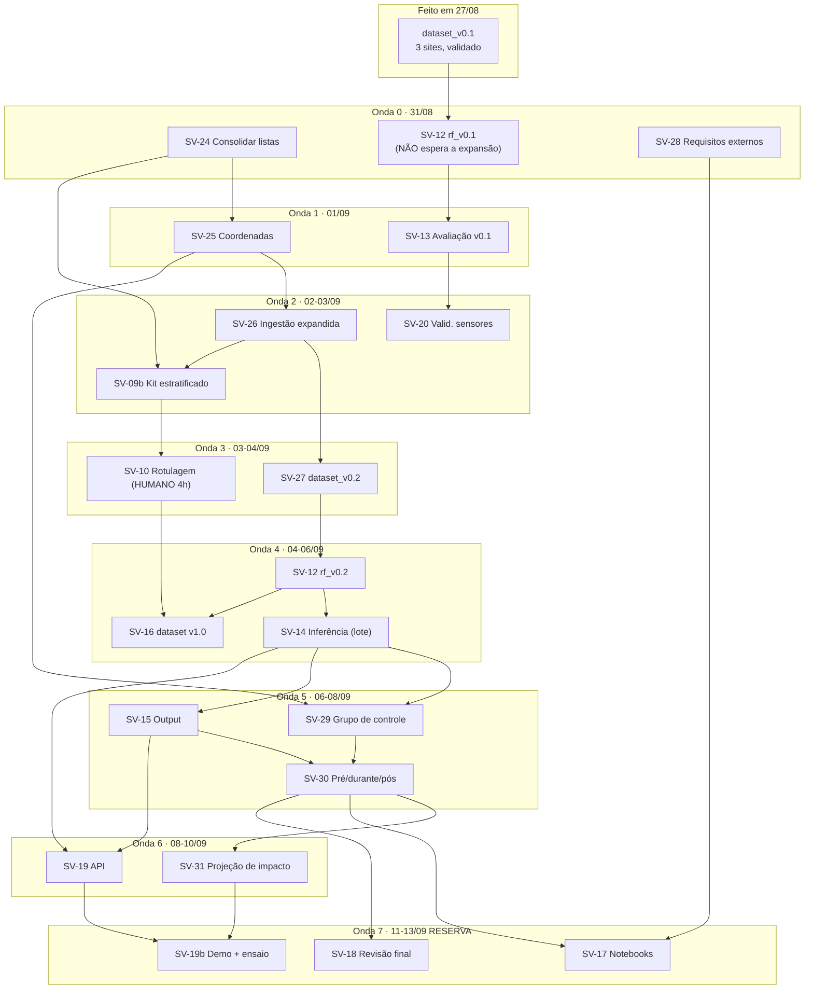

# Plano de Execução — Sentinela Verde / frente de ML

> Cada tarefa vive em `docs/tarefas/SV-XX-*.md` e é **auto-contida**: o arquivo da tarefa É o prompt
> de quem for implementá-la. Escopo, classes e fonte de labels vêm do `CLAUDE.md`.

- **Criado:** 2026-08-27 · **Revisado:** 2026-08-31 (4ª rodada — expansão de 3 para ~25 AOIs)
- **Prazo final:** **14/09/2026, apresentação de 20 min — fixo, sem prorrogação**
- **Hoje:** 31/08 · **Dias até a véspera:** **14** (31/08 a 13/09) — eram 18 no plano anterior

---

## 1. O que mudou nesta revisão

Três mudanças, todas decididas pelo usuário, todas com consequência de calendário:

1. **De 3 para ~25 AOIs.** O time levantou duas listas de data centers no Notion ("20 Data Centers de
   2016 a 2026" e "Lista dos 30..."). Elas serão consolidadas, deduplicadas, georreferenciadas e
   ingeridas. Tarefas novas: **SV-24, SV-25, SV-26, SV-27**.
2. **Variáveis externas não-imagem viram documento, não pipeline.** População, renda, PIB, MW,
   distâncias — este repositório **não coleta**. Ele **define quais são úteis** e entrega isso como
   requisito para a frente de Engenharia. Tarefa nova: **SV-28**.
3. **Objetivo de modelagem novo: impacto de área candidata.** "O que aconteceria se um data center
   fosse construído aqui?" — prospectivo, ao contrário do classificador atual, que é retrospectivo.
   Tarefas novas: **SV-29, SV-30, SV-31**.

E uma consequência que não é opcional: **o Plus (SV-21/22/23, Siamese CNN) fica suspenso.** Não é
preferência; é aritmética — ver §2. A recomendação de cortá-lo, e não a expansão, está justificada em §6.

O que **não** mudou, e não está em discussão nesta revisão: as 5 classes, a fonte de labels
(ADR-004: MapBiomas + WorldCover), a harmonização multissensor (ADR-003), a janela 2013–2025 e o
buffer de 5 km (ADR-001), a regra de split por bloco de 1 km, e a reserva protegida de 11–13/09.

---

## 2. A conta honesta: cabe ou não cabe?

### 2.1 O que o repositório já mediu

Todo o pipeline até `dataset_v0.1` foi construído e executado **em um único dia** (27/08, das 10h39
às 20h21 — 15 commits, SV-01 a SV-11). Os números abaixo são medidos, não estimados:

| Item | 3 sites (medido em 27/08) | ~25 AOIs novas (projetado, linear) |
|---|---|---|
| Rasters ingeridos (S2 + Landsat + labels) | 87 | **~725** |
| Relógio de parede da ingestão | ~30–45 min | **5–9 h** (background) |
| Stack de features em disco | 894 MB | **~7,5 GB** (disco livre hoje: 26 GB) |
| Linhas do dataset | 1,31 M | **~11 M** com o teto atual de 8.000 |
| Um fit de Random Forest | minutos | **30–80 min** com o teto atual |
| **Rotulagem manual (SV-10)** | **~180 polígonos em ~2h30–3h** | **~1.500 polígonos ≈ 21 h** |

### 2.2 Onde a conta quebra — e onde não quebra

**Não quebra na ingestão.** 5–9 h de relógio de parede é tempo de máquina, roda em background, e o
usuário trabalha em outra trilha enquanto isso. Custa disco e paciência, não dias.

**Não quebra no disco.** 26 GB livres, ~10 GB consumidos. Aperta, e SV-26 tem uma trava de 12 GB.

**Quebra no treino, mas tem conserto trivial.** 11 M de linhas fariam cada `GroupKFold` custar 3–7 h,
e o ciclo "treinou, olhou, ajustou" morre. Conserto: baixar o teto de amostragem de 8.000 para ~2.000
por classe × AOI × ano × sensor (SV-27). **Mais pixels do mesmo lugar não são mais informação** —
é exatamente por isso que o split é por bloco. O que a expansão trouxe de valioso foi diversidade de
bioma, não contagem de linha.

**Quebra de verdade na rotulagem manual.** 21 horas de trabalho humano, de uma pessoa, em 14 dias que
já têm outras ~55 h de trabalho. **Não escala com mais agentes, não escala com dinheiro.** É o
equivalente, nesta revisão, ao que o gargalo de GPU era na revisão de 27/08.

### 2.3 A saída: a unidade de amostragem "site" estava errada

O classificador é **por pixel**, sobre reflectância harmonizada e índices espectrais. Ele **não tem
`site_id` como feature** — e SV-27 proíbe explicitamente que tenha `bioma` ou `regiao` também.
Rotular a segunda AOI de Hortolândia não ensina nada que a primeira já não tenha ensinado: mesmo solo,
mesmo bioma, mesma estação, mesmo sensor.

O que o modelo ainda **não** viu, e que só a expansão trouxe, é **outro tipo de solo**. Canteiro de
obra sobre latossolo vermelho do interior de SP e canteiro sobre solo arenoso claro do Ceará têm
assinaturas espectrais diferentes de verdade.

**A unidade de amostragem correta é o estrato (bioma × era de sensor), não o site:**

| Regra | Polígonos | Horas humanas | Diversidade espectral coberta |
|---|---|---|---|
| 60 por site × 25 AOIs | 1.500 | **~21 h** | ~2 biomas (a maioria é Sudeste repetido) |
| **40 por estrato × ~6 estratos** | **~240** | **~3,5 h** | **~5 biomas** |

Seis vezes menos trabalho humano, cobrindo **mais** diversidade. Isso não é um corte de qualidade —
é a correção de um erro de desenho amostral. Formalizado em **SV-09b** e na revisão de **SV-10**.

### 2.4 Veredito

| Cenário | Cabe? |
|---|---|
| 25 AOIs + rotulagem estratificada + análise de impacto + documentação | **Sim**, com ~10% de folga |
| 25 AOIs + rotulagem **por site** (1.500 polígonos) | **Não.** Estoura em ~21 h de trabalho humano |
| 25 AOIs + Plus (Siamese) + documentação | **Não.** Faltam ~20 h |
| 25 AOIs + regressor preditivo treinado (SV-31 opção B) | **Não**, e seria estatisticamente indefensável com N=20 |

**Orçamento restante** (estimativas com margem de 1,6×, mesma convenção do plano anterior):

| Bloco | Horas |
|---|---|
| Fechar a V1 (SV-12, 13, 14, 15, 16, 20) | ~28 h |
| Expansão (SV-24, 25, 26, 27, 09b, 10) | ~20 h |
| Impacto (SV-29, 30, 31) e requisitos (SV-28) | ~17 h |
| Entrega (SV-17, 19, 19b, 18) | ~16 h |
| **Total** | **~81 h** |

**11 dias produtivos** (31/08 a 10/09) × 10 h = 110 h nominais. Descontando troca de contexto, a
vazão efetiva fica em **~80–90 h**. Fecha, com folga de ~10%. **Com o Plus, seriam ~102 h contra
85 h de vazão — não fecha.**

### 2.5 A premissa que precisa ser dita em voz alta

Toda essa conta assume **10 h/dia, todos os dias**. Os commits do repositório contam outra história:
**tudo o que existe foi feito em 27/08, e os dias 28, 29 e 30 não têm nenhum commit.** Quatro dias de
calendário renderam um dia de trabalho.

Não é uma acusação — pode ter havido trabalho não commitado, ou imprevisto. Mas é **a variável mais
determinante do plano inteiro**, muito mais que qualquer decisão técnica aqui. Se o ritmo real for de
~2,5 h/dia, nada nesta revisão cabe, e a conversa certa não é sobre qual alavanca puxar: é sobre
reduzir o escopo para o que 30 h de trabalho entregam (§7, alavancas 1 a 3, todas de uma vez).

**Recomendação: calibrar isso hoje, e não no dia 9.** Se até o fim de 02/09 as tarefas SV-24, SV-25 e
SV-12 não estiverem fechadas, o plano é fechar o escopo em ~12 AOIs, sem SV-31, e seguir.

---

## 3. Cronograma por fases — 31/08 a 14/09

| Fase | Dias | Datas | Entrega |
|---|---|---|---|
| **1b — Expansão** | 4 | 31/08–03/09 | Lista consolidada, coordenadas validadas, séries ingeridas |
| **2b — Dataset e rotulagem** | 2 | 03/09–04/09 | `dataset_v0.2` + labels manuais estratificados |
| **3 — Modelo e análise** | 4 | 05/09–08/09 | RF v0.2, inferência, controles, perfis pré/durante/pós |
| **4 — Produto** | 2 | 09/09–10/09 | Projeção de impacto, API, output para Indicadores |
| **🔒 Congelamento** | — | **fim de 10/09** | **Nada de modelo ou feature novo depois daqui** |
| **5 — Entrega** | 3 | 11/09–13/09 | Notebooks, model card, demo ensaiada, revisão final |
| **Apresentação** | — | **14/09 (seg)** | 20 min |

### Calendário dia a dia

| # | Data | Dia | Trilha A — Dados/Engenharia | Trilha B — Modelagem/Análise |
|---|---|---|---|---|
| 1 | 31/08 | seg | **SV-24** consolidar as duas listas | **SV-12** treinar `rf_v0.1` nos 3 sites · **SV-28** requisitos externos (início) |
| 2 | 01/09 | ter | **SV-25** validar coordenadas em escala | **SV-13** avaliação em holdout (v0.1) · SV-28 fechar |
| 3 | 02/09 | qua | **SV-26** disparar ingestão cedo (roda o dia) · **SV-09b** kit estratificado | **SV-20** validação entre sensores (roda sobre os 3 sites) |
| 4 | 03/09 | qui | SV-26 fechar + validar grades · **SV-27** dataset v0.2 (início) | **SV-10** rotulagem manual (**humano, timebox 4 h**) |
| 5 | 04/09 | sex | SV-27 fechar | **SV-12** re-treino `rf_v0.2` · **SV-16** dataset v1.0 com labels manuais |
| 6 | 05/09 | sáb | **SV-14** inferência em todas as AOIs (lote) | **SV-13** re-avaliação + holdout espacial |
| 7 | 06/09 | dom | **SV-29** grupo de controle (gerar + ingerir) | **SV-15** output para Indicadores |
| 8 | 07/09 | seg | SV-29 fechar (inferência nos controles) | **SV-30** perfis pré/durante/pós (início) |
| 9 | 08/09 | ter | **SV-19** API (FastAPI) | **SV-30** fechar: assinatura agregada + fichas |
| 10 | 09/09 | qua | SV-19 fechar | **SV-31** projeção de impacto por análogo |
| 11 | 10/09 | qui | Absorção de atraso · fechar pendências | SV-31 fechar · 🔒 **congelamento ao fim do dia** |
| 12 | 11/09 | sex | **SV-17** notebooks + model card | SV-17 (notebooks 03 e 04) |
| 13 | 12/09 | sáb | **SV-19b** demo + **ensaio cronometrado** | SV-17 fechar + README |
| 14 | 13/09 | dom | **SV-18** revisão de segurança | **SV-18** revisão de código · ensaio final |
| — | **14/09** | **seg** | **APRESENTAÇÃO — 20 min** | |

**A decisão de calendário mais importante está no dia 1:** SV-12 **não espera a expansão**.
`dataset_v0.1` já existe e está validado. Treinar `rf_v0.1` hoje significa que, de amanhã em diante,
o projeto **sempre tem um modelo funcional para apresentar**, aconteça o que acontecer com as 25 AOIs.
É a proteção mais barata do plano inteiro, e custa 2h30.

**O dia 11 (10/09) é folga deliberada.** Com execução solo e sem backup, um dia perdido custa ~9% do
orçamento. O plano absorve um dia perdido; não absorve dois.

---

## 4. Ondas de execução

**Onda 0 — hoje, 31/08 (nada bloqueado, tudo em paralelo)**
`SV-24` (consolidar listas) · `SV-12` (baseline nos 3 sites) · `SV-28` (requisitos externos)

**Onda 1 — 01/09**
`SV-25` (⬅ SV-24) · `SV-13` (⬅ SV-12) · fechar SV-28

**Onda 2 — 02–03/09**
`SV-26` (⬅ SV-25) · `SV-09b` (⬅ SV-24, e SV-26 para os estratos novos) · `SV-20`

**Onda 3 — 03–04/09**
`SV-10` (⬅ SV-09b, **humano**) · `SV-27` (⬅ SV-26)

**Onda 4 — 04–06/09**
`SV-12` re-treino e `SV-16` (⬅ SV-27, SV-10) · `SV-14` (⬅ SV-12) · `SV-13` re-avaliação

**Onda 5 — 06–08/09**
`SV-29` (⬅ SV-25, SV-14) · `SV-15` (⬅ SV-14) · `SV-30` (⬅ SV-29, SV-15)

**Onda 6 — 08–10/09**
`SV-19` (⬅ SV-14, SV-15) · `SV-31` (⬅ SV-30)

**Onda 7 — 11–13/09 (reserva protegida)**
`SV-17` · `SV-19b` · `SV-18`

**Dependências externas isoladas** (não travam nada): **SV-03** (schema default já em uso),
**SV-10** (SV-27/12/13 rodam com labels automáticos), **SV-28** (é documento; ninguém depende dele
para executar), a aprovação humana do tier 1 em SV-24 (única aprovação bloqueante, e leva ~40 min).

---

## 5. Reserva protegida de entrega (não negociável)

**Dias 12, 13 e 14 (11–13/09) continuam reservados** para documentação, demo e revisão. Nota da
disciplina exige demonstração funcional e documentação completa — critério explícito do professor.

- Nenhum modelo novo, nenhuma feature nova, nenhuma tarefa de dados entra depois de 10/09.
- Tarefa de modelagem que estourar o prazo é **cortada**, não empurrada para dentro da reserva.
- O ensaio de SV-19b acontece em **12/09**, não em 13/09 — para sobrar um dia inteiro de margem para
  corrigir o que o ensaio revelar. Ensaio na véspera é ensaio decorativo.

---

## 6. Por que cortar o Plus e não a expansão

As duas não cabem juntas (§2.4). A escolha é entre uma demonstração de técnica e uma conclusão sobre
o problema:

| | Plus (SV-21/22/23) | Expansão (SV-24…SV-31) |
|---|---|---|
| Custo | ~21 h | ~37 h (mas ~20 h delas já são o caminho da V1 escalada) |
| O que entrega | Um FC-Siam-diff treinado, comparado ao RF | Uma assinatura territorial de ~25 casos, com controle pareado e projeção para área candidata |
| Risco de não entregar | **Alto** — pode não convergir no timebox; depende de GPU externa (D-11) | Baixo — é o pipeline existente rodando em mais lugares |
| Se der certo, a frase final é | *"treinamos uma rede siamesa e ela detectou mudança um pouco melhor/pior que a diferença das classificações"* | *"data centers no Brasil apresentam esta assinatura territorial, medida em ~25 casos contra controles pareados"* |
| Responde ao pedido do usuário de hoje | Não | **Sim** — é literalmente o modelo de impacto |

A análise de mudança **não se perde** com o corte: a comparação pós-classificação que SV-23 faria
continua sendo entregue por SV-30, sobre ~25 AOIs em vez de 3, e agora com grupo de controle.

SV-21/22/23 ficam **suspensas, não canceladas** — escritas por inteiro, no topo do backlog.

---

## 7. Alavancas de corte, em ordem

Checkpoint em **03/09 (dia 4)**: se SV-26 não tiver fechado, puxe uma alavanca **naquele dia**.

| # | Corte | Economia | Custo |
|---|---|---|---|
| 1 | **Tier 2 reduzido:** ingerir só o tier 1 + 3 AOIs de holdout | ~4 h + metade do relógio de ingestão | Perde-se a largura do painel de SV-30, mantém-se a conclusão. **É a melhor alavanca** |
| 2 | **SV-31 vira backlog documentado** | ~4 h | Perde-se a projeção de área candidata — que é o item mais vistoso, mas o menos essencial |
| 3 | **SV-29 reduzida a 1 controle só nas AOIs de tier 1** | ~2 h | Contraste mais fraco, mas ainda existe |
| 4 | **SV-16 cortada:** V1 fecha com `rf_v0.2`, sem labels manuais | ~2h30 | A rotulagem vira melhoria documentada. Só depois de já ter feito SV-10 é que isso é desperdício — corte antes, não depois |
| 5 | **Voltar para 12 AOIs** (só o tier 1) | ~8 h | Nenhuma conclusão metodológica muda; a de SV-30 fica com N menor |

**Nunca cortar:** SV-17 (documentação), SV-19b (demo e ensaio), SV-18 (revisão), SV-20 (validação
entre sensores), SV-25 (coordenadas — cortar aqui é publicar número sobre o terreno errado).

---

## 8. Decisões técnicas registradas

Mantidas de 27/08: **D-01** a **D-10** e **D-12** seguem firmes.
**D-11** (treino do Plus em GPU) fica **suspensa** junto com SV-22.

| ID | Decisão | Razão | Status |
|---|---|---|---|
| **D-13** | **A unidade de análise é a AOI (buffer de 5 km), não o prédio.** Prédios do mesmo campus a menos de 5 km viram uma AOI, e a lista de prédios com seus anos vira metadado | Ingerir 5 vezes o mesmo raster é desperdício; e um campus com prédios de 2018, 2019, 2021 e 2022 é uma AOI com escada de eventos — mais rica, não redundante | **Decidida (SV-24)** |
| **D-14** | **Dois tiers.** Tier 1 (~12 AOIs): pipeline completo + rotulagem. Tier 2 (~13–18): pipeline + inferência, **sem** rotulagem, servindo de generalização fora-da-amostra | O orçamento de rotulagem é humano e fixo. O tier decide **onde o tempo humano é gasto**, não quem entra no estudo | **Decidida (SV-24)** |
| **D-15** | **Rotulagem manual é amostrada por estrato (bioma × era), não por site** | O classificador não tem `site_id` como feature; a segunda AOI do mesmo bioma não ensina nada nova. 240 polígonos em 6 estratos cobrem mais diversidade que 1.500 por site — §2.3 | **Decidida (SV-09b)** |
| **D-16** | **Teto de amostragem baixado de 8.000 para ~2.000** por classe × AOI × ano × sensor | Com o teto antigo e 25 AOIs, um `GroupKFold` custaria 3–7 h e o ciclo de experimentação morreria. Pixel vizinho não é informação nova | **Decidida (SV-27)** |
| **D-17** | **`regiao`, `bioma`, `uf`, `tier` e `fase` são chaves de análise, nunca features do modelo** | Bioma como feature faria o modelo aprender "no Nordeste é solo exposto" em vez da assinatura espectral, e desabar na primeira AOI nova | **Firme (SV-27, SV-12)** |
| **D-18** | **Cascata de fontes para coordenadas:** PeeringDB → OSM/Overpass → geocode → visual humano, com verificação automática de plausibilidade por contexto de cobertura | Conferir 28 pontos no Google Maps é tempo humano gasto onde não há julgamento. A verificação automática reduz a fila visual a ~4–8 casos | **Decidida (SV-25)** |
| **D-19** | **Grupo de controle pareado é requisito, não enfeite** | "Caiu 12%" não é impacto sem "…contra 3% em áreas comparáveis". Nenhum documento do time menciona isso, e no nosso pipeline é barato: mesmas ferramentas, outras coordenadas | **Decidida (SV-29)** |
| **D-20** | **O "modelo de impacto" é projeção por análogo histórico, não regressor treinado** | N = ~20 casos, e as covariáveis mais explicativas (MW, área, investimento) não são coletadas por este repo. Um regressor aí ajusta ruído e é a peça mais fácil de derrubar numa banca | **Recomendada — aguarda o usuário (SV-31)** |
| **D-21** | **Variáveis externas não-imagem: este repo define, não coleta** | Decisão do usuário. O valor que esta frente agrega é o parecer sobre utilidade e granularidade, não a integração | **Decidida (SV-28)** |
| **D-22** | **Plus (SV-21/22/23) suspenso** | 14 dias não comportam expansão + Deep Learning. A análise de mudança sobrevive via SV-30 — §6 | **Recomendada — aguarda o usuário** |

---

## 9. Definition of Done (atualizada)

| # | Critério | Tarefa | Status |
|---|---|---|---|
| 1 | 5 classes codificadas e usadas de ponta a ponta | SV-05 | ✅ feito |
| 2 | Série 2013–2025 harmonizada, resíduo entre sensores medido | SV-02b, SV-06, SV-06b, SV-20 | parcial |
| 3 | Dataset versionado, sem vazamento espacial/temporal/entre-sensores | SV-11 ✅ → SV-27 | parcial |
| 4 | Baseline Random Forest treinado, registrado, reprodutível | SV-12 | pendente |
| 5 | Avaliação em holdout: accuracy, F1 por classe, matriz de confusão, por era | SV-13 | pendente |
| 6 | Classificação reproduzível nas duas eras, em todas as AOIs | SV-14 | pendente |
| 7 | Output consumível pela frente de Indicadores | SV-15 | pendente |
| 8 | **~25 AOIs consolidadas, georreferenciadas com fonte e precisão declaradas** | SV-24, SV-25 | **novo** |
| 9 | **Generalização fora-da-amostra medida (AOIs inteiras nunca vistas)** | SV-27, SV-16 | **novo** |
| 10 | **Perfil pré/durante/pós com grupo de controle pareado** | SV-29, SV-30 | **novo** |
| 11 | **Projeção de impacto para área candidata, com faixa e N declarados** | SV-31 | **novo** |
| 12 | **Requisitos de dados externos entregues à frente de Engenharia** | SV-28 | **novo** |
| 13 | API/demo funcional, ensaiada, offline | SV-19, SV-19b | pendente |
| 14 | Documentação completa: notebooks, model card, ADRs, README | SV-17 | pendente |
| 15 | Nada sensível/pesado no git; reprodução do zero validada | SV-01, SV-18 | parcial |

---

## 10. Índice de tarefas

### Feitas (27/08)
SV-01 · SV-02 · SV-03/ADR-002 · SV-04 · SV-05 · SV-02b/ADR-003 · SV-05b/ADR-004 · SV-06 · SV-06b ·
SV-07 · SV-08 · SV-09 · SV-11

### Novas nesta revisão

| ID | Tarefa | Onda | Data-alvo | Trilha | Risco |
|---|---|---|---|---|---|
| [SV-24](tarefas/SV-24-consolidacao-lista-sites.md) | Consolidação e dedup por AOI + tiering | 0 | 31/08 | A | — |
| [SV-25](tarefas/SV-25-validacao-coordenadas-escala.md) | Validação de coordenadas em escala | 1 | 01/09 | A | **SIM** |
| [SV-26](tarefas/SV-26-execucao-pipeline-expandido.md) | Execução do pipeline no conjunto expandido | 2 | 02–03/09 | A | — |
| [SV-09b](tarefas/SV-09b-kit-rotulagem-estratificado.md) | Kit de rotulagem estratificado | 2 | 02/09 | A | — |
| [SV-27](tarefas/SV-27-dataset-v0.2-expandido.md) | Dataset v0.2 expandido | 3 | 03–04/09 | B | — |
| [SV-28](tarefas/SV-28-requisitos-dados-externos.md) | Requisitos de dados externos (handoff) | 0 | 31/08–01/09 | B | — |
| [SV-29](tarefas/SV-29-grupo-controle-pareado.md) | Grupo de controle pareado | 5 | 06–07/09 | A | **SIM** |
| [SV-30](tarefas/SV-30-perfil-pre-durante-pos.md) | Perfil pré/durante/pós + assinatura | 5 | 07–08/09 | B | **SIM** |
| [SV-31](tarefas/SV-31-impacto-area-candidata.md) | Projeção de impacto por análogo | 6 | 09/09 | B | **SIM** |

### Revisadas nesta revisão

| ID | O que mudou |
|---|---|
| [SV-10](tarefas/SV-10-rotulagem-manual-execucao.md) | Cotas por **estrato**, não por site; timebox duro de 4 h |
| [SV-12](tarefas/SV-12-baseline-random-forest.md) | **Não espera a expansão** — treina `rf_v0.1` hoje; features de estrato proibidas |
| [SV-14](tarefas/SV-14-inferencia-raster-classificado.md) | Lote sobre ~50 AOIs (tratamento + controle), tier 1 primeiro |
| [SV-15](tarefas/SV-15-output-indicadores.md) | Ganha `tipo`, `pareado_com`, `tier`, `precisao_coordenada` |
| [SV-16](tarefas/SV-16-dataset-v1.0-retreino.md) | Comparação por bioma e no holdout espacial |
| [SV-21](tarefas/SV-21-pares-bitemporais-labels-mudanca.md) · [SV-22](tarefas/SV-22-modelo-siamese-change-detection.md) · [SV-23](tarefas/SV-23-avaliacao-plus-vs-baseline.md) | ⏸️ **Suspensas** — §6 |

### Inalteradas
SV-13 · SV-17 · SV-18 · SV-19 · SV-19b · SV-20

**32 tarefas ao todo · 13 feitas · 3 suspensas · 16 em jogo.**

---

## 11. Grafo de dependências (a partir de hoje)

**Caminho crítico:** `SV-24 → SV-25 → SV-26 → SV-27 → SV-12 → SV-14 → SV-29 → SV-30 → SV-31 → SV-19b`

Dez tarefas. O ponto mais frágil é **SV-25 → SV-26**: se a validação de coordenadas escorregar um dia,
a ingestão escorrega junto e come a folga do dia 11. Por isso SV-25 tem kill-switch explícito
(fila visual acima de 8 AOIs → reduz o escopo e segue, não estende a tarefa).

---

## 12. Riscos

| Risco | Impacto | Mitigação | Kill-switch |
|---|---|---|---|
| **Ritmo real muito abaixo de 10 h/dia** (3 dos últimos 4 dias sem commit) | **Crítico** — é a premissa de tudo | Calibrar em **02/09**, não no dia 9: SV-24, SV-25 e SV-12 fechadas até lá, ou o escopo cai | Fechar em 12 AOIs (tier 1), sem SV-31, sem tier 2 |
| **Rotulagem manual estoura** — o gargalo que não escala com agentes nem com dinheiro | **Crítico** | Amostragem por estrato (D-15): 21 h → ~3,5 h. Timebox **duro** de 4 h em SV-10 | Entregar a contagem parcial por estrato e seguir; SV-16 filtra por `confianca` |
| **Coordenada errada → relatório perfeito sobre o terreno errado** | **Crítico** — e silencioso: nada a jusante detecta | Cascata de fontes + V1–V5 automáticas + fila visual (SV-25). `precisao_coordenada` propagado até o CSV de SV-15 | Marcar `ativo: false` e reportar; nunca publicar `inferida` no agregado |
| **Afirmar causa onde só há contraste** — o output nomeia ~25 empresas reais | **Crítico** | Grupo de controle pareado (SV-29) + linguagem de contraste obrigatória no CSV e na figura (SV-30) | Publicar como variação observada, sem atribuição |
| **Degrau de sensor em 2019 lido como impacto** — coincide com o período de obra de vários casos | **Crítico** | SV-02b mediu o resíduo; SV-20 mede na área; SV-30 exige `sensor` visível em toda série | Publicar as duas eras como séries separadas |
| **Clima não controlado** — ano seco derruba NDVI em todo lugar | Alto | Limitação declarada em toda afirmação de vegetação; requisito registrado em SV-28 para a Engenharia | Nenhum: é limitação assumida e documentada |
| **Dataset expandido inviabiliza o ciclo de treino** | Alto | D-16: teto 8.000 → 2.000. Teste de custo em SV-27 (um fit acima de 15 min = teto alto demais) | Amostrar por AOI em vez de por bloco no CV |
| **Disco (26 GB livres, ~10 GB consumidos)** | Médio | Trava de 12 GB em SV-26; features em int16 | Manter só o tier 1 em disco; regerar tier 2 sob demanda |
| **Janela sazonal jun–set não serve fora do Sudeste** | Médio | SV-26 inspeciona 3 AOIs de biomas novos e **reporta** — não ajusta sozinho | Reduzir o tier ao Sudeste + Sul, documentando |
| **Vazamento entre sensores no split** | **Crítico** | `bloco_id` por coordenada projetada; testes bloqueantes herdados de SV-11 para SV-27 | — |
| **Execução solo, sem backup** | Alto | Folga de ~10% + dia 11 (10/09) deliberadamente vazio | Alavancas 1–3 de §7, no mesmo dia da perda |
| **Demo falha na apresentação** | Médio | 100% local e offline; ensaio em **12/09**, não na véspera | Vídeo de 2–3 min gravado |

---

## 13. Backlog (fora do prazo de 14/09)

- **SV-21/22/23 — Plus Siamese CNN.** Suspenso, escrito por inteiro, primeiro da fila.
- Regressor de impacto treinado (SV-31 opção B) — quando houver N e as covariáveis de porte.
- Integração das variáveis externas de SV-28 (datalake, STAC, ANA/INMET/IBGE/OSM) — frente de Engenharia.
- Socioeconômico em setor censitário, com compatibilização 2010↔2022.
- Faixa 2000–2011 com Landsat 5/7 (D-09).
- Janela sazonal por região, em vez de jun–set global.
- Encoder pré-treinado em Sentinel-2 (TorchGeo / SSL4EO-S12).
- Integração com o repo irmão `datacenter-extracao-modelos`.
