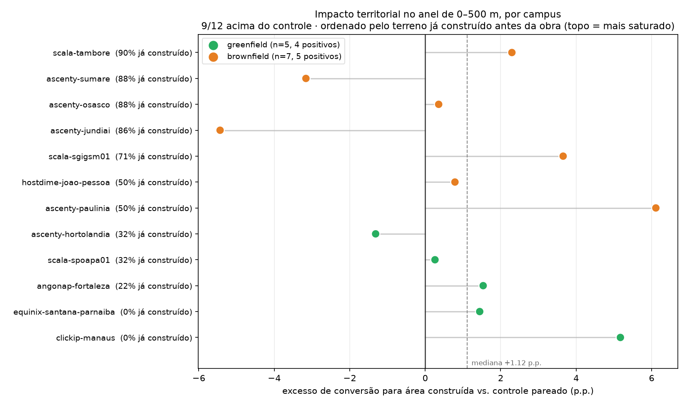

# Impacto territorial de data centers no Brasil

**O que medimos, o que sobrevive a teste, e o que não sabemos.**

- **Gerado por:** `dados-modelo-impacto/scripts/impacto_dc_*.py` (passos 1–22) e
  `modelo-impacto-score/scripts/0{1,2,3}_*.py`
- **Atualizado:** 2026-09-10
- **Amostra:** 15 campi de data center, cada um com um controle pareado sem data center; painel 2013–2025
- **Classificador:** `rf_v1.0-tuned` · **Pareamento:** `dados-modelo-impacto/raw/controles-rf/METODOLOGIA.md`

---

## 1. A pergunta e o que ela não é

> **Depois que um data center é construído, o terreno ao redor muda mais do que mudaria um terreno
> parecido sem data center?**

Não é "apareceu um prédio" — isso seria circular, e é a primeira coisa que se deve descartar. Toda
medida aqui é **contra um controle pareado**, e o anel de análise **exclui o footprint do próprio
data center**. O que se mede é conversão de terreno **fora da cerca**, que podia perfeitamente ser
zero.

Em hectares, para dar escala: o data center mediano tem **1,29 ha** de footprint, e o excesso
convertido fora dele, dentro de 500 m, é **~1,2 ha**. Aproximadamente um hectare a mais se converte
ao redor para cada hectare de data center.

## 2. O desenho

Cada campus tem um controle pareado: ponto sem data center, mesmo estado e bioma, 15–40 km de
distância — perto o bastante para compartilhar clima e dinâmica regional, longe o bastante para não
estar dentro do raio de influência do empreendimento —, escolhido por similaridade de cobertura do
solo no ano anterior à obra.

Três regras sustentam a leitura:

1. **Sensor único por par.** A janela de cada campus cabe inteira em Landsat ou inteira em
   Sentinel-2, nunca cruza a fronteira 2018/2019. SV-20 mediu que o degrau ali é indistinguível de
   artefato de instrumento em 48 de 48 pares — comparar antes e depois em sensores diferentes seria
   medir o satélite, não a obra.
2. **A estatística é trajetória de pixel, não área agregada.** Um pixel só conta se **não** for
   construída nos 2 primeiros anos da janela, **for** construída nos 2 últimos, **e permanecer**.
3. **Tendências pré-obra verificadas.** Antes da obra, o tratamento crescia mais rápido que o
   controle em 6 de 14 pares (p=0,79). Não há evidência de que os data centers tenham sido erguidos
   onde a região já adensava — a hipótese identificadora se sustenta.

## 3. O boletim — quatro eixos, quatro selos

**Não há score único.** Um agregado exigiria pesos arbitrários e misturaria eixos com qualidade de
evidência incompatível.

| eixo | n | efeito mediano | p | selo |
|---|---:|---:|---:|---|
| Conversão para construída, anel **0–500 m** (sem o prédio) | 14 | **+1,50 p.p.** | **0,0065** | `forte` |
| Conversão para construída, anel **500 m–1 km** | 14 | **+1,15 p.p.** | **0,0065** | `forte` |
| Vegetação → construída, anel 0–500 m | 14 | **+0,52 p.p.** | **0,0287** | `forte` |
| Aquecimento de superfície (LST Landsat 30 m), anel 0–500 m | 12 | +0,51 °C | 0,388 | `nulo_amostra_pequena` |

O efeito **decai com a distância e desaparece**: 12/14 a 500 m e a 1 km, 8/14 e p=0,395 em 1–2 km.
E é **localizado, não regional**: de 0,5 km para 5 km o disco cresce 100×, mas o excesso cresce só
11,6× — a densidade cai 7×.

### O efeito é do entorno, não do prédio

Footprints reais do OpenStreetMap em 14 de 15 campi (7 com `building=data_center` explícito, área
mediana 1,29 ha). Dentro do footprint, só **4,8%** dos pixels viraram construída — porque **50%
(mediana) já eram construída antes da obra**, e em quatro casos 85–90%. Estes data centers foram
erguidos dentro de parques industriais que já existiam.

O contra-exemplo fecha: `clickip-manaus` é o único com 0% de terreno já construído, e ali **75%** dos
pixels do footprint viraram construída.

### Onde havia terreno, o efeito é maior

Sítios **greenfield** (< 50% do footprint já construído): **6 de 6** pares positivos, p=0,016,
mediana +2,40 p.p. **Brownfield**: 5 de 7, p=0,227, +0,77 p.p. Isso explica os dois únicos pares
negativos do estudo — `ascenty-jundiai` (−5,37 p.p.) e `ascenty-sumare` (−3,08 p.p.), com 86% e 88%
do footprint já construído: num sítio saturado sobra pouco terreno convertível, e o excesso encolhe
por motivo **mecânico**, não por ausência de efeito.

## 4. O que sobreviveu a teste — e o que não

Esta é a seção que decide se o trabalho vale. Cinco verificações independentes:

| verificação | o que testa | resultado |
|---|---|---|
| **Placebo** (passo 19) | o método acha efeito onde nada foi construído? | **PASSOU** ✓ |
| **Tendências pré-obra** (passo 12) | o DC foi construído onde já adensava? | **PASSOU** ✓ |
| **Gradiente de distância** (passo 14) | o efeito é local ou regional? | **PASSOU** ✓ |
| **Circularidade** (passo 22 / correção) | o "efeito" é o próprio prédio? | **PASSOU** ✓ |
| **Estudo de evento + janela longa** (passos 18, 20) | quando acontece, e persiste? | **INCONCLUSIVO** ⚠ |

### O placebo — a validação mais importante

15 pares **controle contra controle** (dois lugares sem data center cada), mesma janela, mesmo ano
de obra fictício, método idêntico:

| raio | **placebo** | **real** |
|---|---|---|
| 0,5 km | 8/15 · p=0,50 · +0,22 p.p. | 13/15 · **p=0,0037** · +1,93 p.p. |
| 1,0 km | 7/15 · p=0,70 · −0,26 p.p. | 13/15 · **p=0,0037** · +0,89 p.p. |
| 2,0 km | 7/15 · p=0,70 · −0,37 p.p. | 9/15 · p=0,30 · +0,62 p.p. |

O placebo cai **exatamente no acaso**, com sinal trocado em dois dos três raios. Aplicado onde nada
foi construído, o método não acha nada. Isso transforma o selo `forte` de um p-valor solto numa
taxa de falso positivo **medida**.

### O que ficou inconclusivo, e por quê

O estudo de evento (passo 18) mostrou o **timing certo** — pré-período plano, salto em t+1 (+2,6
p.p.) — mas o efeito não se sustentava até t+3. Estendemos a janela para t+6 (passo 20, 38
ponto-ano novos) e o resultado foi **inconclusivo**, com os dois anéis apontando para lados opostos:

| | curto prazo (t1–t3) | longo prazo (t≥4) | |
|---|---:|---:|---|
| anel 0–500 m | +1,16 p.p. | **−1,14 p.p.** | 4/9, p=0,75 |
| anel 0,5–1 km | +1,23 p.p. | **+3,28 p.p.** | 5/9, p=0,50 |

Com n=9 no horizonte longo, 4/9 e 5/9 são cara-ou-coroa. **Nem "o efeito persiste" nem "o controle
alcança" tem sustentação.** Fica como pergunta aberta, não como achado.

### A reconciliação — por que os resultados parecem discordar

Três resultados fracos (estudo de evento ruidoso, janela longa inconclusiva, deltas por classe
nulos) **não são três problemas: são um só**, e o passo 22 o isola de forma limpa.

O passo 22 mediu o delta de todas as 5 classes nos dois anéis — 10 combinações, **nenhuma
detectável**. Inclusive a própria classe `construida_urbana`, que a trajetória detecta com 13/15 e
p=0,0037, fica invisível quando medida como **estoque**: 8/15, p=1,00. Mesmos pares, mesmos anos,
mesma classe — só muda a estatística.

> **A leitura honesta:** com N=15, medidas de estoque não têm sensibilidade para um efeito de ~1,5
> p.p. Só a estatística de trajetória, que exige persistência e por isso filtra ruído de
> classificação, enxerga. Os passos 18, 20 e 22 são todos estoque, e todos ficam mudos pelo mesmo
> motivo.

**A contrapartida, que precisa ir para a apresentação:** o resultado central depende de **uma**
estatística. A defesa dela não é retórica — é o passo 19, que testou exatamente essa estatística e
mediu sua taxa de falso positivo.

## 5. O que este trabalho NÃO afirma

**Temperatura.** Medida **duas vezes**, e a segunda história é mais interessante que a primeira.

*Primeira medição (passo 16, MODIS `MOD11A2`, 1 km, disco de 5 km):* nulo, −0,07 °C, p=0,61. Mas um
nulo que não informava nada — o efeito vive num anel de 500 m, **menor que um pixel MODIS**. Efeito
esperado pela diluição: 0,0015 °C. Efeito mínimo detectável: 0,636 °C. Razão: **427×**.

*Segunda medição (passo 23, Landsat `ST_B10`, 30 m, anel de 500 m):* **872 pixels no anel** em vez
de uma fração de um. A estimativa muda de sinal e ganha estrutura:

| anel | aqueceram mais | mediana | p |
|---|---|---:|---:|
| 0–500 m | 8/12 | **+0,51 °C** | 0,388 |
| 0,5–1 km | 7/12 | +0,20 °C | 0,774 |

O gradiente de distância é **coerente com o eixo de conversão** — o anel externo tem menos da metade
do efeito do interno. Mas não atinge significância.

**E aqui está o achado contraintuitivo:** a resolução melhorou 33× e o **poder estatístico piorou**
(MDE 0,822 °C contra 0,636 °C). Porque `MDE = 2,80 × σ / √n`, e trocar de sensor não mexe em nenhum
dos dois termos a favor: n caiu de 15 para 12 (só os pares Landsat têm banda termal na janela) e o σ
entre pares subiu. **Resolução e poder estatístico são coisas diferentes**, e este é o contraexemplo
limpo disso.

O selo muda de natureza: sai de `nulo_sem_poder` (o sensor não veria nem se existisse) para
`nulo_amostra_pequena` (medimos na escala certa, o sinal aponta para +0,5 °C com o gradiente
esperado, e **seriam necessários n=31 pares** para confirmar — temos 12).

O dado é fisicamente sadio nas duas medições: LST e área construída correlacionam a **r=0,49** nos
204 ponto-ano, com contraste implícito de 7,2 °C entre 0% e 100% construído.

**Ressalva que acompanha o número:** LST é temperatura **radiativa de superfície**, não do ar. Para
"o entorno esquentou por causa da conversão de terreno" é a medida certa; para "está mais quente
para quem mora ali" é um limite superior.

**Água.** Nulo limpo: −0,000 p.p. no anel interno. O que um data center consome é água encanada,
invisível em imagem, e um espelho de resfriamento ficaria abaixo do que um pixel de 30 m distingue
num anel de 78 ha.

**Emprego, PIB, população.** Não afirmamos. São municipais, e os pares têm portes municipais de
razão 0,03 a 15,0 — em `everest-goiania` as duas pontas caem no mesmo município e o contraste é
literalmente zero. O eixo econômico na granularidade certa é viável (**12 de 12 CEPs resolvem a
logradouro**) mas está bloqueado por acesso à base CNPJ da Receita — ver o README de
`dados-modelo-impacto/`.

**Magnitude individual de um site novo.** 13 modelos testados, **todos** com R² LOOCV negativo,
permutação p=0,64. A direção é predizível; a magnitude não.

**Inferência causal formal.** É padrão consistente contra grupo de controle, com pré-tendências
verificadas e placebo. Não é estimativa causal de magnitude.

## 6. Limitações

- **N=15**, e 2 pares na direção contrária (ambos explicados por saturação do sítio).
- **`pct_ja_construida` só existe para 13 campi** — 2 sem footprint no OSM.
- **O corte de 50% greenfield/brownfield foi escolhido depois de ver os dados.** O script varre 7
  limiares e publica todos; greenfield fica 100% positivo de 40% a 80%. O teste contínuo (Spearman
  −0,31) tem direção consistente e magnitude fraca.
- **Horizonte longo com n=9.** Cinco campi de obra recente não alcançam t+4.
- **Sem série de precipitação.** Afirmações sobre vegetação carregam confundidor climático não
  controlado.
- **Anomalias registradas, não corrigidas:** `ascenty-maracanau` sem pixel válido no footprint;
  `equinix-santana-parnaiba` com polígono OSM que provavelmente cobre o lote, não a edificação;
  `scala-sgigsm01` com instabilidade de classificação em tecido urbano muito denso.

## 7. A conclusão

> Em **12 dos 14** data centers com par válido, o anel de 500 m ao redor — **excluído o prédio** —
> converteu para área construída mais do que um terreno pareado sem data center: excesso mediano de
> **1,50 p.p.**, **p=0,0065**. O efeito decai com a distância e desaparece depois de 1 km, é
> localizado e não regional, e é concentrado onde havia terreno livre (**6 de 6** greenfield). As
> tendências pré-obra eram paralelas, e o método, aplicado a 15 pares onde nada foi construído,
> **não encontra nada** (8/15, p=0,50).
>
> O que **não** sabemos: se o efeito persiste além de 3 anos (n=9, inconclusivo), se houve
> aquecimento (a estimativa na escala certa é +0,5 °C com gradiente coerente, mas precisaria de
> n=31 pares para confirmar e temos 12), e qual a magnitude esperada num site novo (13
> modelos, todos sem poder preditivo).

A segunda metade dessa conclusão é tão importante quanto a primeira.
