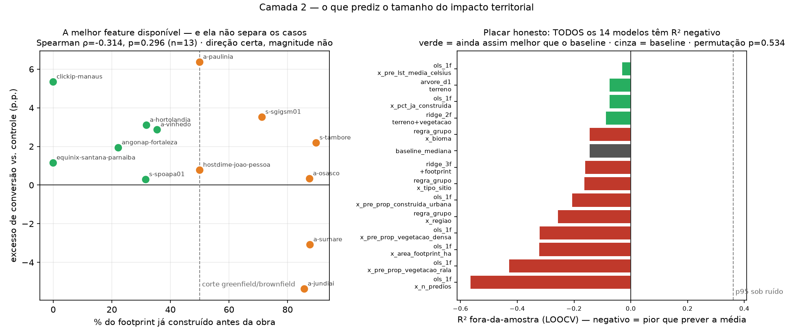
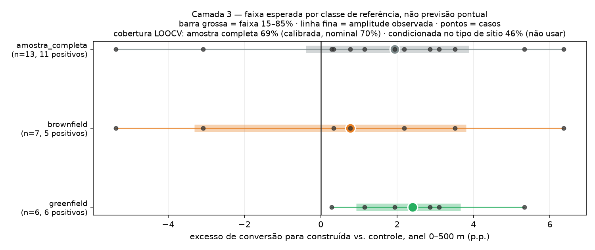

# Impacto territorial de data centers no Brasil — o que medimos, o que explica e o que não sabemos

- **Gerado por:** `modelo-impacto-score/scripts/01_boletim.py` → `02_explicacao.py` → `03_projecao.py`
- **Data:** 2026-09-10
- **Amostra:** 15 campi de data center pareados com 15 controles sem data center; painel 2013–2025
- **Classificador:** `rf_v1.0-tuned` · **Desenho de pareamento:** `dados-modelo-impacto/raw/controles-rf/METODOLOGIA.md`

---

## 1. A pergunta

Data centers estão sendo construídos rápido no Brasil, e a conversa pública sobre eles é feita de
afirmações sem medida — "consomem muita energia", "esquentam a região", "impulsionam a economia
local". A pergunta desta frente é estreita de propósito:

> **Depois que um data center é construído, o terreno ao redor muda mais do que mudaria um terreno
> parecido sem data center?**

Estreita porque é a única versão da pergunta que os dados disponíveis conseguem responder com um
grupo de controle, e porque um efeito medido contra controle vale mais que seis efeitos afirmados
sem ele.

## 2. O desenho

Cada campus de tratamento tem um **controle pareado**: um ponto sem data center, no mesmo estado e
bioma, a 15–40 km de distância (perto o bastante para compartilhar clima e dinâmica regional, longe
o bastante para não estar dentro do raio de influência do empreendimento), escolhido por
similaridade de **cobertura do solo no ano anterior à obra**.

Três regras que sustentam a leitura:

1. **Sensor único por par.** A janela de cada campus (`obra−3 .. obra+3`) cabe inteira em Landsat ou
   inteira em Sentinel-2, nunca cruza a fronteira 2018/2019. SV-20 mediu que o degrau entre sensores
   naquela fronteira é indistinguível de artefato de instrumento em 48 de 48 pares — comparar
   "antes" e "depois" em sensores diferentes seria medir o satélite, não a obra.
2. **A estatística é trajetória de pixel, não área agregada.** Somar área por classe no disco foi
   testado em 6 raios (0,5 a 5 km) e **não detecta a obra** — a fração de pares com excesso fica em
   ~0,5, cara ou coroa. A classe `solo_exposto_obras` é a pior do classificador (F1 0,579), e numa
   soma de área cada falso positivo pesa igual a um pixel verdadeiro. Um pixel só conta aqui se
   cumprir uma sequência ordenada e persistente: não ser construída nos 2 primeiros anos da janela,
   ser construída nos 2 últimos, e permanecer.
3. **Pré-tendências paralelas verificadas.** Antes da obra, o tratamento crescia em área construída
   mais rápido que o controle em apenas 6 de 14 pares (p=0,79). Não há evidência de que os data
   centers tenham sido erguidos justamente onde a região já urbanizava mais rápido — que é a
   hipótese identificadora do desenho, e a primeira coisa que deveria derrubá-lo.

## 3. O boletim — quatro eixos, quatro selos

**Não há um score único.** Um agregado exigiria pesos arbitrários e misturaria eixos com qualidade
de evidência incompatível. Cada eixo carrega o que ele próprio sustenta:

| eixo | n | efeito mediano | p | selo |
|---|---:|---:|---:|---|
| Conversão para construída, anel **0–500 m** | 14 | **+2,06 p.p.** | **0,0065** | `forte` |
| Conversão para construída, anel **500 m–1 km** | 14 | **+1,15 p.p.** | **0,0065** | `forte` |
| Vegetação → construída, anel 0–500 m | 14 | +0,79 p.p. | 0,090 | `sugestivo` |
| Aquecimento de superfície (LST, disco 5 km) | 15 | −0,07 °C | 0,607 | `nulo_sem_poder` |

`nulo_sem_poder` é a categoria que costuma ser reportada errado, e é por isso que ela existe aqui:
não se detectou aquecimento, **e o desenho não o detectaria nem se existisse** — não é evidência de
ausência de efeito. Detalhe na seção 6.

### O efeito é do entorno, não do prédio

Puxamos o footprint real de cada campus no OpenStreetMap (14 de 15, 7 com `building=data_center`
explícito, área mediana 1,29 ha). Dentro do footprint, só **4,8%** dos pixels viraram construída —
porque **50% (mediana) já eram construída antes da obra**, e em quatro casos 85–90%. Estes data
centers foram erguidos dentro de parques industriais que já existiam.

O contra-exemplo fecha o argumento: `clickip-manaus` é o único com 0% de terreno já construído, e
ali 75% dos pixels do footprint viraram construída.

Então o excesso medido **não é o prédio — é conversão no entorno dele**, e decai com a distância:

| zona | pares com excesso | p | excesso mediano |
|---|---:|---:|---:|
| 0–0,5 km | **12/14** | 0,0065 | +2,06 p.p. |
| 0,5–1 km | **12/14** | 0,0065 | +1,15 p.p. |
| 1–2 km | 8/14 | 0,395 | +0,51 p.p. |

E é **localizado, não regional**: de 0,5 km para 5 km o disco cresce 100×, mas o excesso cresce só
11,6× (1,53 → 17,75 ha). A densidade cai 7×. É assinatura de mudança concentrada no terreno, não de
uma região urbanizando por inteiro.


## 4. O que explica o tamanho — nada, e isso está medido

O passo 15 de `dados-modelo-impacto` achou uma regra de uma variável que funciona: sítios
**greenfield** (< 50% do footprint já construído) dão 6/6 pares positivos (p=0,016, mediana
+2,40 p.p.), contra 5/7 e p=0,227 em brownfield. Isso explica os dois únicos pares negativos do
estudo — `ascenty-jundiai` (−5,37 p.p.) e `ascenty-sumare` (−3,08 p.p.), com 86% e 88% do footprint
já construído: num sítio saturado sobra pouco terreno convertível, e o excesso encolhe por motivo
**mecânico**, não por ausência de efeito.

A pergunta desta camada era: **alguma coisa bate `pct_ja_construida` sozinho?**

Testamos 13 modelos contra o baseline "prever a mediana", todos por validação cruzada
leave-one-out, N=13:

| | resultado |
|---|---|
| melhor modelo | R² fora-da-amostra **−0,03** |
| todos os 13 modelos | R² **negativo** — piores que prever a média |
| melhor feature (`pct_ja_construida`) | Spearman ρ=−0,31, **p=0,30** |
| teste de permutação (999 embaralhamentos) | **p=0,53** |

**Nenhum modelo tem poder preditivo demonstrado.** O melhor ajuste encontrado é indistinguível do
que ruído puro produz na mesma busca.

Isto **não** contradiz o achado greenfield/brownfield. São duas perguntas, e as duas respostas estão
certas:

- *"a **direção** é consistente?"* → **sim**: 6/6 greenfield positivos, p=0,016 (teste de sinal)
- *"a **magnitude** é predizível?"* → **não**: R² LOOCV negativo em todos os modelos

Um teste de sinal pergunta se o efeito aponta para o mesmo lado; uma regressão pergunta se dá para
prever o quanto. Com 13 casos muito heterogêneos — um campus de 400 MW e um prédio de 3 MW, Manaus e
Porto Alegre — a primeira resposta se sustenta e a segunda não.



## 5. A projeção — classe de referência, não previsão

Como a regressão de magnitude falhou, projetar um site novo não pode devolver um número. Devolve o
que sítios comparáveis de fato produziram — uma previsão de **classe de referência**, que continua
válida quando a regressão individual falha porque não afirma nada sobre o caso, e sim sobre a
taxa-base do grupo.

Intervalo não se valida por R². Valida-se por **cobertura**:

| estratégia | cobertura da faixa 15–85% | largura mediana | veredito |
|---|---:|---:|---|
| classe única (amostra completa) | **69%** (nominal 70%) | 5,05 p.p. | **calibrada — é esta que se usa** |
| condicionada em greenfield/brownfield | 46% | 4,75 p.p. | estreita só 0,3 p.p. e perde cobertura |

Condicionar no tipo de sítio **piora** o intervalo: com subgrupos de n=6 e n=7 os percentis ficam
instáveis. O achado direcional continua valendo; o intervalo condicionado, não. É um caso limpo de
duas conclusões que parecem contraditórias e não são — e que só aparecem se você validar as duas
coisas separadamente.

```
$ python modelo-impacto-score/scripts/03_projecao.py --pct-ja-construida 15

--- projeção para um site com 15% já construído (greenfield) ---
direção   — 6/6 dos análogos greenfield converteram MAIS que seu controle (100%)
magnitude — faixa 15–85%: -0.39 a +3.88 p.p., mediana +1.93 p.p.
```



## 6. O que este trabalho NÃO afirma

**Temperatura.** Medida, reportada e marcada `nulo_sem_poder`. A LST vem do MODIS `MOD11A2`
(1 km de resolução) num disco de 5 km, e o efeito vive num anel de 500 m — menor que um pixel:

| | valor |
|---|---:|
| efeito esperado no disco, pela diluição | 0,0015 °C |
| efeito mínimo detectável (n=15, α=0,05, poder 80%) | 0,636 °C |
| razão | **427×** |

O dado não é ruim — ao longo dos 204 ponto-ano, LST e proporção de área construída correlacionam a
**r=0,49**, com contraste implícito de 7,2 °C entre 0% e 100% construído. A física está lá. O que
falta é escala, e responder isso de verdade exige a banda termal do Landsat (30 m).

**Emprego, PIB e população.** Todos de nível municipal. Um empreendimento de dezenas de hectares é
fração ínfima de um município, e os pares têm portes municipais de razão 0,03 a 15,0 — em
`everest-goiania` as duas pontas caem no mesmo município e o contraste é literalmente zero. Servem
como contexto e estratificação; não entram em nenhum eixo do boletim.

**Magnitude individual de um site novo.** Seção 4, resultado negativo, medido.

**Inferência causal formal.** N=15, com pré-tendências paralelas verificadas. É padrão consistente
contra grupo de controle — não estimativa causal de magnitude.

## 7. Limitações honestas

- **N=15**, e 2 dos pares vão na direção contrária (ambos explicados pela saturação do sítio).
- **`pct_ja_construida` só existe para 13 campi** — 2 sem footprint no OSM.
- **O corte de 50% greenfield/brownfield foi escolhido depois de ver os dados.** O script varre 7
  limiares e publica todos; greenfield fica 100% positivo em toda a faixa de 40% a 80%. O teste
  contínuo equivalente (Spearman −0,31) tem direção consistente e magnitude fraca.
- **Janela pós-obra curta:** pela coluna `fase`, só 7 dos 15 campi têm ≥2 anos pré *e* ≥2 pós. Por
  isso toda análise aqui usa a convenção "2 primeiros × 2 últimos anos da janela", não os rótulos de
  fase — o que preserva 14–15 pares.
- **Sem série de precipitação.** Qualquer afirmação sobre vegetação carrega o confundidor climático
  não controlado. É a primeira pergunta que uma banca faz, e não temos a resposta.
- **Anomalias registradas, não corrigidas:** `ascenty-maracanau` sem pixel válido no footprint
  (0,82 ha ≈ 9 pixels Landsat); `equinix-santana-parnaiba` com footprint de 9,89 ha e só 1,4%
  classificado como construída (o polígono do OSM provavelmente cobre o lote, não a edificação);
  `scala-sgigsm01` com instabilidade de classificação em tecido urbano muito denso.

## 8. A conclusão em uma frase

> Em 12 dos 14 data centers com par válido, o anel de 500 m ao redor converteu para área construída
> mais do que um terreno pareado sem data center — excesso mediano de 2,06 p.p., p=0,0065. O efeito
> decai com a distância e desaparece depois de 1 km, é localizado e não regional, e as tendências
> pré-obra eram paralelas. A magnitude, porém, não é predizível a partir das features disponíveis:
> nenhum dos 13 modelos testados supera o baseline sob validação cruzada. O que se sustenta é o
> padrão, não o coeficiente.
