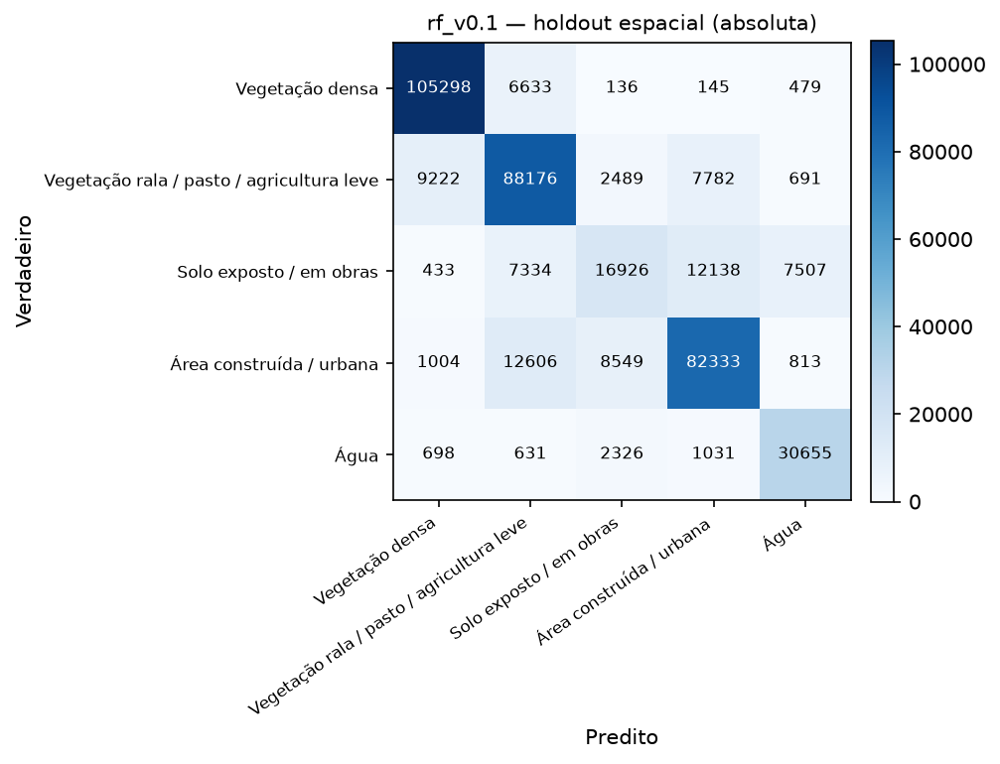
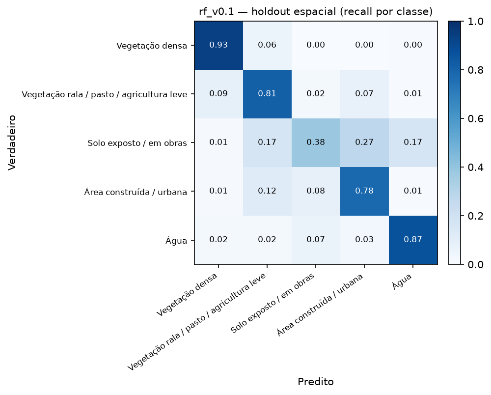
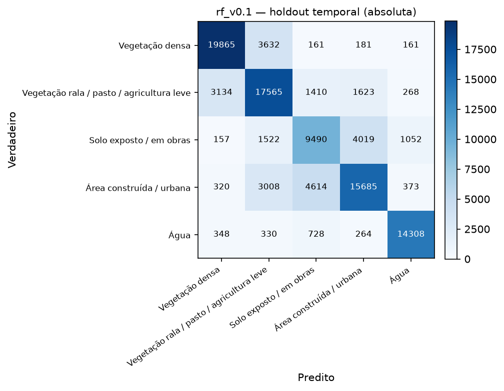
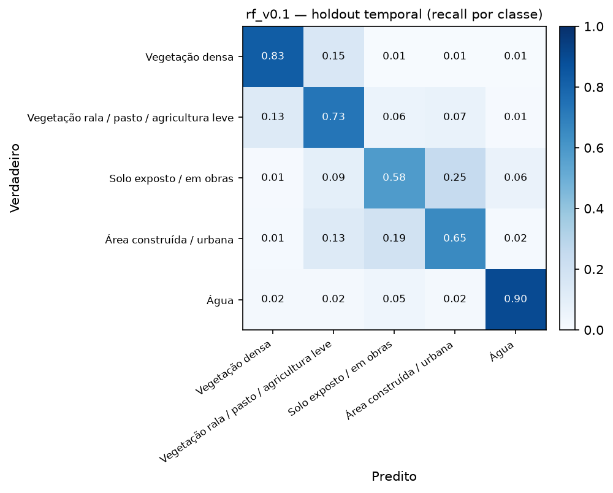
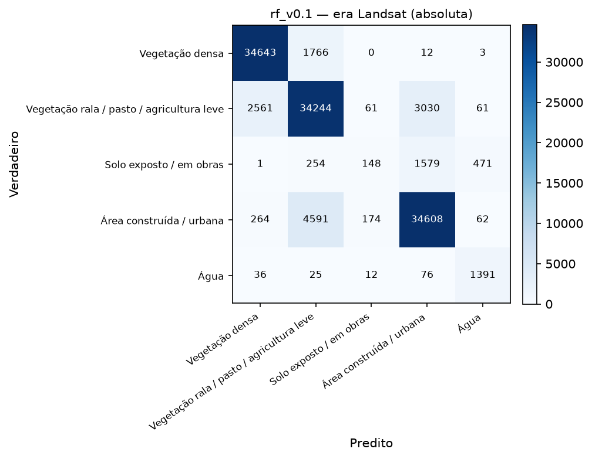
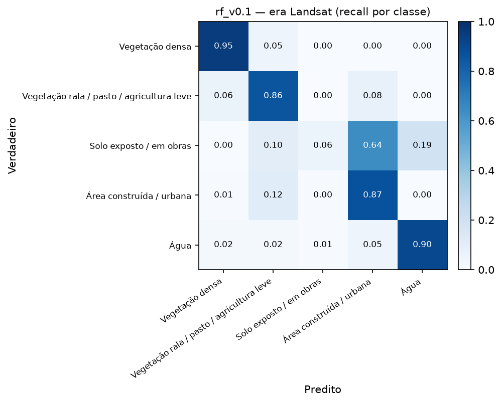
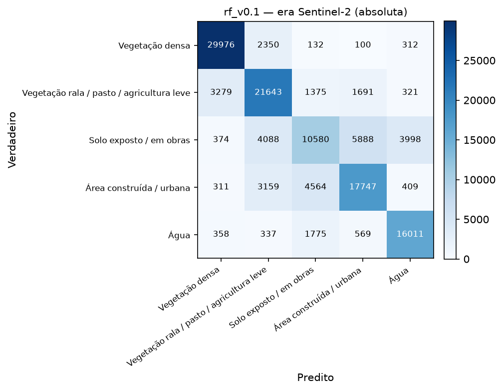
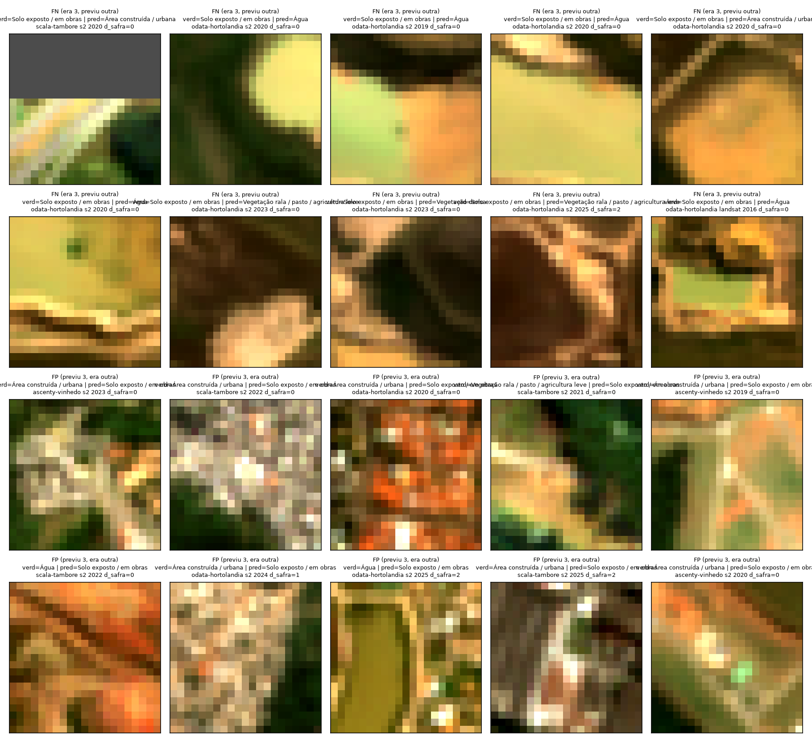

# Avaliação em holdout — `rf_v0.1` sobre `dataset_v0.1` (SV-13)

- **Data:** 2026-09-02T17:16:49.993693+00:00
- **Modelo avaliado:** `models\rf_v0.1.joblib`
- **Dataset:** `dataset_v0.1` — 1307425 linhas totais, 477407 em avaliação (`split == "teste"` OU `holdout_temporal == True`)
- **Isolamento:** este relatório não treina nada — `sentinela.evaluate` nunca chama `.fit`; o modelo já vem pronto de `sentinela.train` (SV-12).

macro-F1 da CV de treino (SV-12, `rf_v0.1`): **0.7845**. macro-F1 do holdout espacial é menor que a da CV de treino (0.7521 vs 0.7845) — esperado (o holdout é sempre mais difícil que a CV, que ainda compartilha a mesma distribuição de treino).

## Métricas-alvo de referência (termômetro, não critério de aprovação)

macro-F1 ≥ 0.70 e F1(classe 3) ≥ 0.55 no holdout espacial (a):

- macro-F1 = **0.7521** → bate a meta? **SIM**
- F1(classe 3) = **0.4528** → bate a meta? **não**

## (a) Holdout espacial — `split == "teste"` (generaliza para área que não viu?)

- n = 406035, accuracy = 0.7965, macro-F1 = **0.7521**, weighted-F1 = 0.7899

| classe | precision | recall | f1 | suporte |
|---|---|---|---|---|
| Vegetação densa | 0.903 | 0.934 | 0.918 | 112691 |
| Vegetação rala / pasto / agricultura leve | 0.764 | 0.814 | 0.788 | 108360 |
| Solo exposto / em obras | 0.556 | 0.382 | 0.453 | 44338 |
| Área construída / urbana | 0.796 | 0.782 | 0.789 | 105305 |
| Água | 0.764 | 0.867 | 0.812 | 35341 |
| **macro avg** | 0.757 | 0.756 | **0.752** | 406035 |
| **weighted avg** | 0.788 | 0.796 | 0.790 | 406035 |

## (b) Holdout temporal — `holdout_temporal == True` (ano mais recente, 2025; generaliza para ano que não viu?)

- n = 104218, accuracy = 0.7380, macro-F1 = **0.7379**, weighted-F1 = 0.7379
- Comparado ao holdout espacial: macro-F1 do temporal é menor ou igual que a do espacial (0.7379 vs 0.7521).

| classe | precision | recall | f1 | suporte |
|---|---|---|---|---|
| Vegetação densa | 0.834 | 0.828 | 0.831 | 24000 |
| Vegetação rala / pasto / agricultura leve | 0.674 | 0.732 | 0.702 | 24000 |
| Solo exposto / em obras | 0.579 | 0.584 | 0.581 | 16240 |
| Área construída / urbana | 0.720 | 0.654 | 0.685 | 24000 |
| Água | 0.885 | 0.895 | 0.890 | 15978 |
| **macro avg** | 0.738 | 0.739 | **0.738** | 104218 |
| **weighted avg** | 0.739 | 0.738 | 0.738 | 104218 |

## (c) Por site — funciona em todos, ou só em alguns?

Tabela por site sobre o holdout espacial (a). Não geramos uma matriz de confusão PNG por site
individualmente (o dataset pode ter de 3 a 16 sites, dependendo da versão — um PNG por site
viraria ruído em vez de sinal); a tabela abaixo já responde a pergunta "funciona em todos, ou só
em um?" de forma direta.

| site | n | accuracy | macro-F1 | F1 classe 3 |
|---|---|---|---|---|
| `ascenty-vinhedo` | 140797 | 0.850 | 0.815 | 0.629 |
| `odata-hortolandia` | 132925 | 0.695 | 0.666 | 0.361 |
| `scala-tambore` | 132313 | 0.842 | 0.788 | 0.534 |

F1(classe 3) por site varia entre 0.361 (`odata-hortolandia`) e 0.629 (`ascenty-vinhedo`) — amplitude de 0.268, relativamente consistente entre sites.

## (d) Por sensor / era — Landsat (2013-2018) vs Sentinel-2 (2019-2025)

Exclui `sobreposicao == True` (154615 linhas descartadas deste recorte, para
não contar o mesmo terreno duas vezes no ano de sobreposição). Se a era Landsat performar muito
pior, metade da série temporal do projeto não se sustenta.

| era | n | accuracy | macro-F1 | weighted-F1 | F1 classe 3 |
|---|---|---|---|---|---|
| Landsat (2013-2018) | 120073 | 0.8748 | 0.7106 | 0.8681 | 0.1039 |
| Sentinel-2 (2019-2025) | 131347 | 0.7306 | 0.7164 | 0.7232 | 0.4881 |

**Veredito sobre a era Landsat:** o macro-F1 agregado das duas eras é próximo (0.7106 Landsat vs 0.7164 Sentinel-2, diferença de 0.0058) — **mas isso esconde o problema real**: a F1 da classe 3 (crítica) cai de **0.4881** (Sentinel-2) para **0.1039** (Landsat), com recall de apenas 0.060 — o modelo praticamente não detecta solo exposto/obras na era Landsat. Isso é grave: metade da série temporal do projeto (2013-2018) não sustenta a métrica que mais importa para o objetivo do projeto, mesmo com macro-F1 agregado enganosamente parecido entre eras — as outras classes (vegetação, água, construída, com suporte maior) compensam a média. macro-F1 agregado é a métrica ERRADA para julgar a era Landsat neste projeto; F1(classe 3) por era é a que importa.

### Matriz de confusão por era

## Análise da classe 3 (solo exposto / obras) — a razão de ser do projeto

Precision/recall isolados por era (recorte d, sobre a classe 3):

| era | precision | recall |
|---|---|---|
| Landsat | 0.375 | 0.060 |
| Sentinel-2 | 0.574 | 0.424 |

**Com o que a classe 3 é confundida?** (holdout espacial (a), linha e coluna da classe 3 na matriz de confusão absoluta)

- Quando o verdadeiro é classe 3, o modelo previu: {'Vegetação densa': 433, 'Vegetação rala / pasto / agricultura leve': 7334, 'Solo exposto / em obras': 16926, 'Área construída / urbana': 12138, 'Água': 7507}
- Quando o modelo previu classe 3, o verdadeiro era: {'Vegetação densa': 136, 'Vegetação rala / pasto / agricultura leve': 2489, 'Solo exposto / em obras': 16926, 'Área construída / urbana': 8549, 'Água': 2326}

### Erro por `distancia_safra`

| distancia_safra | n | recall_classe3 |
|---|---|---|
| 0.000 | 31633.000 | 0.356 |
| 1.000 | 6347.000 | 0.423 |
| 2.000 | 6358.000 | 0.469 |

### Inspeção visual de pixels errados (achado mais importante do relatório)

Amostrados 20 pixels errados envolvendo a classe 3 no holdout espacial (a)
(metade falso-negativo — verdadeiro=3, modelo previu outra —, metade falso-positivo — modelo
previu 3, verdadeiro era outra —, `random_state=42`), com patch RGB verdadeiro extraído do stack
de features original (`data/interim/features/{sensor}/{site}/{ano}.tif`, bandas red/green/blue,
alongamento de contraste 2-98%):

**Conclusão erro-de-modelo vs. erro-de-label:** inspeção visual dos 20 patches (RGB verdadeiro,
alongamento 2-98%) mostra evidência das duas origens de erro, com um viés para erro-de-label nos
falsos positivos. Nos **falsos positivos** (modelo previu classe 3, rótulo dizia outra coisa — 5
dos 10 casos são `odata-hortolandia`), vários patches rotulados "Água" ou "Área construída" mostram
uma textura clara de solo nu/lavrado avermelhado-alaranjado, sem qualquer sinal visual de corpo
d'água (sem tom escuro/homogêneo típico de água) nem de edificação — o padrão espectral que o
modelo pegou parece real, e o rótulo (MapBiomas anual, sem classe de canteiro de obras — ver
ADR-004) é o suspeito mais provável de estar desatualizado ou mal resolvido nesses pixels. Nos
**falsos negativos** (rótulo dizia classe 3, modelo previu outra), o padrão é mais ambíguo: vários
patches "pred=Água" são uniformemente amarelo-esverdeados, sem nenhuma característica visual de
água — aqui a leitura mais provável é erro real do modelo (possivelmente um artefato de índice em
solo seco/claro que se aproxima do limiar espectral de água em `ndwi`/`mndwi`, já que essas duas
features aparecem entre as mais importantes do modelo, ver EXP-001), embora não se possa descartar
uma feição de água pequena demais (ex.: bacia de retenção) para aparecer nítida num patch de 21×21
px. Outros casos FN (`pred=Vegetação rala`) mostram manchas verdes reais dentro do patch,
consistentes com revegetação parcial não capturada pelo rótulo anual — de novo, erro-de-label
plausível. **Conclusão qualitativa (amostra pequena, n=20, não é uma auditoria estatística):**
nenhuma das duas origens domina isoladamente; os falsos-positivos pendem para erro-de-label
(rótulo desatualizado/mal resolvido para "canteiro de obras"), os falsos-negativos "previstos como
água" pendem para erro-de-modelo (possível confusão espectral solo-seco/água). Uma auditoria maior
e estratificada por tipo de erro seria necessária para quantificar a proporção exata — fica como
recomendação para SV-16 (rotulagem manual complementar).

## Limitações conhecidas

- **Fonte de label:** MapBiomas Coleção 9 (anual) + WorldCover como verificação cruzada só em
  2021 (ADR-004). MapBiomas não tem uma classe "canteiro de obras" — o remap usa "Área não
  Vegetada"/"Mineração"/"Afloramento Rochoso" como proxy (ver `config/classes.yml`), o que é uma
  fonte de ruído estrutural na classe 3 que nenhum ajuste de modelo resolve sozinho.
- **2024/2025 replicam o rótulo de 2023** (Coleção 9 não cobre esses anos) — `distancia_safra` de
  1-2 nesses anos, peso reduzido no treino, mas ainda usados como verdade na avaliação aqui.
- **Resolução mista:** Landsat (30m, 2013-2018) e Sentinel-2 (10m, 2019-2025) harmonizados
  espectralmente (ADR-003), mas a área mínima mapeável de um evento de solo exposto é 9x maior em
  pixels Landsat — parte da diferença de era (recorte d) é resolução, não sensor.
- **Região climática:** ver seção específica de cobertura geográfica no manifest do dataset —
  `dataset_v0.1` cobre só 3 sites em Mata Atlântica/SP; `dataset_v0.2` expande para 5 biomas mas
  ainda concentra a maioria das linhas em Mata Atlântica/Sudeste (ver `distribuicao_classes.por_bioma`
  no manifest).
- Este relatório não ajusta o modelo com base no que viu aqui — qualquer ajuste volta para SV-12,
  registrado, e a avaliação é refeita.
