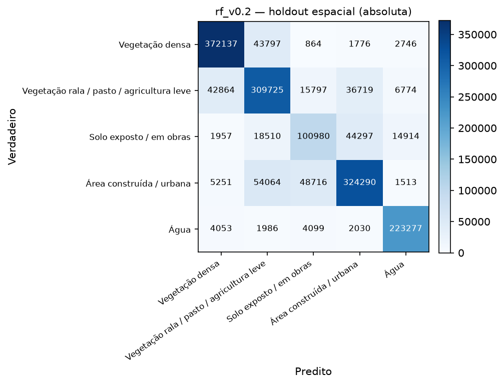
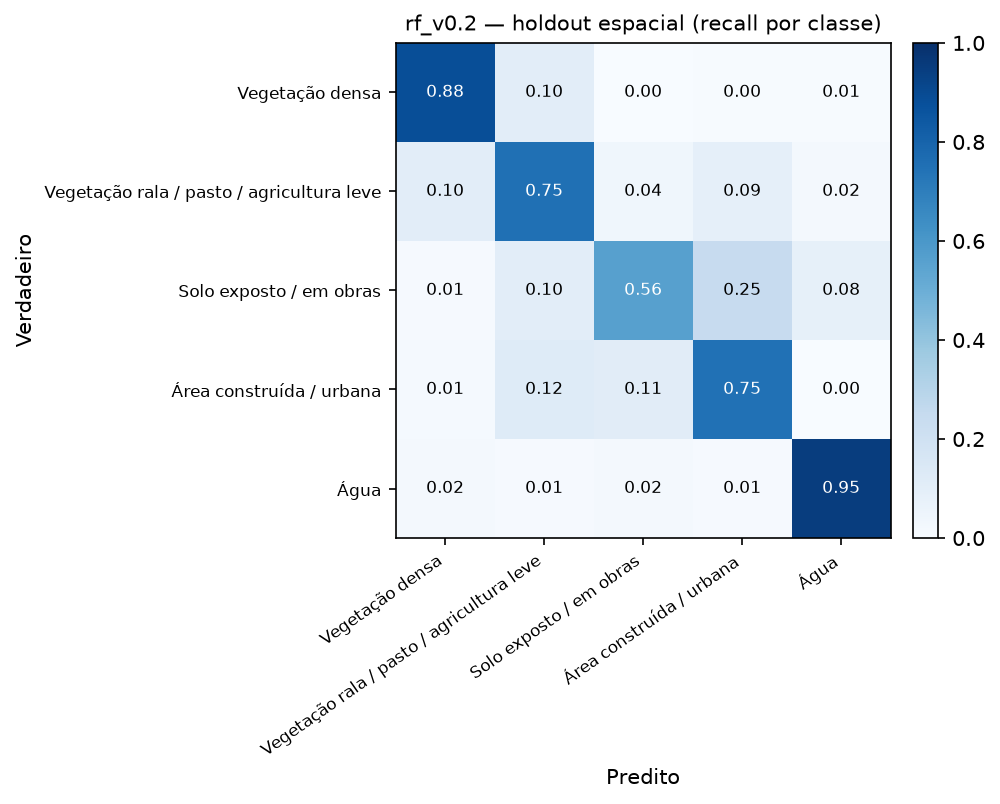
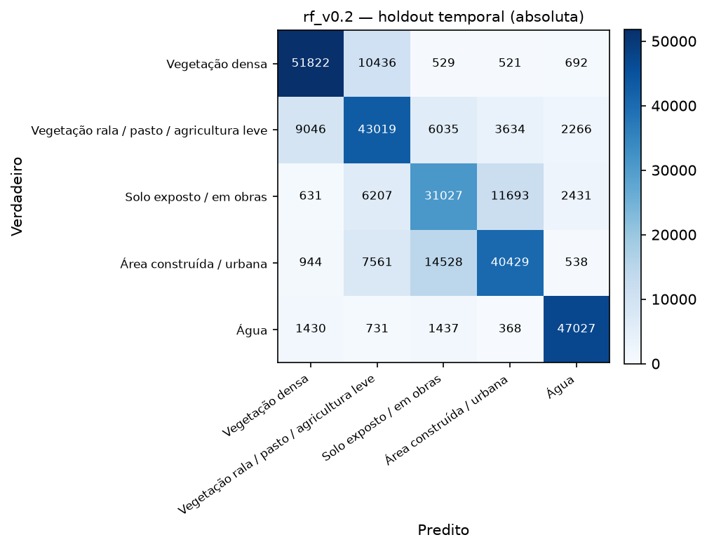
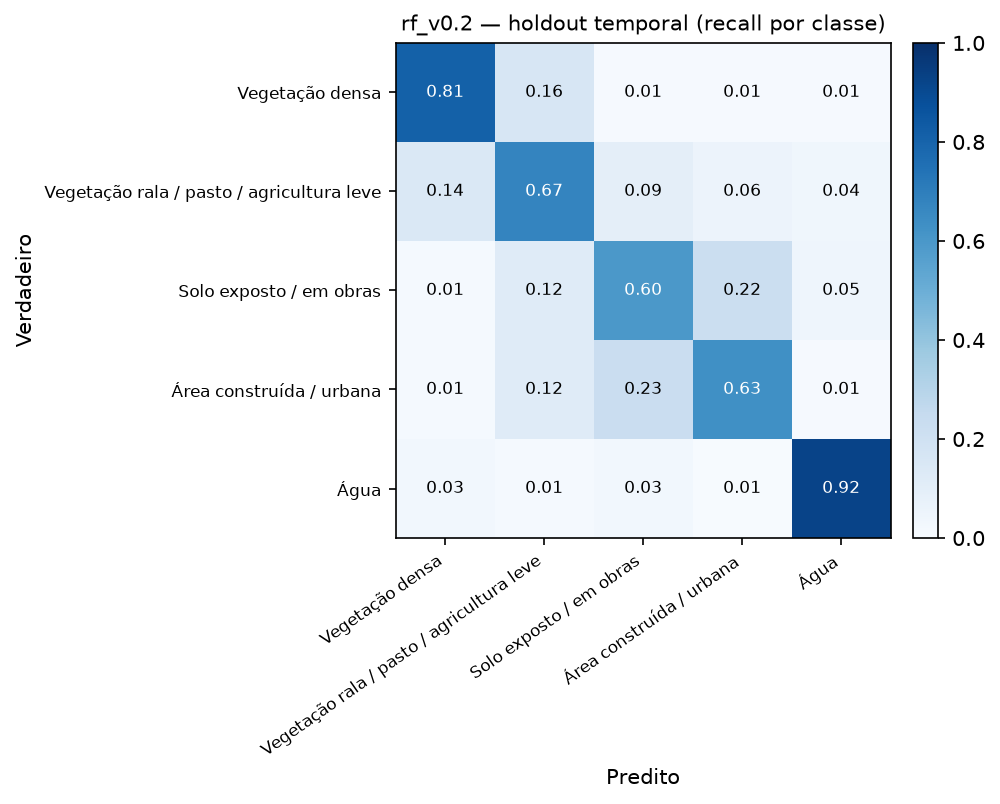
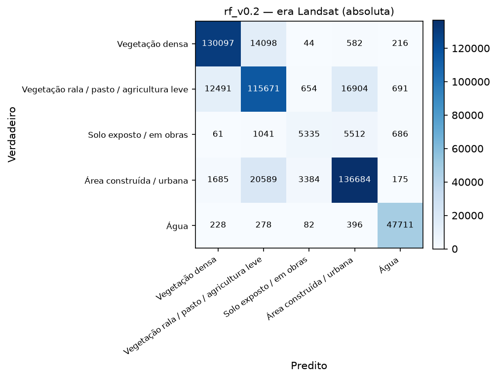
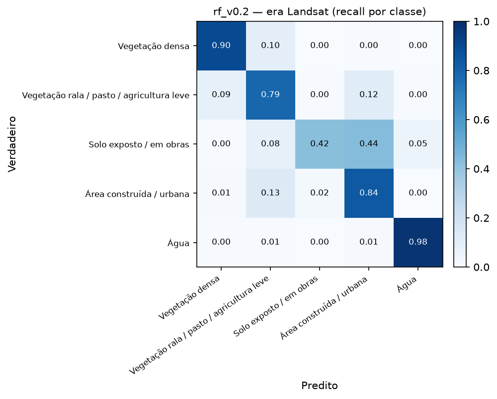
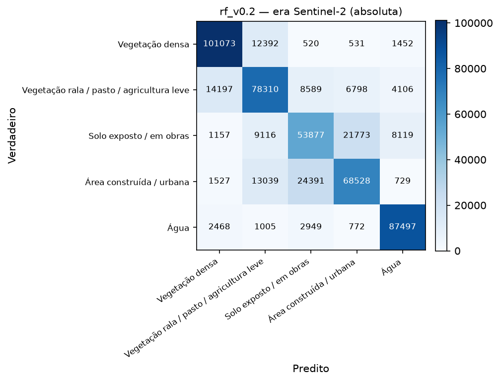
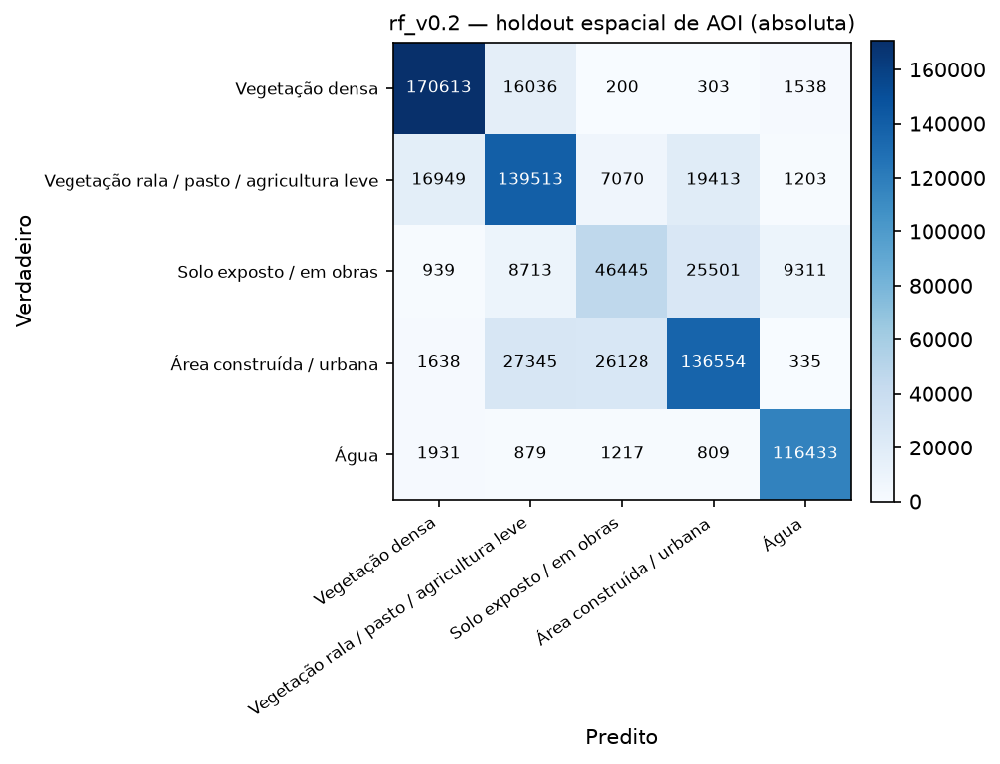
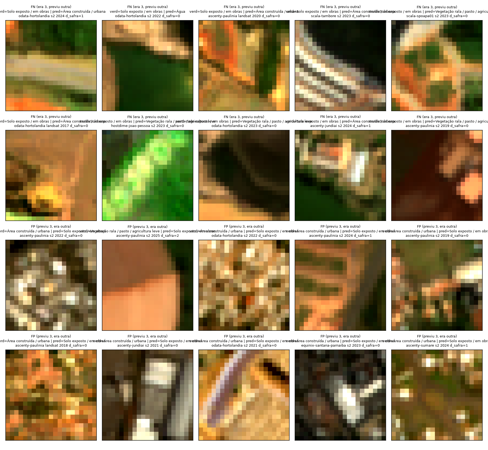

# Avaliação em holdout — `rf_v0.2` sobre `dataset_v0.2` (SV-13)

- **Data:** 2026-09-02T17:17:38.802756+00:00
- **Modelo avaliado:** `models\rf_v0.2.joblib`
- **Dataset:** `dataset_v0.2` — 3759537 linhas totais, 1846867 em avaliação (`split == "teste"` OU `holdout_temporal == True`)
- **Isolamento:** este relatório não treina nada — `sentinela.evaluate` nunca chama `.fit`; o modelo já vem pronto de `sentinela.train` (SV-12).

macro-F1 da CV de treino (SV-12, `rf_v0.2`): **0.7958**. macro-F1 do holdout espacial é menor que a da CV de treino (0.7763 vs 0.7958) — esperado (o holdout é sempre mais difícil que a CV, que ainda compartilha a mesma distribuição de treino).

## Métricas-alvo de referência (termômetro, não critério de aprovação)

macro-F1 ≥ 0.70 e F1(classe 3) ≥ 0.55 no holdout espacial (a):

- macro-F1 = **0.7763** → bate a meta? **SIM**
- F1(classe 3) = **0.5752** → bate a meta? **SIM**

## (a) Holdout espacial — `split == "teste"` (generaliza para área que não viu?)

- n = 1683136, accuracy = 0.7904, macro-F1 = **0.7763**, weighted-F1 = 0.7892

| classe | precision | recall | f1 | suporte |
|---|---|---|---|---|
| Vegetação densa | 0.873 | 0.883 | 0.878 | 421320 |
| Vegetação rala / pasto / agricultura leve | 0.724 | 0.752 | 0.737 | 411879 |
| Solo exposto / em obras | 0.592 | 0.559 | 0.575 | 180658 |
| Área construída / urbana | 0.793 | 0.747 | 0.769 | 433834 |
| Água | 0.896 | 0.948 | 0.921 | 235445 |
| **macro avg** | 0.776 | 0.778 | **0.776** | 1683136 |
| **weighted avg** | 0.789 | 0.790 | 0.789 | 1683136 |

## (b) Holdout temporal — `holdout_temporal == True` (ano mais recente, 2025; generaliza para ano que não viu?)

- n = 294982, accuracy = 0.7232, macro-F1 = **0.7251**, weighted-F1 = 0.7228
- Comparado ao holdout espacial: macro-F1 do temporal é menor ou igual que a do espacial (0.7251 vs 0.7763).

| classe | precision | recall | f1 | suporte |
|---|---|---|---|---|
| Vegetação densa | 0.811 | 0.810 | 0.811 | 64000 |
| Vegetação rala / pasto / agricultura leve | 0.633 | 0.672 | 0.652 | 64000 |
| Solo exposto / em obras | 0.579 | 0.597 | 0.588 | 51989 |
| Área construída / urbana | 0.714 | 0.632 | 0.670 | 64000 |
| Água | 0.888 | 0.922 | 0.905 | 50993 |
| **macro avg** | 0.725 | 0.727 | **0.725** | 294982 |
| **weighted avg** | 0.724 | 0.723 | 0.723 | 294982 |

## (c) Por site — funciona em todos, ou só em alguns?

Tabela por site sobre o holdout espacial (a). Não geramos uma matriz de confusão PNG por site
individualmente (o dataset pode ter de 3 a 16 sites, dependendo da versão — um PNG por site
viraria ruído em vez de sinal); a tabela abaixo já responde a pergunta "funciona em todos, ou só
em um?" de forma direta.

| site | n | accuracy | macro-F1 | F1 classe 3 |
|---|---|---|---|---|
| `angonap-fortaleza` | 102942 | 0.828 | 0.823 | 0.824 |
| `ascenty-hortolandia` | 59781 | 0.714 | 0.722 | 0.606 |
| `ascenty-jundiai` | 247368 | 0.797 | 0.793 | 0.587 |
| `ascenty-maracanau` | 58580 | 0.710 | 0.614 | 0.033 |
| `ascenty-osasco` | 71969 | 0.869 | 0.834 | 0.607 |
| `ascenty-paulinia` | 250657 | 0.794 | 0.782 | 0.538 |
| `ascenty-sumare` | 66587 | 0.813 | 0.819 | 0.684 |
| `ascenty-vinhedo` | 73730 | 0.842 | 0.825 | 0.720 |
| `clickip-manaus` | 59451 | 0.769 | 0.679 | 0.216 |
| `equinix-santana-parnaiba` | 73344 | 0.820 | 0.750 | 0.382 |
| `everest-goiania` | 54145 | 0.768 | 0.652 | 0.262 |
| `hostdime-joao-pessoa` | 278991 | 0.765 | 0.727 | 0.483 |
| `odata-hortolandia` | 72947 | 0.719 | 0.720 | 0.493 |
| `scala-sgigsm01` | 54923 | 0.818 | 0.674 | 0.041 |
| `scala-spoapa01` | 83973 | 0.775 | 0.742 | 0.550 |
| `scala-tambore` | 73748 | 0.847 | 0.826 | 0.691 |

**O desempenho na classe 3 varia muito por site — não é uniforme.** F1(classe 3) vai de **0.033** (`ascenty-maracanau`, praticamente não detecta solo exposto/obras) a **0.824** (`angonap-fortaleza`), uma amplitude de 0.791. Resposta à pergunta do recorte (c): **não, o modelo não funciona igual em todo lugar** — sites com poucos exemplos de treino da classe 3 ou contexto espectral distinto (bioma/solo diferente) tendem a ficar bem abaixo da média. Isso é sinal de que o modelo generaliza espectralmente até um ponto, mas não compensa totalmente a escassez de exemplos por região — candidato direto para a rotulagem manual complementar (SV-09/SV-10) priorizar esses sites piores.

## (d) Por sensor / era — Landsat (2013-2018) vs Sentinel-2 (2019-2025)

Exclui `sobreposicao == True` (642926 linhas descartadas deste recorte, para
não contar o mesmo terreno duas vezes no ano de sobreposição). Se a era Landsat performar muito
pior, metade da série temporal do projeto não se sustenta.

| era | n | accuracy | macro-F1 | weighted-F1 | F1 classe 3 |
|---|---|---|---|---|---|
| Landsat (2013-2018) | 515295 | 0.8451 | 0.7952 | 0.8443 | 0.4821 |
| Sentinel-2 (2019-2025) | 524915 | 0.7416 | 0.7373 | 0.7389 | 0.5845 |

**Veredito sobre a era Landsat:** o macro-F1 agregado das duas eras é próximo (0.7952 Landsat vs 0.7373 Sentinel-2, diferença de 0.0579) — **mas isso esconde o problema real**: a F1 da classe 3 (crítica) cai de **0.5845** (Sentinel-2) para **0.4821** (Landsat), com recall de apenas 0.422 — o modelo praticamente não detecta solo exposto/obras na era Landsat. O recall da classe 3 na era Landsat é mais baixo que no Sentinel-2, mas ainda funcional; a diferença de resolução (30m vs 10m, área mínima mapeável 9x maior em Landsat) é a explicação mais provável, não um defeito do modelo.

### Matriz de confusão por era

## (e) Holdout espacial de AOI — data center nunca visto (só `dataset_v0.2`+)

AOIs inteiras reservadas fora de qualquer split de treino (`holdout_espacial == True`, ver
`aois_holdout_espacial` no manifest): **`ascenty-jundiai`, `ascenty-paulinia`, `hostdime-joao-pessoa`**. Esta é a
**única medida real de "o modelo funciona num data center que nunca viu"** — os outros recortes
ainda compartilham AOI com o treino (só um ano ou um bloco de 1km diferente).

- n = 777016, accuracy = 0.7845, macro-F1 = **0.7675**, weighted-F1 = 0.7819
- F1 classe 3 (crítica) = **0.5402**
- Bate meta de referência? macro-F1 ≥ 0.70: **SIM** · F1(classe 3) ≥ 0.55: **não**

| classe | precision | recall | f1 | suporte |
|---|---|---|---|---|
| Vegetação densa | 0.888 | 0.904 | 0.896 | 188690 |
| Vegetação rala / pasto / agricultura leve | 0.725 | 0.758 | 0.741 | 184148 |
| Solo exposto / em obras | 0.573 | 0.511 | 0.540 | 90909 |
| Área construída / urbana | 0.748 | 0.711 | 0.729 | 192000 |
| Água | 0.904 | 0.960 | 0.931 | 121269 |
| **macro avg** | 0.768 | 0.769 | **0.767** | 777016 |
| **weighted avg** | 0.780 | 0.784 | 0.782 | 777016 |

## Análise da classe 3 (solo exposto / obras) — a razão de ser do projeto

Precision/recall isolados por era (recorte d, sobre a classe 3):

| era | precision | recall |
|---|---|---|
| Landsat | 0.562 | 0.422 |
| Sentinel-2 | 0.596 | 0.573 |

**Com o que a classe 3 é confundida?** (holdout espacial (a), linha e coluna da classe 3 na matriz de confusão absoluta)

- Quando o verdadeiro é classe 3, o modelo previu: {'Vegetação densa': 1957, 'Vegetação rala / pasto / agricultura leve': 18510, 'Solo exposto / em obras': 100980, 'Área construída / urbana': 44297, 'Água': 14914}
- Quando o modelo previu classe 3, o verdadeiro era: {'Vegetação densa': 864, 'Vegetação rala / pasto / agricultura leve': 15797, 'Solo exposto / em obras': 100980, 'Área construída / urbana': 48716, 'Água': 4099}

### Erro por `distancia_safra`

| distancia_safra | n | recall_classe3 |
|---|---|---|
| 0.000 | 133128.000 | 0.555 |
| 1.000 | 23779.000 | 0.577 |
| 2.000 | 23751.000 | 0.561 |

### Inspeção visual de pixels errados (achado mais importante do relatório)

Amostrados 20 pixels errados envolvendo a classe 3 no holdout espacial (a)
(metade falso-negativo — verdadeiro=3, modelo previu outra —, metade falso-positivo — modelo
previu 3, verdadeiro era outra —, `random_state=42`), com patch RGB verdadeiro extraído do stack
de features original (`data/interim/features/{sensor}/{site}/{ano}.tif`, bandas red/green/blue,
alongamento de contraste 2-98%):

**Conclusão erro-de-modelo vs. erro-de-label:** inspeção visual dos 20 patches (RGB verdadeiro,
alongamento 2-98%) confirma o mesmo quadro misto de `rf_v0.1`, com um sinal adicional que a
expansão de sites deixou visível: a amostra de erros está **desproporcionalmente concentrada nos
sites de holdout de AOI** — `ascenty-paulinia` sozinho aparece em 7 dos 20 casos, `ascenty-jundiai`
em 2 — os dois AOIs de holdout espacial que o modelo nunca viu em treino. Isso bate com a métrica
quantitativa: F1(classe 3) no holdout de AOI é 0.540, abaixo da meta (0.55) e abaixo da média geral
do holdout espacial (0.575) — o erro se concentra exatamente onde a teoria prevê que deveria
(generalização para AOI nova). Quanto à origem do erro dentro da amostra: nos **falsos positivos**
(modelo previu classe 3), vários patches (`ascenty-paulinia`, `odata-hortolandia`) mostram gradiente
liso laranja-para-bege — textura de solo nu/lavrado sem sinal de vegetação nem de edificação — cujo
rótulo verdadeiro era "Vegetação rala" ou "Água"; de novo, leitura mais provável é erro-de-label
(rótulo anual sem classe de canteiro de obras, ADR-004). Mas há uma diferença importante em relação
a `rf_v0.1`: vários outros falsos positivos (`ascenty-paulinia`, `equinix-santana-parnaiba`) mostram
claramente um **padrão geométrico de telhado/construção** (linhas retas, textura de laje) rotulado
"Área construída" e confundido pelo modelo com solo exposto — aqui a leitura é **erro genuíno do
modelo**: telhados claros e solo exposto podem ter assinatura espectral parecida em RF sem contexto
espacial/textural, e esse tipo de confusão é estruturalmente esperado com o conjunto de features
atual (só espectral, sem textura). Nos **falsos negativos**, um caso (`hostdime-joao-pessoa`) mostra
uma mancha verde nítida dentro de um patch rotulado classe 3 — revegetação parcial não capturada
pelo rótulo anual, erro-de-label de novo. **Conclusão:** a expansão para 16 sites não eliminou
nenhuma das duas origens de erro identificadas em `rf_v0.1` (label sem classe de canteiro de obras;
possível confusão espectral solo-telhado), mas tornou mais visível uma terceira, estrutural: o
modelo tem uma queda real e consistente de F1(classe 3) especificamente nos AOIs de holdout — o
tipo de erro que rotulagem manual (SV-09/SV-10) não resolve sozinho, porque não é ruído de label,
é falta de exemplos de treino da assinatura local daquele terreno. Isso é o argumento mais forte
deste relatório para priorizar cobertura geográfica (mais sites/biomas) sobre volume de pixels por
site em rodadas futuras.

## Limitações conhecidas

- **Fonte de label:** MapBiomas Coleção 9 (anual) + WorldCover como verificação cruzada só em
  2021 (ADR-004). MapBiomas não tem uma classe "canteiro de obras" — o remap usa "Área não
  Vegetada"/"Mineração"/"Afloramento Rochoso" como proxy (ver `config/classes.yml`), o que é uma
  fonte de ruído estrutural na classe 3 que nenhum ajuste de modelo resolve sozinho.
- **2024/2025 replicam o rótulo de 2023** (Coleção 9 não cobre esses anos) — `distancia_safra` de
  1-2 nesses anos, peso reduzido no treino, mas ainda usados como verdade na avaliação aqui.
- **Resolução mista:** Landsat (30m, 2013-2018) e Sentinel-2 (10m, 2019-2025) harmonizados
  espectralmente (ADR-003), mas a área mínima mapeável de um evento de solo exposto é 9x maior em
  pixels Landsat — parte da diferença de era (recorte d) é resolução, não sensor.
- **Região climática:** ver seção específica de cobertura geográfica no manifest do dataset —
  `dataset_v0.1` cobre só 3 sites em Mata Atlântica/SP; `dataset_v0.2` expande para 5 biomas mas
  ainda concentra a maioria das linhas em Mata Atlântica/Sudeste (ver `distribuicao_classes.por_bioma`
  no manifest).
- Este relatório não ajusta o modelo com base no que viu aqui — qualquer ajuste volta para SV-12,
  registrado, e a avaliação é refeita.
