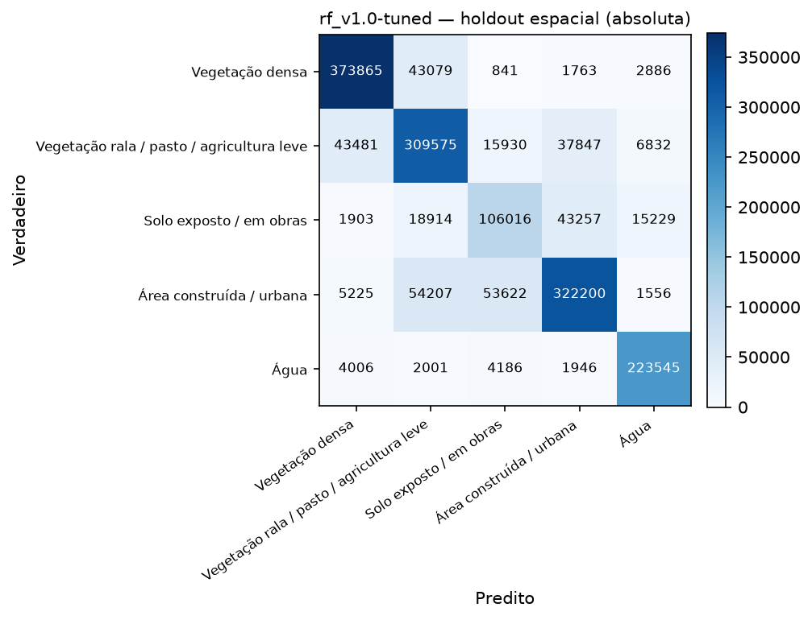
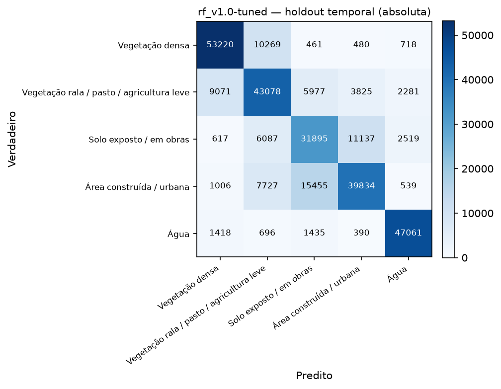
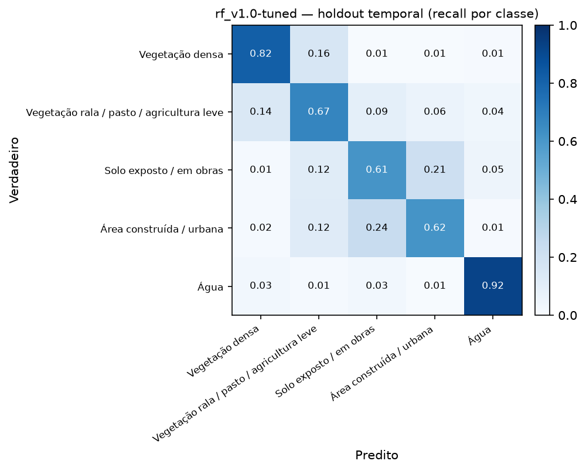
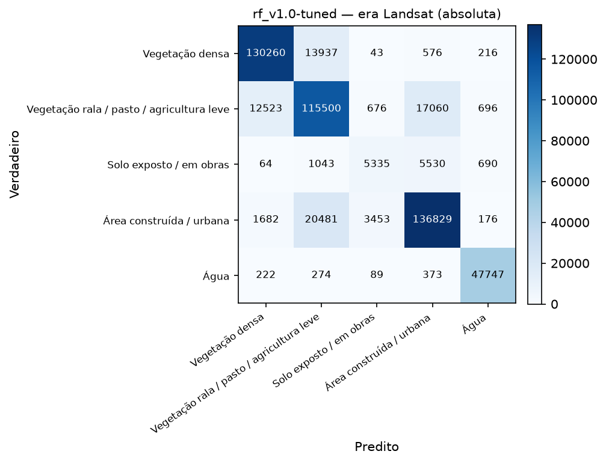
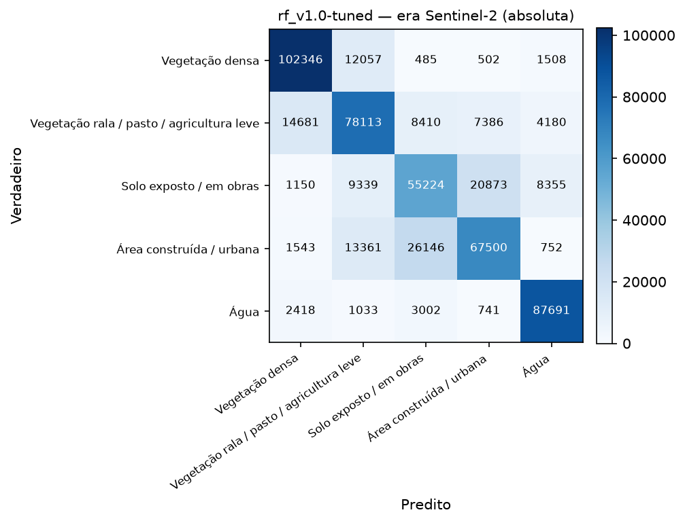
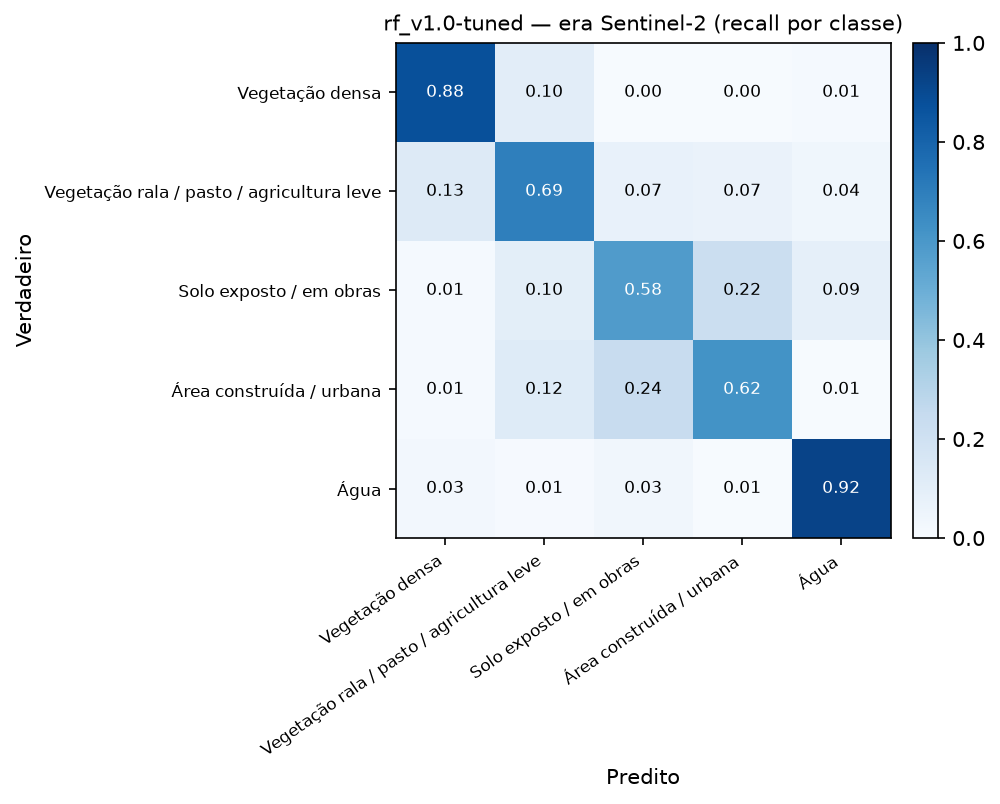
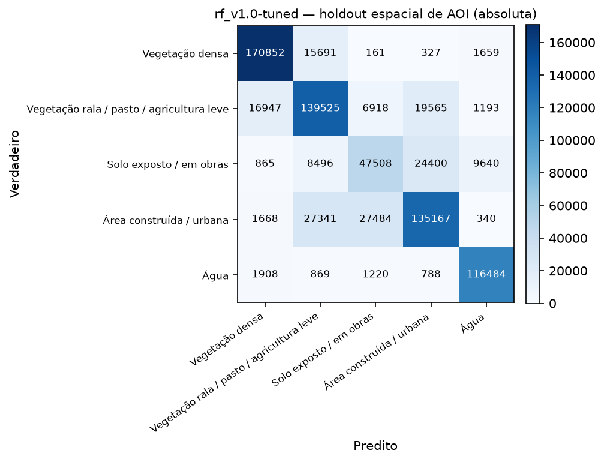
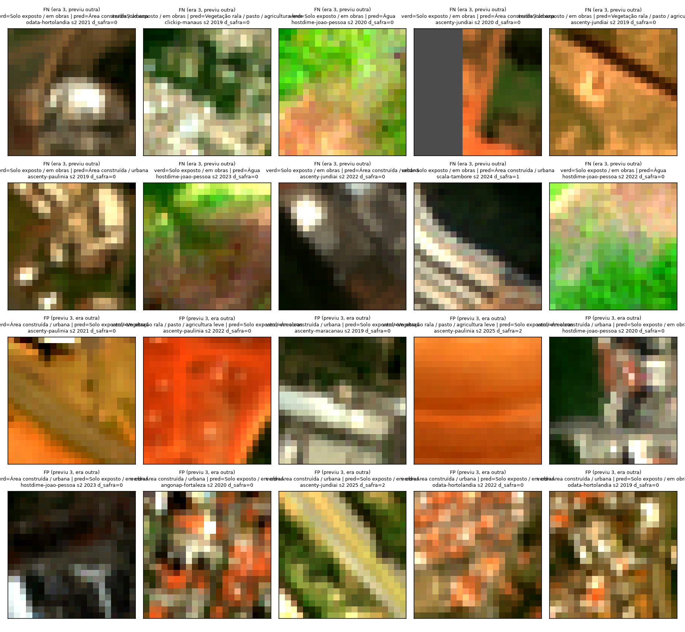

# Avaliação em holdout — `rf_v1.0-tuned` sobre `dataset_v1.0` (SV-13)

- **Data:** 2026-09-03T03:12:22.805462+00:00
- **Modelo avaliado:** `models\rf_v1.0-tuned.joblib`
- **Dataset:** `dataset_v1.0` — 3798750 linhas totais, 1859465 em avaliação (`split == "teste"` OU `holdout_temporal == True`)
- **Isolamento:** este relatório não treina nada — `sentinela.evaluate` nunca chama `.fit`; o modelo já vem pronto de `sentinela.train` (SV-12).

macro-F1 da CV de treino (SV-12, `rf_v1.0-tuned`): **0.7922**. macro-F1 do holdout espacial é menor que a da CV de treino (0.7756 vs 0.7922) — esperado (o holdout é sempre mais difícil que a CV, que ainda compartilha a mesma distribuição de treino).

## Métricas-alvo de referência (termômetro, não critério de aprovação)

macro-F1 ≥ 0.70 e F1(classe 3) ≥ 0.55 no holdout espacial (a):

- macro-F1 = **0.7756** → bate a meta? **SIM**
- F1(classe 3) = **0.5795** → bate a meta? **SIM**

## (a) Holdout espacial — `split == "teste"` (generaliza para área que não viu?)

- n = 1693912, accuracy = 0.7882, macro-F1 = **0.7756**, weighted-F1 = 0.7872

| classe | precision | recall | f1 | suporte |
|---|---|---|---|---|
| Vegetação densa | 0.873 | 0.885 | 0.879 | 422434 |
| Vegetação rala / pasto / agricultura leve | 0.724 | 0.748 | 0.736 | 413665 |
| Solo exposto / em obras | 0.587 | 0.572 | 0.579 | 185319 |
| Área construída / urbana | 0.792 | 0.738 | 0.764 | 436810 |
| Água | 0.894 | 0.948 | 0.920 | 235684 |
| **macro avg** | 0.774 | 0.778 | **0.776** | 1693912 |
| **weighted avg** | 0.787 | 0.788 | 0.787 | 1693912 |

## (b) Holdout temporal — `holdout_temporal == True` (ano mais recente, 2025; generaliza para ano que não viu?)

- n = 297196, accuracy = 0.7237, macro-F1 = **0.7256**, weighted-F1 = 0.7232
- Comparado ao holdout espacial: macro-F1 do temporal é menor ou igual que a do espacial (0.7256 vs 0.7756).

| classe | precision | recall | f1 | suporte |
|---|---|---|---|---|
| Vegetação densa | 0.815 | 0.817 | 0.816 | 65148 |
| Vegetação rala / pasto / agricultura leve | 0.635 | 0.671 | 0.652 | 64232 |
| Solo exposto / em obras | 0.578 | 0.610 | 0.594 | 52255 |
| Área construída / urbana | 0.716 | 0.617 | 0.663 | 64561 |
| Água | 0.886 | 0.923 | 0.904 | 51000 |
| **macro avg** | 0.726 | 0.728 | **0.726** | 297196 |
| **weighted avg** | 0.725 | 0.724 | 0.723 | 297196 |

## (c) Por site — funciona em todos, ou só em alguns?

Tabela por site sobre o holdout espacial (a). Não geramos uma matriz de confusão PNG por site
individualmente (o dataset pode ter de 3 a 16 sites, dependendo da versão — um PNG por site
viraria ruído em vez de sinal); a tabela abaixo já responde a pergunta "funciona em todos, ou só
em um?" de forma direta.

| site | n | accuracy | macro-F1 | F1 classe 3 |
|---|---|---|---|---|
| `angonap-fortaleza` | 103669 | 0.824 | 0.819 | 0.818 |
| `ascenty-hortolandia` | 61560 | 0.704 | 0.718 | 0.597 |
| `ascenty-jundiai` | 247368 | 0.797 | 0.794 | 0.595 |
| `ascenty-maracanau` | 59657 | 0.711 | 0.659 | 0.259 |
| `ascenty-osasco` | 72794 | 0.857 | 0.818 | 0.561 |
| `ascenty-paulinia` | 250657 | 0.795 | 0.785 | 0.551 |
| `ascenty-sumare` | 67322 | 0.811 | 0.820 | 0.695 |
| `ascenty-vinhedo` | 74125 | 0.844 | 0.826 | 0.728 |
| `clickip-manaus` | 60367 | 0.763 | 0.688 | 0.279 |
| `equinix-santana-parnaiba` | 73233 | 0.819 | 0.750 | 0.384 |
| `everest-goiania` | 56540 | 0.764 | 0.694 | 0.487 |
| `hostdime-joao-pessoa` | 278991 | 0.764 | 0.725 | 0.473 |
| `odata-hortolandia` | 73561 | 0.712 | 0.714 | 0.485 |
| `scala-sgigsm01` | 55398 | 0.817 | 0.709 | 0.216 |
| `scala-spoapa01` | 84042 | 0.774 | 0.742 | 0.553 |
| `scala-tambore` | 74628 | 0.844 | 0.824 | 0.682 |

**O desempenho na classe 3 varia muito por site — não é uniforme.** F1(classe 3) vai de **0.216** (`scala-sgigsm01`, praticamente não detecta solo exposto/obras) a **0.818** (`angonap-fortaleza`), uma amplitude de 0.602. Resposta à pergunta do recorte (c): **não, o modelo não funciona igual em todo lugar** — sites com poucos exemplos de treino da classe 3 ou contexto espectral distinto (bioma/solo diferente) tendem a ficar bem abaixo da média. Isso é sinal de que o modelo generaliza espectralmente até um ponto, mas não compensa totalmente a escassez de exemplos por região — candidato direto para a rotulagem manual complementar (SV-09/SV-10) priorizar esses sites piores.

## (d) Por sensor / era — Landsat (2013-2018) vs Sentinel-2 (2019-2025)

Exclui `sobreposicao == True` (649641 linhas descartadas deste recorte, para
não contar o mesmo terreno duas vezes no ano de sobreposição). Se a era Landsat performar muito
pior, metade da série temporal do projeto não se sustenta.

| era | n | accuracy | macro-F1 | weighted-F1 | F1 classe 3 |
|---|---|---|---|---|---|
| Landsat (2013-2018) | 515475 | 0.8452 | 0.7948 | 0.8443 | 0.4794 |
| Sentinel-2 (2019-2025) | 528796 | 0.7392 | 0.7351 | 0.7363 | 0.5868 |

**Veredito sobre a era Landsat:** o macro-F1 agregado das duas eras é próximo (0.7948 Landsat vs 0.7351 Sentinel-2, diferença de 0.0597) — **mas isso esconde o problema real**: a F1 da classe 3 (crítica) cai de **0.5868** (Sentinel-2) para **0.4794** (Landsat), com recall de apenas 0.421 — o modelo praticamente não detecta solo exposto/obras na era Landsat. O recall da classe 3 na era Landsat é mais baixo que no Sentinel-2, mas ainda funcional; a diferença de resolução (30m vs 10m, área mínima mapeável 9x maior em Landsat) é a explicação mais provável, não um defeito do modelo.

### Matriz de confusão por era

## (e) Holdout espacial de AOI — data center nunca visto (só `dataset_v0.2`+)

AOIs inteiras reservadas fora de qualquer split de treino (`holdout_espacial == True`, ver
`aois_holdout_espacial` no manifest): **`ascenty-jundiai`, `ascenty-paulinia`, `hostdime-joao-pessoa`**. Esta é a
**única medida real de "o modelo funciona num data center que nunca viu"** — os outros recortes
ainda compartilham AOI com o treino (só um ano ou um bloco de 1km diferente).

- n = 777016, accuracy = 0.7845, macro-F1 = **0.7681**, weighted-F1 = 0.7820
- F1 classe 3 (crítica) = **0.5454**
- Bate meta de referência? macro-F1 ≥ 0.70: **SIM** · F1(classe 3) ≥ 0.55: **não**

| classe | precision | recall | f1 | suporte |
|---|---|---|---|---|
| Vegetação densa | 0.889 | 0.905 | 0.897 | 188690 |
| Vegetação rala / pasto / agricultura leve | 0.727 | 0.758 | 0.742 | 184148 |
| Solo exposto / em obras | 0.570 | 0.523 | 0.545 | 90909 |
| Área construída / urbana | 0.750 | 0.704 | 0.726 | 192000 |
| Água | 0.901 | 0.961 | 0.930 | 121269 |
| **macro avg** | 0.767 | 0.770 | **0.768** | 777016 |
| **weighted avg** | 0.781 | 0.784 | 0.782 | 777016 |

## Análise da classe 3 (solo exposto / obras) — a razão de ser do projeto

Precision/recall isolados por era (recorte d, sobre a classe 3):

| era | precision | recall |
|---|---|---|
| Landsat | 0.556 | 0.421 |
| Sentinel-2 | 0.592 | 0.582 |

**Com o que a classe 3 é confundida?** (holdout espacial (a), linha e coluna da classe 3 na matriz de confusão absoluta)

- Quando o verdadeiro é classe 3, o modelo previu: {'Vegetação densa': 1903, 'Vegetação rala / pasto / agricultura leve': 18914, 'Solo exposto / em obras': 106016, 'Área construída / urbana': 43257, 'Água': 15229}
- Quando o modelo previu classe 3, o verdadeiro era: {'Vegetação densa': 841, 'Vegetação rala / pasto / agricultura leve': 15930, 'Solo exposto / em obras': 106016, 'Área construída / urbana': 53622, 'Água': 4186}

### Erro por `distancia_safra`

| distancia_safra | n | recall_classe3 |
|---|---|---|
| 0.000 | 137474.000 | 0.571 |
| 1.000 | 24066.000 | 0.583 |
| 2.000 | 23779.000 | 0.567 |

### Inspeção visual de pixels errados (achado mais importante do relatório)

Amostrados 20 pixels errados envolvendo a classe 3 no holdout espacial (a)
(metade falso-negativo — verdadeiro=3, modelo previu outra —, metade falso-positivo — modelo
previu 3, verdadeiro era outra —, `random_state=42`), com patch RGB verdadeiro extraído do stack
de features original (`data/interim/features/{sensor}/{site}/{ano}.tif`, bandas red/green/blue,
alongamento de contraste 2-98%):

**Conclusão erro-de-modelo vs. erro-de-label:** inspeção visual dos 20 patches (RGB verdadeiro,
alongamento 2-98%) repete, em boa parte, o quadro misto já visto em `rf_v1.0` — esperado, já que
`max_depth=30` muda pouco o comportamento do modelo (ver tabela comparativa acima, diferenças
≤0,005 em quase tudo). Nos **falsos negativos** (verdadeiro=3, modelo previu outra), o padrão mais
recorrente continua sendo a confusão estrutural solo-telhado: `odata-hortolandia` (2021),
`ascenty-paulinia` (2019) e `ascenty-jundiai` (2022) mostram manchas claras/cremes com geometria
regular de telhado sobre fundo escuro, previstas como "Área construída" — erro-de-modelo plausível,
mesmo padrão de `rf_v1.0`. Um achado que se destaca mais aqui que na inspeção anterior:
`hostdime-joao-pessoa` aparece em **3 dos 10 falsos negativos** (2020, 2022, 2023), sempre
verdadeiro=solo exposto e sempre previsto como "Água", em patches visivelmente verdes/rosados sem
nenhum sinal real de corpo d'água — um padrão sistemático específico deste site que soa mais a
erro-de-modelo (confusão espectral local, possivelmente solo úmido/refletância anômala) do que a
erro-de-label, e que vale a pena investigar separadamente se o site continuar com F1 classe 3 baixo
(ver tabela por site — `hostdime-joao-pessoa` fica em 0,473, abaixo da média). Nos **falsos
positivos** (previu 3, verdadeiro outra), repete-se o padrão viário já registrado em `rf_v1.0`:
`ascenty-jundiai` (2025) mostra uma faixa clara diagonal sobre fundo verde, com geometria de
via/estrada, rotulada como "Área construída" pelo MapBiomas mas espectralmente mais próxima de solo
exposto às margens da via — leitura de erro-de-label (categoria "construída" cobrindo
infraestrutura viária, que o V1 não separa como classe própria). Já `odata-hortolandia` (2019) e
`angonap-fortaleza` (2020) mostram patches com padrão claro de estrutura construída (telhado
mosqueado, ou bloco vermelho sólido característico de telha metálica/cerâmica) previstos como solo
exposto — erro-de-modelo (confusão espectral solo/telhado na direção oposta à dos falsos negativos).
**Conclusão, consistente com `rf_v1.0`:** nenhuma das duas origens domina isoladamente; o tuning de
`max_depth` não eliminou (nem deveria eliminar) os dois padrões estruturais já conhecidos
(solo-telhado nos dois sentidos, via rotulada como construída) — são limitações de dado/classe, não
de hiperparâmetro. O achado pontual em `hostdime-joao-pessoa` (solo exposto → água) é novo o
suficiente para registrar aqui, mas a amostra de 20 patches é pequena demais para generalizar sem
mais inspeção.

## Limitações conhecidas

- **Fonte de label:** MapBiomas Coleção 9 (anual) + WorldCover como verificação cruzada só em
  2021 (ADR-004). MapBiomas não tem uma classe "canteiro de obras" — o remap usa "Área não
  Vegetada"/"Mineração"/"Afloramento Rochoso" como proxy (ver `config/classes.yml`), o que é uma
  fonte de ruído estrutural na classe 3 que nenhum ajuste de modelo resolve sozinho.
- **2024/2025 replicam o rótulo de 2023** (Coleção 9 não cobre esses anos) — `distancia_safra` de
  1-2 nesses anos, peso reduzido no treino, mas ainda usados como verdade na avaliação aqui.
- **Resolução mista:** Landsat (30m, 2013-2018) e Sentinel-2 (10m, 2019-2025) harmonizados
  espectralmente (ADR-003), mas a área mínima mapeável de um evento de solo exposto é 9x maior em
  pixels Landsat — parte da diferença de era (recorte d) é resolução, não sensor.
- **Região climática:** ver seção específica de cobertura geográfica no manifest do dataset —
  `dataset_v0.1` cobre só 3 sites em Mata Atlântica/SP; `dataset_v0.2` expande para 5 biomas mas
  ainda concentra a maioria das linhas em Mata Atlântica/Sudeste (ver `distribuicao_classes.por_bioma`
  no manifest).
- Este relatório não ajusta o modelo com base no que viu aqui — qualquer ajuste volta para SV-12,
  registrado, e a avaliação é refeita.
