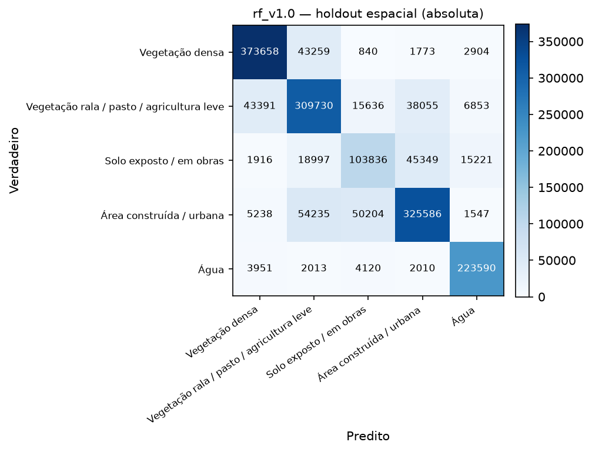
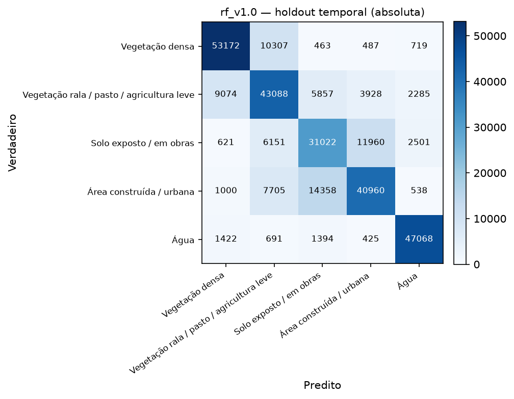
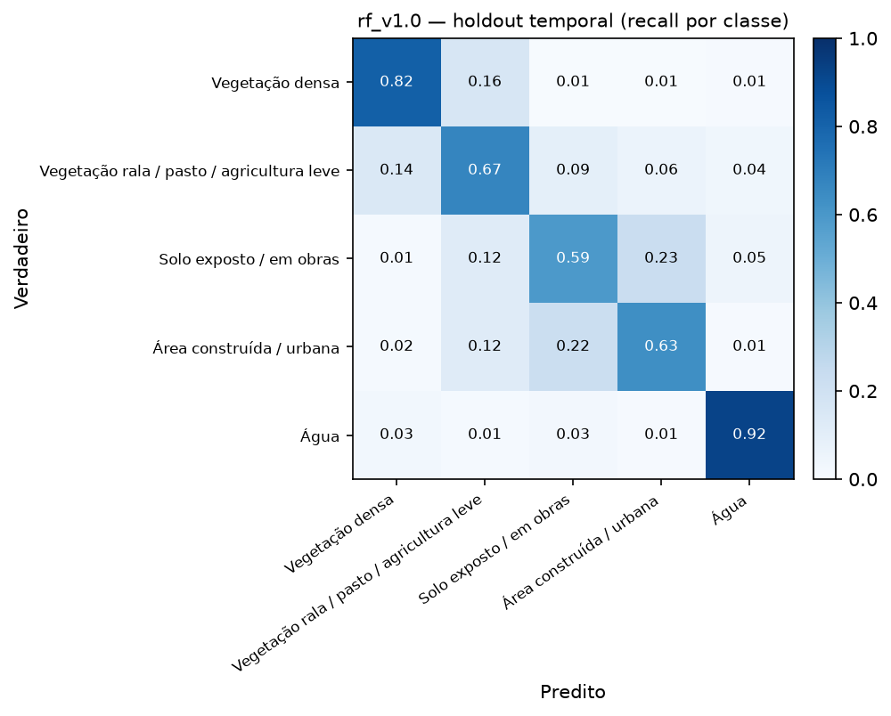
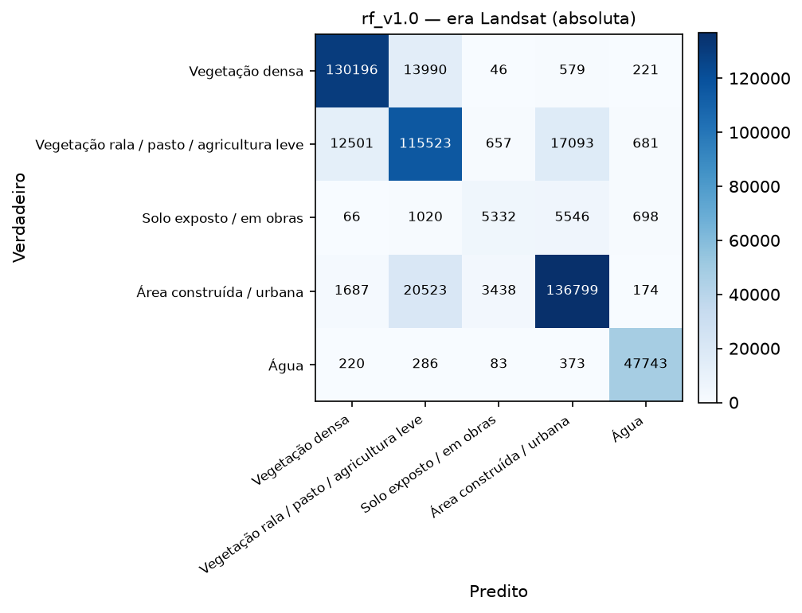
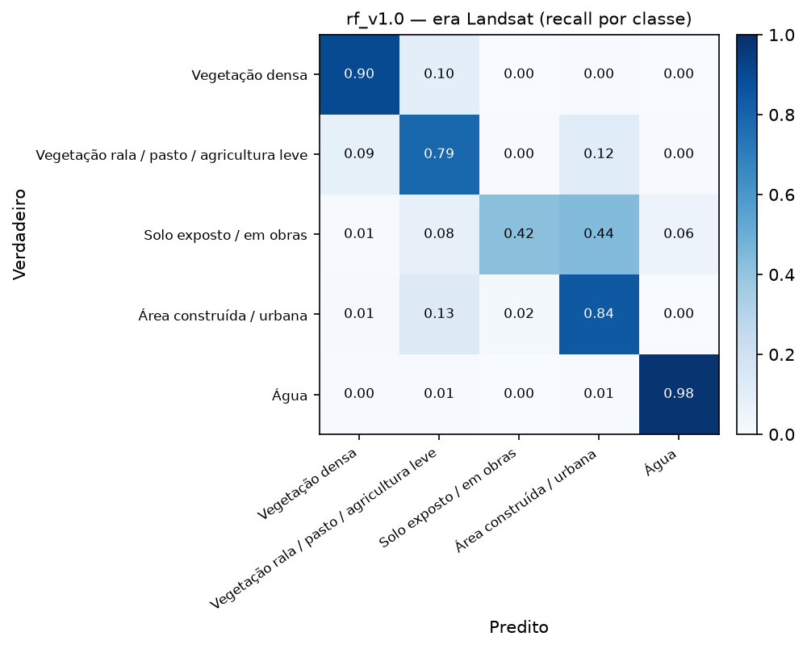
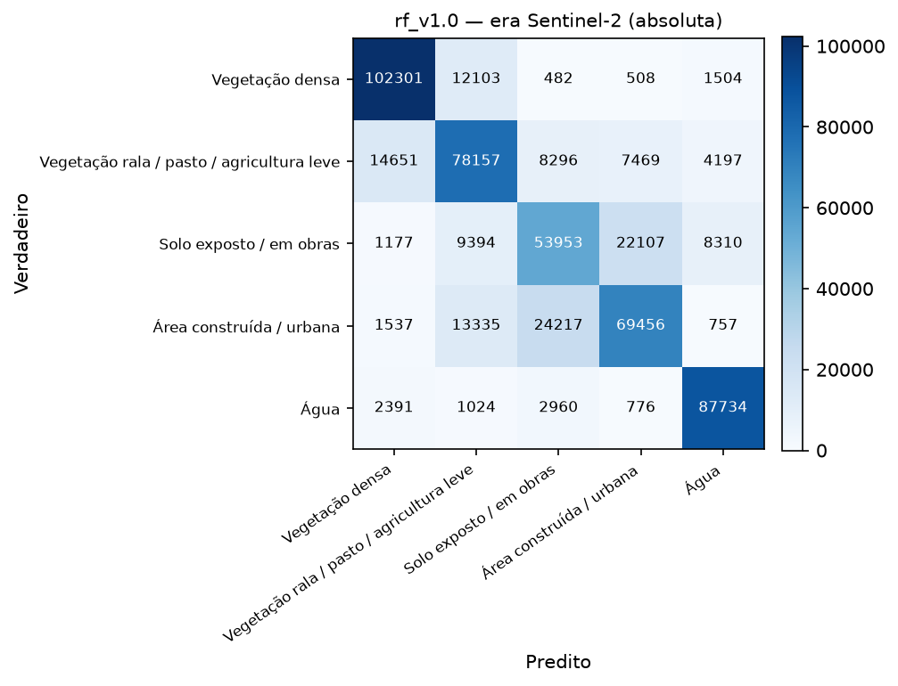
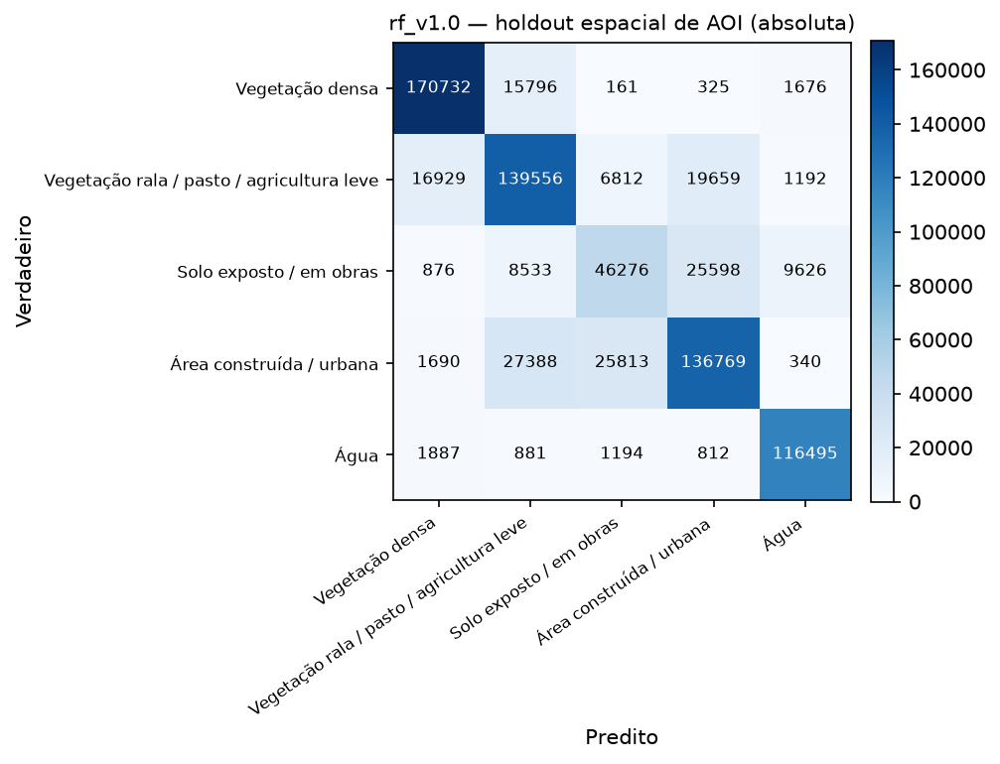
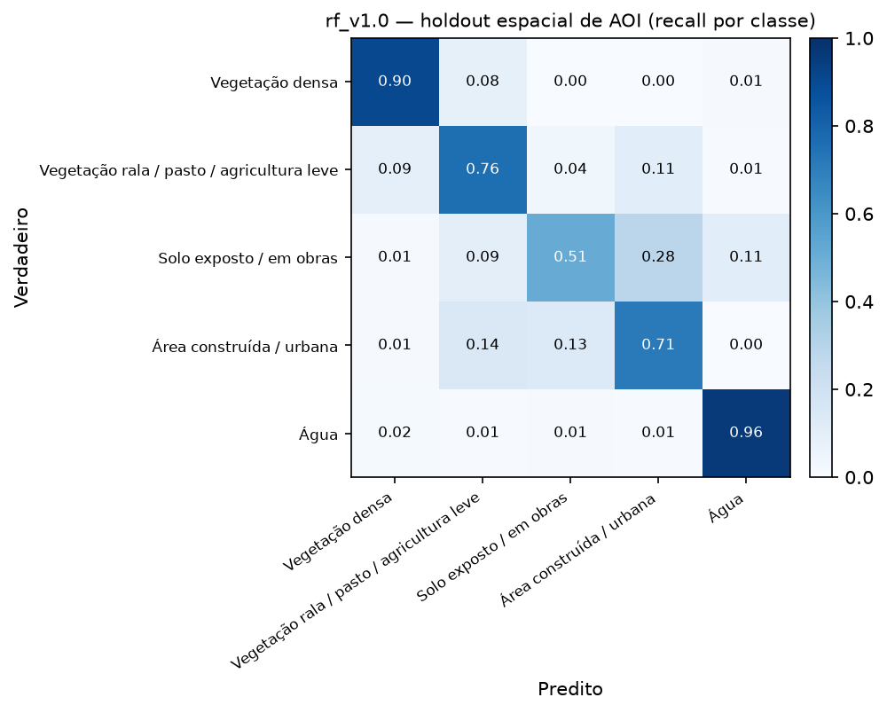
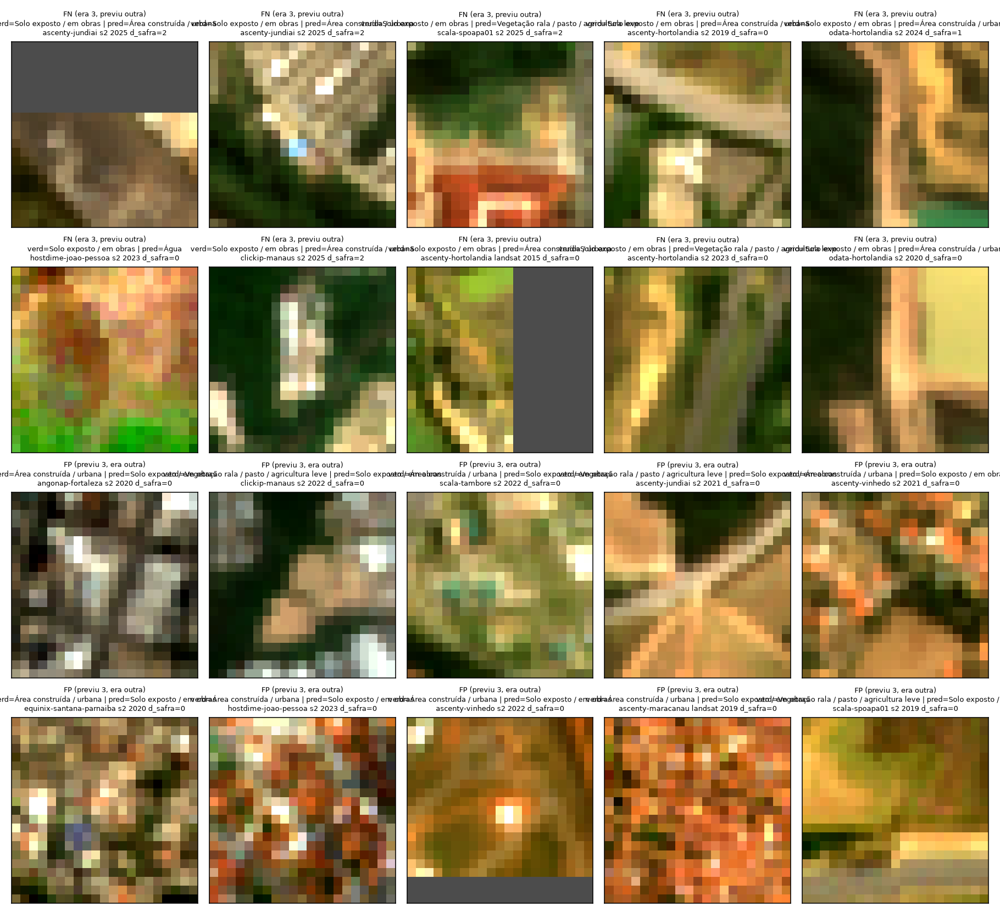

# Avaliação em holdout — `rf_v1.0` sobre `dataset_v1.0` (SV-13)

- **Data:** 2026-09-02T19:09:33.590459+00:00
- **Modelo avaliado:** `models\rf_v1.0.joblib`
- **Dataset:** `dataset_v1.0` — 3798750 linhas totais, 1859465 em avaliação (`split == "teste"` OU `holdout_temporal == True`)
- **Isolamento:** este relatório não treina nada — `sentinela.evaluate` nunca chama `.fit`; o modelo já vem pronto de `sentinela.train` (SV-12).

macro-F1 da CV de treino (SV-12, `rf_v1.0`): **0.7927**. macro-F1 do holdout espacial é menor que a da CV de treino (0.7757 vs 0.7927) — esperado (o holdout é sempre mais difícil que a CV, que ainda compartilha a mesma distribuição de treino).

## Métricas-alvo de referência (termômetro, não critério de aprovação)

macro-F1 ≥ 0.70 e F1(classe 3) ≥ 0.55 no holdout espacial (a):

- macro-F1 = **0.7757** → bate a meta? **SIM**
- F1(classe 3) = **0.5769** → bate a meta? **SIM**

## (a) Holdout espacial — `split == "teste"` (generaliza para área que não viu?)

- n = 1693912, accuracy = 0.7889, macro-F1 = **0.7757**, weighted-F1 = 0.7876

| classe | precision | recall | f1 | suporte |
|---|---|---|---|---|
| Vegetação densa | 0.873 | 0.885 | 0.879 | 422434 |
| Vegetação rala / pasto / agricultura leve | 0.723 | 0.749 | 0.736 | 413665 |
| Solo exposto / em obras | 0.595 | 0.560 | 0.577 | 185319 |
| Área construída / urbana | 0.789 | 0.745 | 0.766 | 436810 |
| Água | 0.894 | 0.949 | 0.921 | 235684 |
| **macro avg** | 0.775 | 0.778 | **0.776** | 1693912 |
| **weighted avg** | 0.787 | 0.789 | 0.788 | 1693912 |

## (b) Holdout temporal — `holdout_temporal == True` (ano mais recente, 2025; generaliza para ano que não viu?)

- n = 297196, accuracy = 0.7245, macro-F1 = **0.7260**, weighted-F1 = 0.7238
- Comparado ao holdout espacial: macro-F1 do temporal é menor ou igual que a do espacial (0.7260 vs 0.7757).

| classe | precision | recall | f1 | suporte |
|---|---|---|---|---|
| Vegetação densa | 0.814 | 0.816 | 0.815 | 65148 |
| Vegetação rala / pasto / agricultura leve | 0.634 | 0.671 | 0.652 | 64232 |
| Solo exposto / em obras | 0.584 | 0.594 | 0.589 | 52255 |
| Área construída / urbana | 0.709 | 0.634 | 0.670 | 64561 |
| Água | 0.886 | 0.923 | 0.904 | 51000 |
| **macro avg** | 0.726 | 0.728 | **0.726** | 297196 |
| **weighted avg** | 0.724 | 0.724 | 0.724 | 297196 |

## (c) Por site — funciona em todos, ou só em alguns?

Tabela por site sobre o holdout espacial (a). Não geramos uma matriz de confusão PNG por site
individualmente (o dataset pode ter de 3 a 16 sites, dependendo da versão — um PNG por site
viraria ruído em vez de sinal); a tabela abaixo já responde a pergunta "funciona em todos, ou só
em um?" de forma direta.

| site | n | accuracy | macro-F1 | F1 classe 3 |
|---|---|---|---|---|
| `angonap-fortaleza` | 103669 | 0.825 | 0.819 | 0.820 |
| `ascenty-hortolandia` | 61560 | 0.702 | 0.715 | 0.583 |
| `ascenty-jundiai` | 247368 | 0.798 | 0.795 | 0.593 |
| `ascenty-maracanau` | 59657 | 0.711 | 0.659 | 0.260 |
| `ascenty-osasco` | 72794 | 0.859 | 0.821 | 0.570 |
| `ascenty-paulinia` | 250657 | 0.795 | 0.783 | 0.540 |
| `ascenty-sumare` | 67322 | 0.811 | 0.820 | 0.693 |
| `ascenty-vinhedo` | 74125 | 0.844 | 0.828 | 0.731 |
| `clickip-manaus` | 60367 | 0.764 | 0.687 | 0.278 |
| `equinix-santana-parnaiba` | 73233 | 0.821 | 0.753 | 0.391 |
| `everest-goiania` | 56540 | 0.766 | 0.696 | 0.492 |
| `hostdime-joao-pessoa` | 278991 | 0.764 | 0.725 | 0.475 |
| `odata-hortolandia` | 73561 | 0.713 | 0.714 | 0.483 |
| `scala-sgigsm01` | 55398 | 0.820 | 0.714 | 0.235 |
| `scala-spoapa01` | 84042 | 0.774 | 0.740 | 0.542 |
| `scala-tambore` | 74628 | 0.847 | 0.826 | 0.689 |

**O desempenho na classe 3 varia muito por site — não é uniforme.** F1(classe 3) vai de **0.235** (`scala-sgigsm01`, praticamente não detecta solo exposto/obras) a **0.820** (`angonap-fortaleza`), uma amplitude de 0.585. Resposta à pergunta do recorte (c): **não, o modelo não funciona igual em todo lugar** — sites com poucos exemplos de treino da classe 3 ou contexto espectral distinto (bioma/solo diferente) tendem a ficar bem abaixo da média. Isso é sinal de que o modelo generaliza espectralmente até um ponto, mas não compensa totalmente a escassez de exemplos por região — candidato direto para a rotulagem manual complementar (SV-09/SV-10) priorizar esses sites piores.

## (d) Por sensor / era — Landsat (2013-2018) vs Sentinel-2 (2019-2025)

Exclui `sobreposicao == True` (649641 linhas descartadas deste recorte, para
não contar o mesmo terreno duas vezes no ano de sobreposição). Se a era Landsat performar muito
pior, metade da série temporal do projeto não se sustenta.

| era | n | accuracy | macro-F1 | weighted-F1 | F1 classe 3 |
|---|---|---|---|---|---|
| Landsat (2013-2018) | 515475 | 0.8450 | 0.7948 | 0.8442 | 0.4800 |
| Sentinel-2 (2019-2025) | 528796 | 0.7406 | 0.7362 | 0.7376 | 0.5838 |

**Veredito sobre a era Landsat:** o macro-F1 agregado das duas eras é próximo (0.7948 Landsat vs 0.7362 Sentinel-2, diferença de 0.0586) — **mas isso esconde o problema real**: a F1 da classe 3 (crítica) cai de **0.5838** (Sentinel-2) para **0.4800** (Landsat), com recall de apenas 0.421 — o modelo praticamente não detecta solo exposto/obras na era Landsat. O recall da classe 3 na era Landsat é mais baixo que no Sentinel-2, mas ainda funcional; a diferença de resolução (30m vs 10m, área mínima mapeável 9x maior em Landsat) é a explicação mais provável, não um defeito do modelo.

### Matriz de confusão por era

## (e) Holdout espacial de AOI — data center nunca visto (só `dataset_v0.2`+)

AOIs inteiras reservadas fora de qualquer split de treino (`holdout_espacial == True`, ver
`aois_holdout_espacial` no manifest): **`ascenty-jundiai`, `ascenty-paulinia`, `hostdime-joao-pessoa`**. Esta é a
**única medida real de "o modelo funciona num data center que nunca viu"** — os outros recortes
ainda compartilham AOI com o treino (só um ano ou um bloco de 1km diferente).

- n = 777016, accuracy = 0.7848, macro-F1 = **0.7676**, weighted-F1 = 0.7821
- F1 classe 3 (crítica) = **0.5407**
- Bate meta de referência? macro-F1 ≥ 0.70: **SIM** · F1(classe 3) ≥ 0.55: **não**

| classe | precision | recall | f1 | suporte |
|---|---|---|---|---|
| Vegetação densa | 0.889 | 0.905 | 0.897 | 188690 |
| Vegetação rala / pasto / agricultura leve | 0.726 | 0.758 | 0.742 | 184148 |
| Solo exposto / em obras | 0.577 | 0.509 | 0.541 | 90909 |
| Área construída / urbana | 0.747 | 0.712 | 0.729 | 192000 |
| Água | 0.901 | 0.961 | 0.930 | 121269 |
| **macro avg** | 0.768 | 0.769 | **0.768** | 777016 |
| **weighted avg** | 0.780 | 0.785 | 0.782 | 777016 |

## Análise da classe 3 (solo exposto / obras) — a razão de ser do projeto

Precision/recall isolados por era (recorte d, sobre a classe 3):

| era | precision | recall |
|---|---|---|
| Landsat | 0.558 | 0.421 |
| Sentinel-2 | 0.600 | 0.568 |

**Com o que a classe 3 é confundida?** (holdout espacial (a), linha e coluna da classe 3 na matriz de confusão absoluta)

- Quando o verdadeiro é classe 3, o modelo previu: {'Vegetação densa': 1916, 'Vegetação rala / pasto / agricultura leve': 18997, 'Solo exposto / em obras': 103836, 'Área construída / urbana': 45349, 'Água': 15221}
- Quando o modelo previu classe 3, o verdadeiro era: {'Vegetação densa': 840, 'Vegetação rala / pasto / agricultura leve': 15636, 'Solo exposto / em obras': 103836, 'Área construída / urbana': 50204, 'Água': 4120}

### Erro por `distancia_safra`

| distancia_safra | n | recall_classe3 |
|---|---|---|
| 0.000 | 137474.000 | 0.560 |
| 1.000 | 24066.000 | 0.571 |
| 2.000 | 23779.000 | 0.553 |

### Inspeção visual de pixels errados (achado mais importante do relatório)

Amostrados 20 pixels errados envolvendo a classe 3 no holdout espacial (a)
(metade falso-negativo — verdadeiro=3, modelo previu outra —, metade falso-positivo — modelo
previu 3, verdadeiro era outra —, `random_state=42`), com patch RGB verdadeiro extraído do stack
de features original (`data/interim/features/{sensor}/{site}/{ano}.tif`, bandas red/green/blue,
alongamento de contraste 2-98%):

**Conclusão erro-de-modelo vs. erro-de-label:** inspeção visual dos 20 patches (RGB verdadeiro,
alongamento 2-98%) repete o quadro misto de `rf_v0.1`/`rf_v0.2`, sem sinal de que a rotulagem
manual tenha eliminado nenhuma das duas origens de erro (esperado — os 211 polígonos cobrem uma
fração pequena da área total, e a maior parte do teste continua vindo do label automático). Nos
**falsos negativos** (verdadeiro=3, modelo previu outra), um caso (`odata-hortolandia`, 2020,
pred="Área construída") mostra um padrão geométrico regular de telhado/laje sobre fundo bege claro
— a mesma confusão estrutural solo-telhado identificada em `rf_v0.2`, erro-de-modelo plausível; já
`ascenty-hortolandia` (landsat 2015 e s2 2023, ambos pred="Vegetação rala") mostra manchas
verde-amareladas com padrão de textura de lavoura — leitura mais provável é erro-de-label (label
anual capturou uma safra/revegetação parcial que o polígono/pixel individual não reflete). Um caso
(`hostdime-joao-pessoa`, pred="Água") é um patch claramente terroso/avermelhado sem nenhum sinal
d'água — erro-de-modelo (possível confusão espectral solo-seco/água já registrada em `rf_v0.1`).
Nos **falsos positivos** (previu 3, verdadeiro outra), `ascenty-jundiai` (2021, verdadeiro="Área
construída") mostra um padrão claramente **viário** (faixas ramificadas em leque, típico de
interseção/alça de acesso) — coerente com solo exposto às margens de via, mas rotulado como
"construída" pelo MapBiomas; e `scala-spoapa01` (2019, verdadeiro="Vegetação rala") é um bloco
verde-amarelado homogêneo sem nenhuma característica de solo nu — erro-de-modelo (falso positivo
espectral). **Conclusão, consistente com v0.1/v0.2:** nenhuma das duas origens domina isoladamente;
o padrão dominante nos falsos positivos (rótulo "construída" cobrindo solo exposto de apoio
viário/canteiro) e nos falsos negativos (label anual defasado em relação à safra/revegetação) seguem
os mesmos apontados nas rodadas anteriores — a rotulagem manual de SV-10, por ser pequena em relação
ao volume total do teste automático, não tinha como (e não teve) efeito visível nesta amostra de 20
patches; seu efeito é mensurável nas métricas agregadas por `origem_label` abaixo, não nesta
inspeção qualitativa.

## Limitações conhecidas

- **Fonte de label:** MapBiomas Coleção 9 (anual) + WorldCover como verificação cruzada só em
  2021 (ADR-004). MapBiomas não tem uma classe "canteiro de obras" — o remap usa "Área não
  Vegetada"/"Mineração"/"Afloramento Rochoso" como proxy (ver `config/classes.yml`), o que é uma
  fonte de ruído estrutural na classe 3 que nenhum ajuste de modelo resolve sozinho.
- **2024/2025 replicam o rótulo de 2023** (Coleção 9 não cobre esses anos) — `distancia_safra` de
  1-2 nesses anos, peso reduzido no treino, mas ainda usados como verdade na avaliação aqui.
- **Resolução mista:** Landsat (30m, 2013-2018) e Sentinel-2 (10m, 2019-2025) harmonizados
  espectralmente (ADR-003), mas a área mínima mapeável de um evento de solo exposto é 9x maior em
  pixels Landsat — parte da diferença de era (recorte d) é resolução, não sensor.
- **Região climática:** ver seção específica de cobertura geográfica no manifest do dataset —
  `dataset_v0.1` cobre só 3 sites em Mata Atlântica/SP; `dataset_v0.2` expande para 5 biomas mas
  ainda concentra a maioria das linhas em Mata Atlântica/Sudeste (ver `distribuicao_classes.por_bioma`
  no manifest).
- Este relatório não ajusta o modelo com base no que viu aqui — qualquer ajuste volta para SV-12,
  registrado, e a avaliação é refeita.
