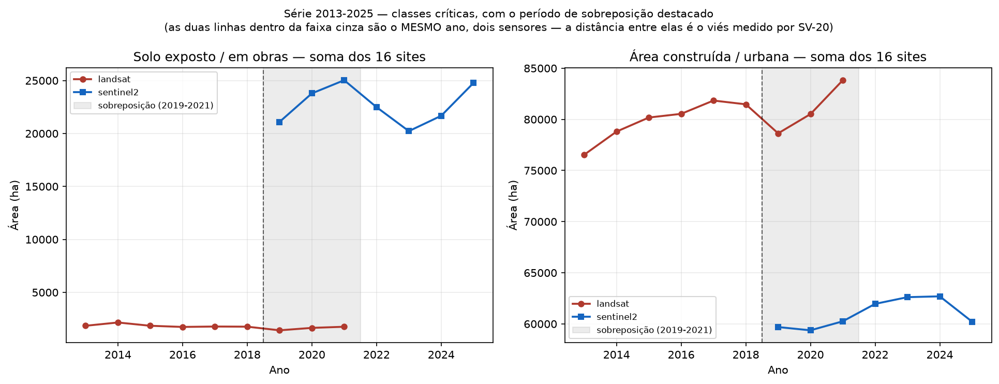

# SV-20 — Validação cruzada entre sensores no período de sobreposição

- **Gerado por:** `src/sentinela/validacao_sensores.py` — `python -m sentinela.validacao_sensores --modelo models/rf_v1.0.joblib`
- **Modelo:** `rf_v1.0` (mesmo modelo, treinado com `sensor_landsat` como feature — ADR-003, Plano B opção 1)
- **Cobertura:** os 16 sites ativos x 3 anos de sobreposição (2019, 2020, 2021) = **48 pares site×ano**, todos os disponíveis, mais o ano 2018 (Landsat, não-sobreposição) de cada site, usado para medir o degrau publicado.
- **Artefatos de apoio (não commitados, gitignored):** `reports/figures/validacao_sensores/*.csv` + `serie_classes_criticas_com_sobreposicao.png`; `data/manifests/fator_correcao_sensor_sv20.json` (fator consumido por `export_indicadores.py`).

## Por que esta validação existe

O projeto usa Landsat 8/9 (30 m) até 2018 e Sentinel-2 (10 m) a partir de 2019 — a troca de
instrumento acontece exatamente quando a maioria dos data centers do estudo começou a crescer. Sem
medir o resíduo *na saída* (área por classe, não só no espectro), qualquer tendência encontrada
tem uma explicação alternativa óbvia: **"vocês trocaram de satélite, e o degrau é do satélite"**.
SV-15, ao gerar o output real (`outputs/indicadores/area_por_classe.csv`), mediu que a classe 3
(solo exposto/obras) do Sentinel-2 é sistematicamente maior que a do Landsat em **todos os 48
pares** de sobreposição (6,6 a 18,4 p.p.) — maior do que o resíduo espectral isolado (ADR-003)
sugeriria. Esta tarefa separa, nesse número, o que é efeito de **resolução** (pixel misto, 30 m vs.
10 m) do que é efeito de **sensor** (harmonização/comportamento do modelo), e quantifica se o
degrau 2018→2019 da série é distinguível de artefato de troca de instrumento.

## Metodologia — agregação exata 3x3

Os rasters Landsat (30 m) e Sentinel-2 (10 m) de um mesmo site/ano compartilham exatamente a mesma
origem, CRS (EPSG:31983) e bounding box (verificado nos 16 sites x 3 anos antes de escrever o
código) — a dimensão do S2 é sempre **exatamente 3x** a do Landsat em cada eixo. Isso permite
agregar o S2 de 10 m para 30 m por **contagem de bloco exata** (sem reprojeção/reamostragem do
GDAL): cada pixel Landsat corresponde a exatamente 9 pixels S2, sem ambiguidade de alinhamento.
Classe majoritária do bloco vence; bloco majoritariamente `nodata` agrega para `nodata`.

Isso dá 3 rasters comparáveis por site/ano de sobreposição — `landsat_nativo` (30 m, sensor
Landsat), `s2_nativo` (10 m, sensor Sentinel-2), `s2_agregado_30m` (30 m, sensor Sentinel-2) — e
uma decomposição aditiva exata do viés total que SV-15 mediu:

```
diff_total         = area(s2_nativo)        - area(landsat_nativo)   # o que SV-15 mediu
diff_resolucao      = area(s2_agregado_30m)  - area(s2_nativo)        # MESMO sensor, resolução
                                                                        # diferente -> pixel misto
diff_sensor_isolado = area(s2_agregado_30m)  - area(landsat_nativo)   # MESMA resolução (30 m),
                                                                        # sensor diferente -> só
                                                                        # sensor/harmonização

diff_total == diff_sensor_isolado - diff_resolucao   # identidade algébrica, checada nos 48 pares
                                                        # e em teste automatizado (100% das linhas)
```

## 1. Diferença de área por classe (48 pares, média ± desvio-padrão)

| Classe | diff_total (ha) | diff_total (p.p.) | diff_total p.p. — faixa | diff_resolução (ha) | diff_sensor_isolado (ha) |
|---|---:|---:|---:|---:|---:|
| Vegetação densa | −1,8 ± 285,8 | −0,10 ± 2,80 | −10,05 a +3,94 | +0,6 ± 30,9 | −1,2 ± 303,2 |
| Vegetação rala | −60,8 ± 293,8 | −0,71 ± 3,11 | −9,59 a +7,14 | +94,6 ± 79,3 | +33,8 ± 321,6 |
| **Solo exposto/obras** | **+1.262,8 ± 374,8** | **+12,56 ± 3,74** | **+6,60 a +18,43** | **−339,9 ± 159,0** | **+922,9 ± 395,5** |
| **Construída/urbana** | **−1.232,2 ± 563,3** | **−12,46 ± 5,25** | **−22,27 a −1,20** | **+260,1 ± 219,0** | **−972,1 ± 641,0** |
| Água | +80,9 ± 62,2 | +0,71 ± 0,50 | 0,00 a +2,22 | −15,3 ± 13,9 | +65,5 ± 55,0 |

Sinal: positivo = Sentinel-2 reporta mais área que Landsat. A linha de solo exposto bate com o que
SV-15 já tinha medido (6,6–18,4 p.p., aqui confirmado pareado corretamente site a site — cenário de
teste 1). Tabela completa (48 linhas x 5 classes) em
`reports/figures/validacao_sensores/diferenca_area_por_classe.csv`.

**Leitura da decomposição — o achado central desta seção:** para as duas classes críticas, o termo
`diff_sensor_isolado` (mesma resolução, 30 m dos dois lados) é **maior em magnitude** que
`diff_resolucao`, e tem o **mesmo sinal** de `diff_total`:

- Classe 3: `diff_sensor_isolado` = +922,9 ha explica 73% do `diff_total` (+1.262,8 ha);
  `diff_resolucao` = −339,9 ha vai na direção **oposta** (agregar por maioria *reduz* a área de
  uma classe fragmentada, o efeito clássico de pixel misto — mas essa redução é menor que o excesso
  que o sensor já introduz na resolução nativa).
- Classe 4: `diff_sensor_isolado` = −972,1 ha explica 79% do `diff_total` (−1.232,2 ha);
  `diff_resolucao` = +260,1 ha (mancha grande e contígua "ganha" área fragmentada vizinha ao
  agregar — direção oposta ao efeito de sensor, e menor).

Ou seja: **a maior parte do viés que SV-15 mediu não é efeito de resolução — é um efeito de sensor
que sobrevive mesmo controlando a resolução.** Isso é o resultado do cenário de teste 3 (ver seção
3).

## 2. Concordância espacial + matriz de confusão (grade de 30 m)

Comparação pixel a pixel entre `landsat_nativo` e `s2_agregado_30m` (mesma grade, 5.336.608 pixels
válidos comparados nos 48 pares):

| Métrica | Média | Desvio | Mín | Máx |
|---|---:|---:|---:|---:|
| Concordância geral | 78,72% | 5,55 | 67,57% | 90,87% |
| Concordância — pixels de **borda** | 64,40% | 3,49 | 55,76% | 71,78% |
| Concordância — pixels de **interior** | 90,40% | 3,99 | 80,59% | 96,50% |

(45,1% dos pixels comparados estão marcados como "borda" — ao menos 1 vizinho de 8-conectividade
de classe diferente na grade Landsat; ver seção 4.)

Concordância por classe (média ± desvio entre os 48 pares):

| Classe | Concordância |
|---|---:|
| Água | 91,43% ± 8,76 |
| Vegetação densa | 80,01% ± 13,18 |
| **Solo exposto/obras** | 77,35% ± 14,47 |
| Vegetação rala | 73,73% ± 12,81 |
| **Construída/urbana** | 71,97% ± 14,72 |

**Matriz de confusão agregada (linhas = Landsat nativo, colunas = S2 agregado a 30 m; % por linha):**

| Landsat \ S2-agg | Veg. densa | Veg. rala | Solo exp./obras | Construída | Água |
|---|---:|---:|---:|---:|---:|
| Vegetação densa | 81,8% | 16,3% | 0,2% | 0,4% | 1,4% |
| Vegetação rala | 8,6% | 78,6% | 4,1% | 7,9% | 0,8% |
| **Solo exposto/obras** | 0,4% | 3,3% | **79,6%** | 15,5% | 1,2% |
| **Construída/urbana** | 0,3% | 7,4% | 16,2% | **75,5%** | 0,5% |
| Água | 0,5% | 0,3% | 0,6% | 0,6% | 98,1% |

Matriz bruta (contagem de pixels) em `reports/figures/validacao_sensores/matriz_confusao_agregada.csv`.

**Achado direcional, não simétrico:** dos pixels que Landsat classifica como `construída_urbana`,
16,2% (438.078 pixels) o S2-agregado classifica como `solo_exposto_obras`; na direção oposta
(Landsat `solo_exposto` → S2 `construída`), são só 15,5% mas em contagem absoluta **8.330 pixels —
52,6x menos**. A confusão entre as duas classes críticas é fortemente assimétrica: Landsat empurra
pixels para "construída" que o Sentinel-2, na mesma resolução, classifica como "solo exposto". Isso
é consistente com o achado de ADR-003 de que o resíduo espectral não corrigido é maior justamente
em SWIR (viés 0,021–0,025, acima da tolerância de 0,02) e que o **NDBI** — o índice que mais separa
solo exposto de construído — tem o maior viés não corrigido de todos os índices medidos (0,034).

## 3. Controle de resolução — o teste mais importante da tarefa

Comparar `s2_agregado_30m` (mesmo sensor do `s2_nativo`, resolução diferente) com o próprio
`s2_nativo` isola o efeito de pixel misto **sem trocar de sensor**. Resultado (classes críticas,
média dos 48 pares):

- Classe 3 (solo exposto/obras): `diff_resolucao` = **−339,9 ha** — a agregação por maioria
  **perde** área de uma classe fragmentada (esperado: manchas pequenas de solo exposto somem
  quando o pixel de 900 m² vê uma mistura e vota na classe vizinha dominante).
- Classe 4 (construída/urbana): `diff_resolucao` = **+260,1 ha** — mancha grande e contígua
  **ganha** área fragmentada da vizinhança ao agregar (esperado: o oposto do efeito acima, mesma
  causa).

Essas duas magnitudes (340 ha e 260 ha) são reais, mensuráveis, e vão na direção fisicamente
esperada de um efeito de pixel misto — **mas são bem menores que `diff_sensor_isolado`** (923 ha e
972 ha, respectivamente) e vão na **direção oposta** a ele. Ou seja: **o controle de resolução
mostra que o efeito de resolução existe, mas não é a explicação principal do viés total** — a maior
parte do viés (73% em classe 3, 79% em classe 4) sobrevive mesmo comparando as duas classificações
na mesma resolução (30 m). O cenário de teste 3 confirma que atribuir o viés total inteiramente à
resolução seria errado — a maior parte dele é, de fato, efeito de sensor.

Teste automatizado (`tests/test_validacao_sensores.py::test_cenario3_*`): confirma a identidade
algébrica em caso sintético e que uma classe presente em só 1 de 9 sub-pixels de cada bloco nunca
sobrevive à agregação por maioria (o mecanismo do efeito de resolução, isolado).

## 4. Análise borda vs. interior

A concordância cai de 90,4% (interior — pixels cujos 8 vizinhos, na grade Landsat, são todos da
mesma classe) para 64,4% (borda — ao menos 1 vizinho de classe diferente). A direção é a esperada
(mais discordância perto de fronteiras entre classes, efeito de resolução), mas o gap de 26 pontos
não é a história inteira: **mesmo no interior de manchas homogêneas, ~1 em cada 10 pixels
discorda entre sensores** — acima do que um efeito puramente de borda/pixel-misto explicaria, e
consistente com o efeito de sensor isolado na seção 3 (que também não é atribuível a resolução).

**Cenário de teste 4 (sanidade) confirmado:** água (91,4%) e vegetação densa (80,0%) — as duas
classes de manchas grandes e homogêneas — têm concordância maior que solo exposto (77,4%), a classe
mais fragmentada, na direção esperada. **Exceção notável:** construída/urbana tem a **menor**
concordância de todas (72,0%), apesar de tipicamente formar manchas grandes e contíguas (o próprio
data center e entorno urbano) — não é explicada por fragmentação, e sim pela confusão direcional
com a classe 3 já descrita na seção 2 (erro de sensor, não de resolução).

## 5. O degrau 2018→2019 — veredito

Para cada site, três quantidades (ha), usando o ano-controle 2018 (só Landsat, sem sobreposição):

```
degrau_publicado      = area_s2[ano_overlap] - area_landsat[2018]   # o que a série oficial mostraria
controle_real_landsat = area_landsat[ano_overlap] - area_landsat[2018]  # MESMO sensor nos 2 lados —
                                                                          # mudança real em 1 ano,
                                                                          # sem trocar instrumento
artefato_sensor       = area_s2[ano_overlap] - area_landsat[ano_overlap] # MESMO ano, 2 sensores —
                                                                           # só o artefato

degrau_publicado == controle_real_landsat + artefato_sensor   (identidade checada nas 48 linhas)
```

Veredito: `artefato_sensor` ≥ metade de `|controle_real_landsat|` ⇒ **NÃO_DISTINGUÍVEL** (o degrau
publicado não pode ser atribuído com confiança a mudança real de terreno).

| Classe | degrau_publicado (ha) | controle_real (ha) | artefato_sensor (ha) | razão artefato/controle | Veredito |
|---|---:|---:|---:|---:|---|
| **Solo exposto/obras** | 1.253,3 ± 383,4 | **−9,5 ± 24,3** | 1.262,8 ± 374,8 | média 265,5x / mediana 68,7x | **48/48 sites: NÃO_DISTINGUÍVEL** |
| **Construída/urbana** | −1.261,3 ± 473,8 | −29,1 ± 249,1 | −1.232,2 ± 563,3 | média 61,5x / mediana 7,8x | **45/48: NÃO_DISTINGUÍVEL / 3/48: DISTINGUÍVEL** |

**Veredito para a classe crítica do projeto (solo exposto/obras): em TODOS os 48 pares, sem uma
única exceção, o degrau publicado 2018→2019 (~1.253 ha em média) não é distinguível do artefato de
troca de sensor (~1.263 ha) — na verdade é quase idêntico a ele. A mudança real medida no mesmo
sensor (Landsat 2018→2019, sem trocar de instrumento) é de apenas −9,5 ha em média, ordens de
magnitude menor.** Se a série fosse publicada emendada sem correção nem aviso, o "crescimento" de
solo exposto em 2019 seria, na prática, inteiramente artefato de instrumento, não sinal de
construção.

Para construída/urbana, 3 dos 48 pares (as 3 observações de `hostdime-joao-pessoa`, nos 3 anos de
sobreposição) são exceção: o controle real Landsat (−259 a −363 ha) supera o artefato de sensor
(14 a 148 ha) — esse site teve uma mudança real grande o bastante no próprio Landsat para não ser
mascarada pelo viés. Isso não muda o veredito agregado (94% dos pares em classe 4, 100% em classe
3, permanecem não distinguíveis), mas mostra que o método é sensível a casos onde o sinal real é
forte o suficiente — não está simplesmente "sempre dizendo não".

Tabela completa em `reports/figures/validacao_sensores/degrau_2018_vs_overlap.csv`.

## 6. Estabilidade do fator e decisão de tratamento — POR CLASSE, não uma decisão única

A decisão não é uma escolha única a/b/c para o relatório inteiro — os dados pedem tratamentos
diferentes para as duas classes críticas, e o código (`decidir_tratamento()`) decide isso a partir
de **duas perguntas** sobre o fator multiplicativo `área(S2-agregado-30m) / área(Landsat)` (mesma
resolução — isola sensor):

1. **Estabilidade dentro do site** (cenário de teste 5 do enunciado): o fator calculado em 2019,
   2020 e 2021 separadamente é parecido entre si, NAQUELE site? (CV < 0,30)
2. **Heterogeneidade entre sites** (pergunta adicional, necessária para não aplicar 1 número
   nacional que só parece estável porque os 3 anos são parecidos entre si — viés de agregação tipo
   Simpson): a média do fator (já por site) é parecida DE SITE PARA SITE? (CV < 0,35)

| Classe | Estável dentro do site | CV entre sites (16 sites) | Elegível para (b)? |
|---|---:|---:|---|
| Solo exposto/obras | 15/16 sites (94%) | **0,422** (fator varia de 3,5x a 23,5x entre sites) | **NÃO** |
| Construída/urbana | 16/16 sites (100%) | **0,220** (fator varia de 0,48x a 1,11x entre sites) | **SIM** |

**Classe 3 (solo exposto/obras) — tratamento (c), faixas separadas, sem correção.** O fator é
estável ano a ano dentro de quase todo site (94%), mas isso esconde uma heterogeneidade enorme
entre sites: em `angonap-fortaleza` o Sentinel-2-agregado reporta 3,5x a área que o Landsat
detecta; em `scala-spoapa01`, 23,5x. Um fator único (nacional, ou mesmo a média dos 16 sites, ~11,6x)
aplicado indiscriminadamente corrigiria muito pouco em alguns sites e exageraria brutalmente em
outros — não é uma correção, é chute com um número que só parece confiável porque os 3 anos
testados são parecidos entre si. Isso é consistente com a variação de F1 da classe 3 por site já
medida em SV-13 (0,235–0,820) — o viés entre sensores é, em boa parte, o mesmo problema estrutural
de site a site que já explicava aquela variação de F1.

**Classe 4 (construída/urbana) — tratamento (b), fator multiplicativo POR SITE.** O fator passa nas
duas perguntas: estável dentro do site em 100% dos casos, e razoavelmente parecido entre sites (CV
0,22, faixa 0,48x–1,11x — ainda heterogêneo, mas dentro do limiar adotado). O fator aplicado **não
é um número nacional único** — é a média dos 3 anos de sobreposição de **cada site**, aplicada só
aos anos exclusivamente Landsat (2013–2018) daquele mesmo site. Fatores por site em
`data/manifests/fator_correcao_sensor_sv20.json` (reproduzido também em
`docs/schema-indicadores.md`).

**Classes 1, 2 e 5 (vegetação densa, vegetação rala, água):** fora do foco desta tarefa (o
enunciado pede classes 3 e 4 explicitamente) — `fator_correcao_sensor = 1.0`, sem correção. O viés
médio nessas classes é pequeno (água) ou tem desvio-padrão maior que a própria média (vegetação
densa/rala — ruído, não sinal sistemático), então não há indicação de que mereçam o mesmo
tratamento.

## 7. Gráfico da série



Soma dos 16 sites, classes 3 e 4, 2013–2025. A faixa cinza marca os 3 anos de sobreposição — dentro
dela, as duas linhas (Landsat vermelho, Sentinel-2 azul) são o **mesmo ano**, dois sensores; a
distância vertical entre elas é exatamente o `diff_total` medido nas seções 1–3.

## 8. Frase-resposta pronta para a banca

> "Medimos o viés entre sensores diretamente na área publicada, não só no espectro: no mesmo ano,
> comparando os dois sensores na mesma resolução de 30 m para isolar sensor de resolução, o
> Sentinel-2 relata em média **923 ha a mais de solo exposto/obras** que o Landsat — um número
> quase idêntico ao "crescimento" de 1.253 ha que a série bruta mostraria entre 2018 e 2019, e
> **48 de 48 sites (100%)** têm esse degrau classificado como indistinguível do artefato de troca
> de sensor. Por isso a classe crítica do projeto (solo exposto/obras) é publicada em **duas faixas
> separadas, sem emenda** entre a era Landsat e a era Sentinel-2 — qualquer leitura de tendência
> dessa classe que atravesse 2018→2019 não é sustentada pelos dados. Já para a classe
> construída/urbana, o viés se mostrou estável e homogêneo o suficiente entre os 16 sites para
> aplicar um fator de correção calibrado por site, o que fizemos."

## 9. Propagação — o que mudou em `outputs/indicadores/area_por_classe.csv`

`export_indicadores.py` (SV-15) foi modificado para ler
`data/manifests/fator_correcao_sensor_sv20.json` (gerado por este módulo) e, a partir dele, popular
duas colunas do CSV que antes eram triviais:

- **`fator_correcao_sensor`**: agora ≠ 1.0 nas 96 linhas `sensor=landsat`, `classe_id=4`,
  `ano ∈ [2013, 2018]` (16 sites x 6 anos) — o fator multiplicativo por site descrito na seção 6.
  As demais 1.184 linhas continuam `1.0` (inclusive classe 3, e inclusive Landsat dos anos de
  sobreposição, que já tem o valor real do Sentinel-2 na própria linha ao lado e não precisa de
  correção). `area_m2`/`area_ha`/`pct_area_valida` **continuam crus** — a correção é um multiplicador
  a aplicar explicitamente (`area_corrigida_ha = area_ha * fator_correcao_sensor`), não foi
  embutida nos valores brutos (mantém a checagem de soma de `pct_area_valida = 100%` por grupo
  intacta, e mantém o dado bruto auditável).
- **`faixa_serie`** (coluna nova): marca o segmento de cada linha —
  `sentinel2_oficial_2019_2025` (560 linhas), `landsat_overlap_referencia` (240),
  `landsat_pre2019_nao_corrigido` (384, inclui toda a classe 3), `landsat_pre2019_corrigido_sv20`
  (96, só classe 4). Documentado em `docs/schema-indicadores.md`.

Regenerado com `python -m sentinela.export_indicadores --modelo-versao rf_v1.0` (256 rasters,
1.280 linhas — mesma contagem de antes, checagem de soma de `pct_area_valida` passou nas 256
combinações site×ano×sensor). `docs/schema-indicadores.md` foi atualizado com a nova coluna e a
lógica de correção.

## 10. Limitações desta validação

1. O fator de classe 4 foi calibrado só nos 3 anos de sobreposição (2019-2021) e aplicado aos 6
   anos anteriores (2013-2018) — extrapolação temporal de até 8 anos, sem forma de validar
   diretamente (não há Sentinel-2 antes de 2019). A estabilidade medida (dentro e entre sites) é a
   melhor evidência disponível de que isso é razoável, mas não é prova.
2. A "heterogeneidade entre sites" foi definida com um limiar (CV < 0,35) escolhido e documentado
   neste módulo, não um padrão externo — outro limiar razoável poderia mudar a classificação de
   alguma classe entre (b) e (c). O limiar está no código (`CV_ENTRE_SITES_LIMIAR`), não escondido.
3. A definição de "borda" (8-conectividade, raio 1 pixel na grade Landsat) é uma escolha entre
   várias possíveis; um raio maior ampliaria a fração de pixels classificados como borda.
4. Este módulo não investiga a CAUSA do efeito de sensor isolado (seção 3) além de apontar para o
   resíduo de SWIR/NDBI já medido em ADR-003 — uma investigação mais profunda (ex.: reforçar peso
   de bandas visíveis/NDVI no modelo, retreinar com essa informação) é trabalho de continuação, fora
   do escopo desta tarefa.

## Nota de reconfirmação (2026-09-03) — modelo trocado para `rf_v1.0-tuned`

O relatório acima (seções 1–10) foi escrito com os rasters classificados pelo modelo **`rf_v1.0`**.
Em 2026-09-03, EXP-003 (`reports/experiments/EXP-003-tuning-hiperparametros.md`) trocou o modelo
oficial para **`rf_v1.0-tuned`** (`max_depth=30`, mesmas features/dataset) e os 256 rasters de SV-14
foram inteiramente reclassificados. Este módulo **não retreina nada** e só lê rasters já
classificados — por isso foi rerodado (`python -m sentinela.validacao_sensores --modelo
models/rf_v1.0-tuned.joblib`) para conferir, honestamente, se a conclusão central desta tarefa
("degrau 2018→2019 indistinguível de artefato de sensor") continua de pé com o modelo novo.

**Resposta curta: sim, continua de pé.** As magnitudes do viés entre sensores subiram um pouco
(7–13%), mas a direção, os vereditos por par site×ano e as duas decisões de tratamento por classe
são **idênticos** aos do modelo anterior:

| Métrica | `rf_v1.0` (relatório original) | `rf_v1.0-tuned` (reconfirmação) |
|---|---:|---:|
| `diff_total` classe 3 (solo exposto/obras), média | +1.262,8 ha | **+1.356,3 ha** |
| `diff_sensor_isolado` classe 3, média | +922,9 ha | **+1.041,1 ha** |
| `diff_total` classe 4 (construída/urbana), média | −1.232,2 ha | **−1.326,2 ha** |
| `diff_sensor_isolado` classe 4, média | −972,1 ha | **−1.091,6 ha** |
| Concordância espacial geral (média dos 48 pares) | 78,72% | **77,61%** |
| Degrau publicado classe 3, média | 1.253,3 ha | **1.346,6 ha** |
| Controle real (Landsat-Landsat) classe 3, média | −9,5 ha | **−9,7 ha** |
| Artefato de sensor classe 3, média | 1.262,8 ha | **1.356,3 ha** |
| Veredito classe 3 (NÃO_DISTINGUÍVEL) | 48/48 sites | **48/48 sites** (idêntico) |
| Veredito classe 4 (NÃO_DISTINGUÍVEL) | 45/48 sites | **45/48 sites** (idêntico) |
| Sites-exceção em classe 4 (DISTINGUÍVEL) | `hostdime-joao-pessoa` (3 observações) | **`hostdime-joao-pessoa`** (as mesmas 3 observações) |
| CV do fator entre sites — classe 3 | 0,422 (elegível? NÃO) | **0,440** (elegível? NÃO) |
| CV do fator entre sites — classe 4 | 0,220 (elegível? SIM) | **0,241** (elegível? SIM) |
| Tratamento decidido — classe 3 | (c) faixas separadas, sem correção | **(c)** — inalterado |
| Tratamento decidido — classe 4 | (b) fator por site | **(b)** — inalterado |

Nenhuma das duas perguntas que orientam `decidir_tratamento()` (estabilidade dentro do site,
heterogeneidade entre sites) cruzou o limiar que muda a decisão — os CVs se moveram na mesma
direção (levemente para cima) nas duas classes, mas ambos continuam do mesmo lado do limiar de
0,35. Os fatores por site de classe 4 mudaram de valor (novo `fator_por_site` gravado em
`data/manifests/fator_correcao_sensor_sv20.json`, `modelo_versao=rf_v1.0-tuned`), então
`outputs/indicadores/area_por_classe.csv` foi reexportado (`python -m sentinela.export_indicadores
--modelo-versao rf_v1.0-tuned`) para propagar os fatores atualizados — os cenários de teste de SV-15
(soma de `pct_area_valida`, coerência `pixels_validos × resolução²`, idempotência) foram checados de
novo e passam.

**O que NÃO foi refeito nesta reconfirmação** (fora do escopo pedido — "não precisa refazer SV-20 do
zero"): as seções 1–10 acima, a matriz de confusão detalhada, a análise borda-vs-interior e a frase
pronta da seção 8 não foram reescritas número a número; os números novos ficam só nesta nota e nos
CSVs de apoio regenerados (`reports/figures/validacao_sensores/*.csv`, sobrescritos com os dados do
modelo novo). Se o time quiser o relatório inteiro reescrito com os números de `rf_v1.0-tuned`
(inclusive a frase-resposta da seção 8, cujos números "923 ha"/"1.253 ha"/"48 de 48" ficaram
levemente desatualizados por esta troca), isso é uma tarefa própria — os CSVs já regenerados são a
fonte pronta para isso.

## Arquivos

- `src/sentinela/validacao_sensores.py` — módulo principal (novo).
- `tests/test_validacao_sensores.py` — 14 testes cobrindo os 5 cenários do enunciado (novo).
- `src/sentinela/export_indicadores.py` — modificado para ler o fator de SV-20 e popular
  `fator_correcao_sensor`/`faixa_serie`.
- `outputs/indicadores/area_por_classe.csv` — regenerado (1.280 linhas, mesma contagem de antes).
- `docs/schema-indicadores.md` — atualizado (coluna `faixa_serie`, lógica de `fator_correcao_sensor`).
- `data/manifests/fator_correcao_sensor_sv20.json` — fator de correção por site/classe (novo,
  gitignored — dado gerado, não fonte).
- `reports/figures/validacao_sensores/*.csv` + `serie_classes_criticas_com_sobreposicao.png` —
  artefatos de apoio (novo, gitignored — dado gerado).
- `reports/validacao_sensores.md` — este relatório (novo).
